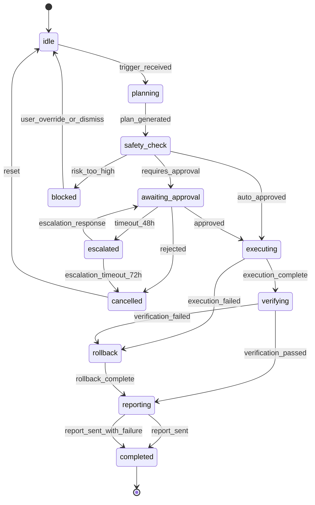

# 002: BPO編 — 業務代行・人材紹介を潰す

> **このフェーズの本質**: ブレイン編で溜まったナレッジを「実行」に変換する。
> 「人を雇う・派遣を頼む・外注する」の代わりに、AIエージェントが業務を代行する。
> 人材紹介会社に年収の35%を払う世界、BPO会社に月50万払う世界を終わらせる。

## このドキュメントの使い方（SMB / Enterprise 別読み方ガイド）

| | SMB（10〜200名） | Enterprise（200名以上・上場等） |
|---|---|---|
| **BPOレベル目標** | Level 2〜3（承認付き自動化） | Level 3〜4（完全自動化） |
| **優先フェーズ** | Phase 4（ワークフロー発見）から | Phase 4〜5全て |
| **重点機能** | 即時起動エンジン・Shadow Mode | エージェント分裂・人材BPO |
| **スキップ可** | §4.5（スタッフィングKill詳細）は後回し可 | なし |

### SMB向け — BPO導入の最短ルート（7日間）

```
Day 1: LINE連携でSaaS接続（§4.6 ①）
  → freee / kintone / Slack を1タップOAuth接続
  → 接続するだけで自動的にプロセスマイニング開始

Day 2-3: 操作ログ自動分析（§4.6 ③）
  → 既存SaaS操作パターンからワークフロー自動発見（§4.1）
  → 「毎月5日に請求書チェック」等が自動検出される

Day 4-5: Shadow Mode起動（§4.6 ④）
  → バックグラウンドで人間と同じ操作を並行実行
  → 実害なく一致率を蓄積（目標: 2日で80%以上）

Day 6-7: Level 2に昇格
  → 一致率80%超のルールを「下書き生成」として有効化
  → LINEで確認・承認する習慣を作る

SMBで最初に自動化すべき業務TOP3:
  1. 請求書受取→仕訳入力（freee連携）
  2. 問い合わせ→Slack通知→担当者アサイン
  3. 月末勤怠集計→給与計算下書き
```

### Enterprise向け — SMB機能に加えて実装

```
◎ エージェント特化・分裂（§4.2）
  → DBSCAN クラスタリングで業務ドメイン別エージェント自動生成
  → 「経理BPOエージェント」「採用BPOエージェント」等に分化
  → 100業務以上の自動化に対応

◎ BPO品質保証マトリクス（§4.3）
  → Confidence × Impact の安全ガードレール
  → 高インパクト操作は複数承認者設定（2-of-3等）

◎ 3層コネクタ戦略（§4.4）
  → API直接→Make（iPaaS）→Computer Use の自動アップグレード
  → SaaS連携を社内IT部門なしで拡張可能

◎ スタッフィングKill（§4.5）
  → 派遣社員・アウトソース先の業務を段階的にBPO代替
  → 人件費削減効果の可視化・ROI計算

◎ BPO即時起動のネットワーク信頼トランスファー（§4.6 ②）
  → 同業他社の導入実績をもとに初期Levelを高く設定
  → Enterpriseは初日からLevel 1でスタート可能
```

---

### ⚡ MVP実装ノート（Elon Mode）

> **BPOはPhase 1.5（Week 10-14）から。Phase 1ではブレインのみ。**

| 機能 | MVP (Phase 1.5) | Phase 2+ |
|---|---|---|
| コネクタ | Tier 1 APIのみ (kintone/freee/Slack/LINE WORKS) | Tier 2 iPaaS + Tier 3 Computer Use |
| ワークフロー発見 | 手動設定 + テンプレート | SaaSログ自動マイニング (§4.1) |
| Shadow Mode | ヒストリカルシミュレーション (3日) | リアルタイム30日検証 (§4.6) |
| 実行モード | 承認モードのみ (CEO承認→実行) | Auto Mode (§4.2) |
| 昇格基準 | match_rate ≥ 90% + CEO承認 | 100回実行 + 95%精度 + 2%FP |
| エージェント分化 | 単一BPOエージェント | DBSCAN クラスタリング分裂 (§4.2) |
| BPO品質保証 | シンプル承認フロー | Confidence × Impact マトリクス (§4.3) |
| LangGraph | Phase 1.5で導入 (BPO HitL) | フル状態管理 |

**MVP完了基準**: 1社で週5時間の工数削減（承認モード）

**7日間BPO稼働（修正版）:**
- Day 1: SaaS OAuth接続 + 過去ログ取得
- Day 2: テンプレートマッチング + CEO確認
- Day 3-4: ヒストリカルシミュレーション（過去3ヶ月データ）
- Day 5: 承認モード開始（CEO承認→実行）
- Day 6-7: 精度モニタリング + 調整

### BPO MVPレベル定義（c_03との統一 Source of Truth）

> **b_02とc_03の矛盾を解消するための統一定義。**
> MVPではLevel 0→1→2の段階的昇格。Level 3-4はPhase 2+。

```
■ MVP（Phase 1.5: Week 10-14）のBPOレベルロードマップ

  Week 10-11: Level 0（リードオンリー）
    ・SaaS接続（OAuth read-only scope）
    ・操作ログ取得・可視化
    ・テンプレートマッチング
    ・BPO Worker自体は読み取りのみ。書き込みゼロ。
    ※ c_03「Phase 4: Level 0 リマインダーのみ」に対応

  Week 12: Level 1（下書き生成）
    ・SaaSに下書きを作成するが、確定はしない
    ・例: freeeの仕訳下書き、kintoneのレコード下書き
    ・ユーザーがSaaS上で手動確定
    ・OAuth scope: read + write:drafts
    ※ c_03「Level 1: Week 2」に対応（Phase 1.5のWeek 2）

  Week 13-14: Level 2（承認付き実行）
    ・ユーザー承認後に確定操作を実行
    ・承認UI: LINEタップ or Web画面
    ・承認なしの自動実行は不可（Level 3はPhase 2+）
    ・影響度判定（§5参照）に基づく追加認証
    ・OAuth scope: read + write:all
    ※ b_02「SMB BPOレベル目標: Level 2〜3」の Level 2 に対応

■ Phase 2+（Week 15以降）のBPOレベル

  Level 3（条件付き自動実行）— Phase 2
    ・low impact + match_rate ≥ 95% のタスクのみ自動実行
    ・medium以上は引き続き承認必要
    ・100回連続成功で自動昇格条件クリア

  Level 4（完全自動実行）— Phase 3+
    ・high impact まで自動実行可
    ・critical は常に承認必要（解除不可）
    ・Enterprise専用（SMBはLevel 3まで推奨）

■ 昇格基準（統一版）

  Level 0→1: SaaS接続 + 過去ログ取得成功
  Level 1→2: match_rate ≥ 90% + CEO承認 + ヒストリカルシミュレーション3日通過
  Level 2→3: 100回実行 + 成功率 ≥ 95% + FP rate ≤ 2% + CEO承認
  Level 3→4: 500回実行 + 成功率 ≥ 99% + CEO承認 + Enterprise契約

■ b_02 vs c_03 矛盾解消マッピング

  b_02 記述                    | c_03 記述              | 統一解釈
  ------------------------------|------------------------|-------------------
  SMBレベル目標: Level 2-3      | Phase 4: Level 0のみ   | MVP=Level 0-2段階的
  承認モードのみ (CEO承認→実行) | Level 3: Week 4        | Phase 2+ で Level 3
  Shadow Mode 30日検証           | ヒストリカル3日         | MVP=3日、Phase 2=30日
```

---

## 1. 潰す対象の構造理解

```
■ 業務代行（BPO）が売っているもの

  ① 定型業務の代行      経理・請求・給与計算・データ入力
  ② 専門業務の代行      記帳代行・社保手続き・採用事務
  ③ 季節業務の代行      年末調整・決算・棚卸
  ④ 一時的なマンパワー  引越し・システム移行・イベント対応

■ 人材紹介・派遣が売っているもの

  ① 即戦力の確保        「明日から経理できる人」
  ② 採用コストの外部化  面接・選考を代行
  ③ リスクの外部化      合わなければ交代
  ④ 専門スキルの一時利用 「3ヶ月だけ経理のプロが必要」

■ これらの弱点（= シャチョツーの勝ち筋）

  BPO:
    ・高い（月30-100万。経理BPOで月20-50万）
    ・ブラックボックス（中で何をやっているか見えない）
    ・引き継ぎリスク（担当者変更で品質低下）
    ・スケールしない（業務量2倍 = コスト2倍）
    ・カスタマイズ困難（「うちのやり方」に合わせてくれない）

  人材紹介:
    ・高い（年収の30-35%。年収500万なら紹介料175万）
    ・辞めるリスク（1年以内離職率20-30%）
    ・教育コスト（即戦力でも社内ルール習得に1-3ヶ月）
    ・そもそも採用できない（中小企業の採用難）

■ シャチョツーの圧倒的優位

  ・安い（BPOタスク¥200/件。月1万件でも20万）
  ・透明（全ステップが可視化。承認チェックポイント付き）
  ・学習する（同じ業務を繰り返すほど精度UP。人間は忘れる）
  ・スケールする（業務量10倍でもコストは微増）
  ・「うちのやり方」に完全適合（ブレインのナレッジそのもの）
  ・辞めない。休まない。引き継ぎ不要。
```

---

## 2. BPO編のゴール

```
入口: ブレイン編で蓄積されたナレッジ（業務フロー・判断基準・暗黙知）
 ↓
変換: ナレッジ → 実行可能なルール → BPOタスク定義（★ここが最重要の追加設計）
 ↓
実行: Level 0（通知）→ 1（読取）→ 2（下書き）→ 3（承認実行）→ 4（自律実行）
 ↓
学習: 実行結果 → 精度向上 → Level自動昇格
 ↓
出口: 社長が「やっておいて」と言えば、全部やってくれる
      → 「もうBPO会社も派遣もいらないじゃん」
```

---

## 3. 実装フェーズ

### Phase 4: BPO Level 0-2 + 統一コネクタ（4-5週間）

```
■ Level 0-2の段階的自動化

  Level 0: リマインダー（通知するだけ）
  ━━━━━━━━━━━━━━━━━━━━━━━━━━━━━━━━━
    入力: ナレッジの「業務フロー」+「スケジュール情報」
    出力: 「明日は月末請求の日です。去年は15件でした」
    技術: Cron + ナレッジ検索 + LLM文章生成
    → リスクゼロ。Day 1から動く。

  Level 1: データ収集代行（読み取りだけ）
  ━━━━━━━━━━━━━━━━━━━━━━━━━━━━━━━━━
    入力: ナレッジの「どこに何のデータがあるか」
    出力: 「kintoneから今月の受注データを集計しました。15件 / ¥4,500,000です」
    技術: SaaS API (GET) + LLM集計 + レポート生成
    → 書き込みなし。安全。

  Level 2: 下書き作成（書き込むが確定しない）
  ━━━━━━━━━━━━━━━━━━━━━━━━━━━━━━━━━
    入力: ナレッジの「業務ルール」+「判断基準」
    出力: 「freeeに請求書の下書きを15件作りました。確認してください」
    技術: SaaS API (POST/draft) + LLM判断 + 差分表示
    → 下書き状態なので間違っても被害なし。

■ 統一コネクタレイヤー

  [BPO Worker] → [統一コネクタ] → [SaaS API / iPaaS / RPA]
                     │
                     ├─ API直接（kintone, freee, Slack, LINE WORKS...）
                     ├─ iPaaS経由（Make/Zapier — API非公開SaaS用）
                     └─ Computer Use（Phase 5以降 — UI操作が必要なSaaS用）
```

**タスク:**
- [ ] Level 0: リマインダーエンジン（スケジュール×ナレッジ）
- [ ] Level 1: データ収集代行（SaaS GET + 集計レポート）
- [ ] Level 2: 下書き生成（SaaS POST/draft + 差分表示 + 確認UI）
- [ ] 統一コネクタレイヤー（API > iPaaS 自動選択）
- [ ] 共通SaaSコネクタ（kintone / freee / Slack / LINE WORKS / ジョブカン）
- [ ] 業種固有SaaSコネクタ（ANDPAD / Photoruction / zaico / Dentis）
- [ ] 承認チェックポイントUI（計画表示 / 修正 / 承認 / 却下）
- [ ] ROIリアルタイム計測 + ダッシュボード
- [ ] 棄却学習（却下理由 → 次回の計画改善）

**完了基準:**
- Level 0-2が段階的に動作する
- 承認画面で計画の確認・修正ができる
- ROIがリアルタイムで可視化される

### Phase 5: BPO Level 3-4 + 行動推論（4-5週間）

```
■ Level 3-4 = 「人間の代わり」の完成形

  Level 3: 承認付き実行（確定するが人間が承認）
  ━━━━━━━━━━━━━━━━━━━━━━━━━━━━━━━━━
    入力: Level 2の下書き + 承認率80%以上の実績
    出力: 「確認OKなら請求書を確定して送付します」→ [承認][修正][却下]
    昇格条件: 下書き承認率80%以上（直近1ヶ月）

  Level 4: 自律実行（信頼が蓄積された後）
  ━━━━━━━━━━━━━━━━━━━━━━━━━━━━━━━━━
    入力: Level 3で承認率95%以上 × 6回連続の実績
    出力: 「毎月の請求書処理、自動実行しました。レポートをご確認ください」
    昇格条件: 承認率95%以上 × 6回連続 + ユーザー明示許可
    安全弁: いつでもLevel 3に戻せる

■ 行動推論（Behavior Inference）= 暗黙知の自動取り込み

  [Slack/メールのパターン分析]
    「毎週月曜に全体MTG → 議事録をSlackに投稿」→ 自動化候補
  [SaaS操作ログ]
    「月末にkintoneで売上集計 → freeeに手入力」→ 自動化候補
  [推論ルール → 確認フロー]
    「こういう暗黙ルールがありそうですが、合っていますか？」
    → 社長が確認 → Brain のナレッジに追加
```

**タスク:**
- [ ] Level 3: 承認付き実行（昇格条件判定 + 実行エンジン）
- [ ] Level 4: 自律実行（信頼スコア + 安全弁 + 結果レポート）
- [ ] 行動推論: Slack/メールパターン分析
- [ ] 行動推論: SaaS操作ログ観察
- [ ] 推論ルール → 確認フロー → ナレッジ追加パイプライン
- [ ] 予測スケジューリング（パターンから事前準備）
- [ ] クロスフロー最適化（受注→請求→在庫の連動）
- [ ] 事業別エージェント基盤（★詳細は後述 4.1）

**完了基準:**
- Level 3-4が動作し、定型業務は自律実行される
- 行動推論が暗黙ルールを提案できる
- 予測スケジューリングで事前準備ができる

---

## 4. 詰めるべき設計ポイントと提案

### 4.1 ワークフローマイニング — ナレッジグラフから実行ルールを自動発見（★最重要）

**課題**: ナレッジは「テキスト→LLM構造化→保存」で止まっている。BPO Workerが動くにはトリガールールが必要だが、**個別ナレッジをLLMで変換するだけでは精度が低い**。ナレッジ間の「関係」にこそワークフローが隠れている。

**核心のアイデア**: ナレッジグラフの `triggers` / `depends_on` エッジを辿ると、**暗黙のワークフロー（業務フロー）が浮かび上がる**。プロセスマイニングの手法をナレッジグラフに適用する。

```
■ 提案: 3段階ワークフローマイニングパイプライン

  [Stage 1] ナレッジグラフからワークフロー候補を抽出
  ━━━━━━━━━━━━━━━━━━━━━━━━━━━━━━━━━━━━━━━━━━━

    knowledge_relations テーブルの triggers チェーンを辿る:

    例:
      KI_001「月末25日になる」
        → triggers → KI_042「kintoneから受注データを集計する」
        → triggers → KI_078「freeeで請求書を作成する」
        → triggers → KI_091「経理部長が確認する」
        → triggers → KI_102「請求書を取引先にメール送付する」

    このチェーン = 「月次請求ワークフロー」

    抽出アルゴリズム:
      1. 全 triggers エッジを取得
      2. 連結成分（Connected Components）を計算
      3. 各成分をDAG（有向非巡回グラフ）として検出
      4. DAGのルートノード = トリガー条件
      5. DAGのリーフノード = 最終アクション
      6. DAGの中間ノード = ステップ

    不足情報の補完:
      ・triggers チェーンが途切れている場合
        → LLM に「KI_078 の次のステップは何ですか？」と推論させる
        → 推論結果は confidence 低めで仮挿入 → 社長に確認

      ・テンプレート遺伝子から補完
        → 「建設業の請求フロー遺伝子」に標準ステップがある
        → 個社ナレッジに抜けがあれば、遺伝子のデフォルトで埋める
        → ⚠️マーク付きで「テンプレートから補完しています。確認してください」

  [Stage 2] ワークフロー → 実行ルール + タスクテンプレートに変換
  ━━━━━━━━━━━━━━━━━━━━━━━━━━━━━━━━━━━━━━━━━━━

    抽出されたワークフローの各ステップを、実行可能な形式に変換する。

    変換ロジック（ステップ単位）:

      [ステップのナレッジ]
        「kintoneから受注データを集計する」

      [LLM構造化プロンプト]
        あなたはBPOシステム設計者です。以下のナレッジを実行可能なルールに変換してください。
        - 対象ナレッジ: {knowledge_text}
        - 利用可能コネクタ: {available_connectors}  ← 接続済みSaaS一覧
        - 会社の業務コンテキスト: {company_context}  ← 9次元モデルサマリ

        出力形式:
        {
          "action": "connector.method",
          "params": {...},
          "preconditions": [...],     ← このステップの前に必要な条件
          "postconditions": [...],    ← このステップ完了後の状態
          "confidence": 0.0-1.0,
          "missing_info": [...]       ← 変換に必要だが不足している情報
        }

      [変換結果の検証]
        ・preconditions が前ステップの postconditions と整合するか
        ・コネクタが実際に接続済みか
        ・パラメータに必要な情報が全て揃っているか
        ・不整合がある場合 → 社長に質問キューに追加

    変換後のタスクテンプレート例:
      {
        "template_id": "tpl_monthly_billing_001",
        "name": "月次請求書発行",
        "source_workflow": "wf_003",       // 元のワークフローID
        "source_knowledge_ids": ["KI_001", "KI_042", "KI_078", "KI_091", "KI_102"],
        "trigger": {
          "type": "schedule",
          "cron": "0 9 25 * *",
          "condition": "business_day_or_next"
        },
        "steps": [
          {
            "order": 1,
            "name": "受注データ集計",
            "action": "kintone.get_records",
            "params": {"app_id": "受注管理", "query": "month=current AND status=confirmed"},
            "expected_output": {"type": "array", "min_count": 1},
            "on_empty": "skip_with_notification",  // データ0件なら通知して終了
            "timeout_ms": 30000,
            "fallback_chain": ["retry_3", "notify_admin"]
          },
          {
            "order": 2,
            "name": "請求書下書き作成",
            "action": "freee.create_invoice_drafts",
            "params": {"data_ref": "step_1.output", "template": "standard"},
            "validation": {
              "total_amount_range": {"min": 100000, "max": 50000000},
              "count_delta_from_last_month": {"max_percent": 30}  // 前月比30%以上変動で警告
            },
            "on_validation_fail": "pause_and_highlight",
            "timeout_ms": 60000,
            "fallback_chain": ["retry_3", "ipas_fallback", "notify_admin"]
          },
          {
            "order": 3,
            "name": "差分チェック＋承認",
            "action": "approval_checkpoint",
            "params": {
              "show_diff_from_last_month": true,
              "highlight_anomalies": true,
              "approver_role": "director",
              "department": "accounting",
              "timeout_hours": 24,
              "escalation": [
                {"after_hours": 4, "channel": "push_notification"},
                {"after_hours": 12, "channel": "email"},
                {"after_hours": 20, "channel": "slack_dm"}
              ]
            }
          },
          {
            "order": 4,
            "name": "請求書確定＋送付",
            "action": "freee.confirm_and_send",
            "params": {"invoices_ref": "step_2.output"},
            "requires_approval": true,      // Step 3の承認が必要
            "post_action": "slack.notify_channel",
            "post_params": {"channel": "#経理", "message": "月次請求処理完了"}
          }
        ],
        "current_level": 2,
        "level_history": [],
        "promotion_criteria": {
          "2_to_3": {"min_executions": 3, "min_approval_rate": 0.8, "max_modification_rate": 0.2},
          "3_to_4": {"min_executions": 6, "min_approval_rate": 0.95, "user_explicit_consent": true}
        },
        "rollback_plan": {
          "step_2": "freee.delete_drafts",
          "step_4": "freee.cancel_invoices"    // 確定後の取り消し手順
        }
      }

  [Stage 3] 実行 → 学習 → ワークフロー改善ループ
  ━━━━━━━━━━━━━━━━━━━━━━━━━━━━━━━━━━━━━━━━━━━

    [承認時の修正を構造化して学習]
      社長がStep 2で「取引先Aの請求書だけ税率を変更」→ 修正内容を記録:
        {
          "modification": "tax_rate_override",
          "condition": "client_id = 'A'",
          "new_value": 0.08,
          "frequency": "every_time"       // 毎回 or 一時的
        }
      → frequency = "every_time" の場合、ルールに自動組み込み
      → 次回から自動適用 → 修正不要に → 承認率UP → Level昇格に寄与

    [却下パターン分析]
      直近3回のうち2回以上却下 → ルールに根本的な問題あり:
        → 元のナレッジを社長に再確認
        → ワークフロー自体の見直しを提案

    [クロスフロー最適化]
      「受注ワークフロー」の完了が「請求ワークフロー」のトリガーになる:
        → 受注確定イベント → 請求準備を事前開始
        → 月末の集中処理を平準化

■ LangGraph 状態遷移（BPO実行グラフ）

  class BPOExecutionState(TypedDict):
      company_id: str
      template_id: str
      current_step: int
      step_results: list[dict]         # 各ステップの実行結果
      anomalies_detected: list[dict]   # 異常検出リスト
      approval_status: str             # pending/approved/modified/rejected
      modifications: list[dict]        # 承認時の修正内容
      rollback_needed: bool

  グラフ:
    load_template → execute_step → validate_output
        ↓ (正常)            ↓ (異常)
    next_step           anomaly_handler → pause_and_notify
        ↓ (承認ステップ)      ↓ (自動修復可能)
    request_approval    self_heal → retry_step
        ↓ (承認)
    execute_step → ... → complete → record_result → update_learning

■ DB スキーマ

  CREATE TABLE discovered_workflows (
    id UUID PRIMARY KEY,
    company_id UUID REFERENCES companies(id),
    workflow_name TEXT NOT NULL,
    knowledge_chain UUID[] NOT NULL,       -- ナレッジIDの順序付きリスト
    trigger_knowledge_id UUID,             -- トリガーとなるナレッジ
    completeness NUMERIC(3,2),             -- 0.0-1.0（全ステップが明確か）
    missing_steps TEXT[],                  -- 不足しているステップの説明
    is_validated BOOLEAN DEFAULT false,    -- 社長が確認済みか
    created_at TIMESTAMPTZ DEFAULT NOW()
  );

  CREATE TABLE executable_rules (
    id UUID PRIMARY KEY,
    company_id UUID REFERENCES companies(id),
    workflow_id UUID REFERENCES discovered_workflows(id),
    rule_name TEXT NOT NULL,
    trigger_config JSONB NOT NULL,
    steps JSONB NOT NULL,                  -- 実行ステップ定義（上記の詳細形式）
    validation_rules JSONB,                -- 各ステップの検証ルール
    rollback_plan JSONB,                   -- ロールバック手順
    confidence NUMERIC(3,2) DEFAULT 0.5,
    source_knowledge_ids UUID[],
    is_active BOOLEAN DEFAULT true,
    current_level INTEGER DEFAULT 0,
    execution_count INTEGER DEFAULT 0,
    approval_rate NUMERIC(4,3),
    modification_rate NUMERIC(4,3),        -- 承認時に修正が入る率
    learned_modifications JSONB,           -- 学習済みの修正パターン
    created_at TIMESTAMPTZ DEFAULT NOW(),
    updated_at TIMESTAMPTZ DEFAULT NOW()
  );

  CREATE TABLE bpo_execution_log (
    id UUID PRIMARY KEY,
    company_id UUID REFERENCES companies(id),
    rule_id UUID REFERENCES executable_rules(id),
    execution_start TIMESTAMPTZ NOT NULL,
    execution_end TIMESTAMPTZ,
    status TEXT NOT NULL,                   -- running/completed/failed/cancelled/expired
    step_results JSONB NOT NULL,           -- 各ステップの詳細結果
    anomalies JSONB,                       -- 検出された異常
    approval_result TEXT,                  -- approved/modified/rejected/expired
    modifications JSONB,                   -- 承認時の修正内容
    rejection_reason TEXT,
    execution_time_ms INTEGER,
    cost_saved_yen INTEGER,                -- この実行で削減されたコスト（推定）
    created_at TIMESTAMPTZ DEFAULT NOW()
  );
```

### 4.2 エマージェントエージェント — 使用パターンから自然に専門化

**課題**: エージェントを「事前定義」するのは筋が悪い。使われ方が分からないうちに「営業エージェント」「経理エージェント」と決め打ちしても、実際の業務境界と合わない。**使われ方から自然に専門化すべき**。

**核心のアイデア**: 最初は1つの汎用エージェント。実行ログを分析して「この企業では経理系タスクが集中している」と判明したら、経理特化エージェントの「分裂」を提案する。生物の細胞分裂のように。

```
■ 提案: エマージェント（創発的）エージェント生成

  [Phase 0] 汎用エージェント1体（導入時）
  ━━━━━━━━━━━━━━━━━━━━━━━━━━━━━━━━━
    ・テンプレートベースのQ&A + Level 0 リマインダー
    ・全ナレッジにアクセス可能
    ・名前:「シャチョツー」（社名なし — 親しみやすさ重視）

  [Phase 1] 使用パターン蓄積（導入後1-4週間）
  ━━━━━━━━━━━━━━━━━━━━━━━━━━━━━━━━━━━
    全てのインタラクションをログ:
      ・誰が（ユーザーID + ロール + 部門）
      ・何を聞いた/依頼した（Q&A or BPOタスク）
      ・どのナレッジが使われた（knowledge_item_ids）
      ・どのワークフローが実行された（workflow_id）
      ・満足度（👍/👎 or 修正率）

  [Phase 2] クラスタリング分析（自動・週次実行）
  ━━━━━━━━━━━━━━━━━━━━━━━━━━━━━━━━━━━━
    インタラクションログをクラスタリング:

    分析手法:
      1. 各インタラクションを特徴ベクトル化
         features = [部門, ナレッジカテゴリ, ワークフロー種別, 時間帯, 頻度]
      2. DBSCAN or K-means でクラスタ検出
      3. 各クラスタに「ラベル」をLLMで自動付与

    例:
      Cluster A: 「経理部からの月末集中型」（42インタラクション/月）
        → 請求・支払・経費精算に関するQ&A + BPOが集中
      Cluster B: 「現場監督からの日次型」（180インタラクション/月）
        → 日報・写真・天候・安全に関するQ&Aが日次で発生
      Cluster C: 「社長からの不定期戦略型」（15インタラクション/月）
        → What-if・業界比較・意思決定支援

  [Phase 3] 分裂提案（閾値超過時）
  ━━━━━━━━━━━━━━━━━━━━━━━━━━━━━━━━━━━━
    分裂条件:
      ・クラスタの月間インタラクション ≥ 20
      ・クラスタ内の満足度 < 全体平均 - 10%（専門化で改善余地あり）
      OR
      ・クラスタのBPOタスク月間実行数 ≥ 10
      ・クラスタのBPOタスク成功率 ≥ 80%

    提案例:
      「現場管理に関するやり取りが月180回あり、
       専門エージェントを作ると応答精度が推定15%向上します。
       『〇〇建設 現場アシスタント』を作成しますか？

       このエージェントができること:
       ・現場日報の受付・構造化（LINE写真対応）
       ・天候リスクアラート（Level 0）
       ・安全書類リマインダー（Level 0）
       ・原価データ集計（Level 1）

       [作成する] [後で検討] [必要ない]」

  [Phase 4] 分裂実行 — エージェントの「遺伝」
  ━━━━━━━━━━━━━━━━━━━━━━━━━━━━━━━━━━━━
    新エージェント作成時に「遺伝」するもの:
      ・ナレッジフィルタ（クラスタに関連するナレッジのみアクセス）
      ・ワークフロー割当（クラスタに関連するBPOルールのみ実行）
      ・学習済み修正パターン（親エージェントの学習結果を引き継ぎ）
      ・ペルソナ設定（参謀/アシスタント/ヘルパーの自動判定）

    ペルソナ自動判定:
      ・社長向けクラスタ → 参謀ペルソナ（経営判断支援・戦略的な言い回し）
      ・管理職向けクラスタ → アシスタント（業務実行支援・具体的な指示）
      ・一般社員向けクラスタ → ヘルパー（Q&A・簡易作業・やさしい言い回し）

  [Phase 5] 進化・統合・廃止
  ━━━━━━━━━━━━━━━━━━━━━━━━━━━━━━━━━━━━
    ・進化: 新ナレッジ追加 → 担当エージェントのスキルが自動拡張
    ・再分裂: エージェントのクラスタ内でさらに分化が検出 → 提案
    ・統合: 2つのエージェントの担当範囲が80%以上重複 → 統合提案
    ・廃止: 30日間の利用ゼロ → 「このエージェントを停止しますか？」
    ・格下げ: BPO成功率が60%以下に低下 → Level自動格下げ + 原因調査

■ DB スキーマ

  CREATE TABLE company_agents (
    id UUID PRIMARY KEY,
    company_id UUID REFERENCES companies(id),
    agent_name TEXT NOT NULL,
    parent_agent_id UUID REFERENCES company_agents(id),  -- 分裂元
    generation INTEGER DEFAULT 1,         -- 何世代目か（1=初代汎用）
    persona TEXT NOT NULL,                -- sanbo/assistant/helper
    scope_description TEXT,
    knowledge_filter JSONB,               -- ナレッジアクセス条件
    assigned_workflow_ids UUID[],         -- 担当ワークフロー
    interaction_cluster JSONB,            -- クラスタ分析結果
    performance JSONB NOT NULL DEFAULT '{
      "total_interactions": 0,
      "satisfaction_rate": null,
      "bpo_success_rate": null,
      "avg_response_quality": null
    }',
    status TEXT DEFAULT 'active',         -- active/dormant/archived
    last_active_at TIMESTAMPTZ,
    split_proposed_at TIMESTAMPTZ,        -- 分裂提案日
    created_at TIMESTAMPTZ DEFAULT NOW()
  );

  CREATE TABLE agent_interaction_log (
    id UUID PRIMARY KEY,
    agent_id UUID REFERENCES company_agents(id),
    user_id UUID REFERENCES users(id),
    interaction_type TEXT NOT NULL,        -- qa/bpo_request/notification/proactive
    knowledge_ids_used UUID[],
    workflow_id UUID,
    satisfaction TEXT,                     -- positive/negative/neutral
    cluster_label TEXT,                    -- 後から付与されるクラスタラベル
    created_at TIMESTAMPTZ DEFAULT NOW()
  );
```

### 4.3 BPO品質保証フレームワーク — 確信度×影響度の2軸ガードレール

**課題**: BPO Workerがミスすると、実際の業務に損害が出る（請求書の金額間違い等）。Level 0-4の段階制だけでは粒度が粗い。**タスクの種類ごとに「どこまで自動化を許すか」のガードレール**が必要。

```
■ 提案: 確信度 × 影響度マトリクスによる動的ガードレール

  [2軸の定義]

    確信度（Confidence）: BPO Workerがそのタスクをどれだけ正確に実行できるか
      ・算出: 直近10回の成功率 × ルールの confidence × データ品質スコア
      ・範囲: 0.0 - 1.0

    影響度（Impact）: そのタスクが間違った場合のビジネスインパクト
      ・算出: LLMが以下の4要素から自動判定
        - 金額規模（10万未満=低 / 10-100万=中 / 100万以上=高）
        - 外部送信の有無（社外送付=高）
        - 可逆性（取り消し可能=低 / 不可逆=高）
        - 法令関連（法的義務あり=高）
      ・範囲: low / medium / high / critical

  [マトリクス]

    ┌─────────────┬──────────────┬──────────────┬──────────────┐
    │              │ 影響度: Low   │ 影響度: Med   │ 影響度: High  │
    ├─────────────┼──────────────┼──────────────┼──────────────┤
    │ 確信度 ≥0.9 │ 自律実行OK   │ 承認1段       │ 承認2段       │
    │              │ (Level 4可)  │ (Level 3)    │ (Level 3)    │
    ├─────────────┼──────────────┼──────────────┼──────────────┤
    │ 0.7-0.9     │ 承認1段      │ 承認1段       │ 下書きのみ    │
    │              │ (Level 3可)  │ + 差分表示   │ (Level 2)    │
    ├─────────────┼──────────────┼──────────────┼──────────────┤
    │ 0.5-0.7     │ 下書きのみ   │ 下書き       │ 手動推奨      │
    │              │ (Level 2)    │ + 警告表示   │ (Level 0-1)  │
    ├─────────────┼──────────────┼──────────────┼──────────────┤
    │ < 0.5       │ 通知のみ     │ 手動推奨      │ 実行禁止      │
    │              │ (Level 0)    │ + 理由表示   │ + 社長通知    │
    └─────────────┴──────────────┴──────────────┴──────────────┘

    ※ impact: critical（法令関連）は常に承認2段 + 手動確認必須

  [異常検出の具体ルール]

    金額系:
      ・前回比30%以上の変動 → 一時停止 + ハイライト表示
      ・端数異常（1円単位の端数が大量） → 消費税計算の確認を促す
      ・合計金額がゼロまたはマイナス → 実行ブロック

    件数系:
      ・前月比50%以上の増減 → 警告表示
      ・処理対象ゼロ件 → スキップ + 原因調査提案

    タイミング系:
      ・営業時間外の外部送信 → 翌営業日に延期提案
      ・祝日の処理 → カレンダーチェック + 確認

  [ロールバック保証]

    全BPOタスクに対して、実行前に「ロールバック可能性」を判定:
      ・完全ロールバック可能: SaaS APIに取り消しエンドポイントがある
      ・部分ロールバック可能: 下書きは削除可能だが確定分は手動対応
      ・ロールバック不可能: メール送信・FAX送信など
      → ロールバック不可能なステップは、必ず承認ステップを直前に挿入
```

### 4.4 コネクタ戦略 — 3層アーキテクチャ + 自動昇格パイプライン

**課題**: 全業界展開でSaaSが爆発的に増える。API直接実装ではスケールしない。かつ、iPaaS選定が未決定。

```
■ 提案: 3層コネクタ + 利用量ベース自動昇格

  [Layer 1] API直接コネクタ（信頼度: 高 / コスト: 低 / 対応: 60-70%）
  ━━━━━━━━━━━━━━━━━━━━━━━━━━━━━━━━━━━━━━━━━━
    対象: 利用企業10社以上 or BPOタスク月100件以上のSaaS
    初期対象: kintone / freee / Slack / LINE WORKS / ジョブカン / ANDPAD

    共通インターフェース:
      class BaseConnector:
          async def read(self, query) -> list[dict]
          async def create_draft(self, data) -> dict
          async def confirm(self, draft_id) -> dict
          async def cancel(self, id) -> dict     # ロールバック用
          async def health_check(self) -> bool

    API変更の自動検出:
      ・レスポンススキーマのハッシュ値を保持
      ・ハッシュ変更を検出 → アラート → テスト自動実行 → 失敗なら一時停止

  [Layer 2] iPaaS経由（信頼度: 中 / コスト: 中 / 対応: 20-25%）
  ━━━━━━━━━━━━━━━━━━━━━━━━━━━━━━━━━━━━━━━━━━
    標準iPaaS: Make（旧Integromat）
    選定理由:
      ・日本語SaaS対応数: Make(800+) > Zapier(500+) > n8n(400+)
      ・月額: Make ¥1,800(Core) vs Zapier ¥2,800 vs n8n(セルフホスト無料だがインフラ費)
      ・API直接実行モード: MakeのHTTPモジュールで任意API呼び出し可能
      ・Webhookトリガー: シャチョツーからMakeシナリオをAPI経由で起動可能

    統合方式:
      シャチョツー → Make API → Make Scenario → 対象SaaS
      ・シャチョツーがMakeのシナリオをプログラマティックに作成・実行
      ・結果をWebhookでシャチョツーに返却

  [Layer 3] Computer Use（信頼度: 低-中 / コスト: 高 / 対応: 10-15%）
  ━━━━━━━━━━━━━━━━━━━━━━━━━━━━━━━━━━━━━━━━━━
    対象: API非公開 / iPaaS非対応 / レガシーWebシステム
    導入時期: Phase 4後半（全業界展開に必須のため前倒し）

    実装設計:
      ・Chrome拡張 or Playwright + Claude Computer Use API
      ・「操作手順書」をナレッジから自動生成 → Computer Useに指示
      ・スクリーンショットで結果を検証（期待画面との差分検出）
      ・UI変更検出: 前回のスクリーンショットと比較 → 差分大なら停止

    制約と対策:
      ・処理速度: API直接の5-10倍遅い → 夜間バッチ実行を推奨
      ・コスト: API直接の3-5倍 → 利用量が増えたらAPI直接に昇格
      ・信頼性: UI変更に弱い → 失敗時はiPaaS or 手動にフォールバック

  [自動昇格パイプライン]

    Computer Use → iPaaS → API直接 の自動昇格:

    Phase A: 新SaaSは Computer Use で即対応（開発工数ゼロ）
    Phase B: 月間利用50回超 → Make連携を自動提案（iPaaS移行）
    Phase C: 月間利用200回超 + 5社以上利用 → API直接コネクタ開発を起票

    これにより:
      ・新SaaS対応の初速がゼロ日（Computer Useで即稼働）
      ・利用量に応じて自動的にコスト最適化
      ・コネクタ開発の優先度が利用データで自動決定（人間の判断不要）

■ DB スキーマ

  CREATE TABLE saas_connectors (
    id UUID PRIMARY KEY,
    saas_name TEXT UNIQUE NOT NULL,
    connector_layer INTEGER NOT NULL,      -- 1:API直接 / 2:iPaaS / 3:Computer Use
    api_base_url TEXT,
    ipas_scenario_id TEXT,                -- Make のシナリオID
    computer_use_playbook JSONB,          -- Computer Use 操作手順
    health_status TEXT DEFAULT 'unknown',  -- healthy/degraded/down/unknown
    last_health_check TIMESTAMPTZ,
    response_schema_hash TEXT,            -- API変更検出用
    monthly_usage_count INTEGER DEFAULT 0,
    company_count INTEGER DEFAULT 0,       -- 利用企業数
    upgrade_eligible BOOLEAN DEFAULT false, -- 昇格候補か
    created_at TIMESTAMPTZ DEFAULT NOW()
  );
```

### 4.5 「人材紹介を潰す」— 採用の根本原因をBPOで消す

**課題**: BPOだけでは人材紹介は潰せない。「人を雇う必要性」自体を消す + 残る採用ニーズも自動化する、の二段構えが必要。

```
■ 提案: 採用ニーズ消滅エンジン + 採用BPO

  [1] 「人を雇う前にBPOで解決できないか」自動診断
  ━━━━━━━━━━━━━━━━━━━━━━━━━━━━━━━━━━━━━━━

    トリガー: 社長が「人が足りない」「採用したい」と発言した時
    （LINE対話 or Q&A で検出）

    自動応答:
      「〇〇さん、採用の前に確認させてください。
       どの業務で人手が足りませんか？

       御社の自動化可能性マップによると:
       ┌─────────────────────────────────────────────┐
       │ 経理部の業務（月間推定120時間）               │
       │                                               │
       │  請求処理    30h → BPO Level 3 で 2h に削減可 │
       │  記帳        20h → BPO Level 2 で 5h に削減可 │
       │  経費精算    15h → BPO Level 2 で 3h に削減可 │
       │  月次決算    25h → 自動化困難（判断業務）      │
       │  資金繰り管理 15h → 自動化困難（戦略業務）     │
       │  その他      15h                               │
       │                                               │
       │  自動化可能: 65h（54%） → 月額¥13,000で実現   │
       │  人間が必要: 55h（46%）                        │
       │                                               │
       │  → フルタイム1人分(160h)は不要。               │
       │    週3日のパート(96h)で十分回ります。           │
       │    人材紹介料¥175万の代わりに、                 │
       │    パート月¥15万 + BPO月¥1.3万 = 月¥16.3万    │
       └─────────────────────────────────────────────┘

       [BPO設定を開始する] [やっぱり採用する] [詳細を見る]」

  [2] 残る採用ニーズのBPO自動化
  ━━━━━━━━━━━━━━━━━━━━━━━━━━━━━━━━━━━━━━━

    「やっぱり採用する」を選んだ場合:

    BPO Level 1（データ収集）:
      ・ナレッジから求人票を自動生成
        「経理部の業務内容・必要スキル・会社の特徴」をナレッジから組み立て
      ・Indeed / エンゲージ / Wantedly にクロスポスト（コネクタ連携）
      ・応募者データの自動集約

    BPO Level 2（下書き作成）:
      ・応募者スクリーニング（履歴書 × 求人要件のマッチングスコア）
      ・面接日程候補の自動生成（Google Calendar連携）
      ・不合格通知メールの下書き

    BPO Level 3（承認付き実行）:
      ・合格通知メールの送信（承認後）
      ・オファーレターの生成（テンプレート × 条件）

    → 人材紹介会社が年収35%取っていた「仲介作業」をBPOが代替
    → 社長は「最終面接と判断」だけに集中
```

---

### 4.6 BPO即時起動エンジン — 導入1週間でLevel 2到達

```
■ 課題: 現設計の導入ボトルネック

  コネクタ接続  → 設定画面でOAuth手動操作      （社長は絶対やらない）
  ナレッジ収集  → 社長が話してくれないと溜まらない（受動的）
  ワークフロー  → 「このフローで合ってますか？」確認が必要（面倒）
  Level昇格    → 全社Level 0スタート            （数ヶ月かかる）

  → 導入からBPO開始まで: 1-2ヶ月
  → 社長の忍耐限界: 1週間（価値を感じなければ解約）

  ━━━━━━━━━━━━━━━━━━━━━━━━━━

■ 解決策: 4つの即時起動エンジン
```

**① LINE会話ドリブンSaaS接続**

```
■ 設計原則: 「接続してください」と言わない。会話の中で勝手に繋がる。

  [フロー]

  社長:「うちはkintoneで案件管理してる」
    ↓ SaaS名検出（固有名詞認識 + SaaSデータベース照合）
    ↓
  AI:「kintoneを接続すると、案件データを自動で読めるようになります。
      こちらをタップしてください 👇
      [kintoneを接続する →]」
    → LINEリッチメッセージでOAuthリンクを1タップ送信
    ↓
  社長がタップ → kintoneログイン画面 → アクセス許可ボタン
    ↓
  AI:「接続できました！案件が147件ありますね。
      月末に請求書を作るとき、ここから取り込んでますか？」
    → 接続完了 + 即座にナレッジ収集・プロセスマイニング開始

  ━━━━━━━━━━━━━━━━━━━━━━━━━━

■ SaaS自動検出（先回り提案）

  接続済みfreeeの請求書データをスキャン:
    → 「kintone: ¥50,000/月」「Slack: ¥15,000/月」「ジョブカン: ¥8,000/月」を検出
    → 社長への確認なしに利用SaaS一覧が判明
    → 接続提案を先回りで送信

  bank_statement_scanningで検出可能なSaaS一覧:
    業務系: kintone, Salesforce, HubSpot, マネーフォワード, freee
    労務系: ジョブカン, SmartHR, KING OF TIME
    コミュニケーション: Slack, Chatwork, LINE WORKS
    その他: Notion, Google Workspace, Box

  DB: saas_detection_log
    company_id, detected_saas, detection_source, monthly_fee,
    connection_status, detection_date
```

**② ネットワーク信頼トランスファー**

```
■ 設計原則: 他社の実績を「証明書」として使う。100社が安全なら、101社目はLevel 0から始める必要がない。

  [信頼スコア計算]

  network_trust = network_success_rate × similarity_score × company_count_weight

    network_success_rate : ネットワーク内での成功率（例: 0.992）
    similarity_score     : 同業種・同規模・同SaaS構成の一致度（0.0-1.0）
    company_count_weight : log2(実績社数) / 10（社数が多いほど信頼UP）

  knowledge_coverage: 個社のナレッジ充足率（0.0-1.0）

  adjusted_trust = network_trust + knowledge_coverage × 0.5

  Level判定:
    adjusted_trust ≥ 0.8 → Level 2スタート（下書き作成から）
    adjusted_trust ≥ 0.6 → Level 1スタート（データ読み取りから）
    adjusted_trust < 0.6 → Level 0スタート（通知から）

  ━━━━━━━━━━━━━━━━━━━━━━━━━━

■ 具体例: 建設業30名・月次請求ワークフロー

  network_success_rate : 0.992（同業種42社で99.2%成功）
  similarity_score     : 0.85（業種・規模・kintone+freee構成が一致）
  company_count_weight : log2(42)/10 = 0.54
  → network_trust = 0.992 × 0.85 × 0.54 = 0.455

  knowledge_coverage   : 0.9（請求フロー充足）
  → adjusted_trust = 0.455 + 0.9 × 0.5 = 0.905

  → ★ Level 2スタート。初日から「請求書の下書き」まで自動実行

  ━━━━━━━━━━━━━━━━━━━━━━━━━━

■ シミュレーション昇格（過去データで検証）

  コネクタ接続後、直近3ヶ月のデータを取得:
    → 「もしBPOが動いていたら、この結果になっていた」をシミュレーション
    → 実際の結果と比較 → 一致率95%以上でLevel昇格を提案

  AI:「直近3ヶ月の請求書をシミュレーションしました。
      実際に発行された45件中、44件が完全一致。
      1件は消費税の端数処理が異なりました（設定で調整可能）。
      → Level 3（承認付き自動実行）に進みますか？　[はい] [詳細を見る]」

  DB: trust_transfer_log
    company_id, workflow_id, network_trust, adjusted_trust,
    initial_level, simulation_match_rate, simulation_count,
    promoted_to_level, promoted_at
```

**③ SaaS操作ログ受動的プロセスマイニング**

```
■ 設計原則: 社長に「どんな業務がありますか？」と聞かない。
           SaaS操作を観察するだけで業務フローが自動的に分かる。

  [kintone操作ログの分析]

    観察パターン:
      毎月25日前後: 「案件一覧 → CSVエクスポート」操作が集中
      → 30分後: freeeへのログインを検出
    推論:
      「月末にkintone→freeeの転記作業をしている」
      → discovered_workflows に自動登録（confidence: 0.7）

  [freee APIログの分析]

    観察パターン:
      請求書作成: 毎月25-28日に集中、平均15件
      支払先: 上位10社で全体の75%
    推論:
      「月次請求は月末15件前後、固定取引先中心」
      → knowledge_items に自動登録（source: inferred）

  [Slackメッセージパターンの分析]

    観察パターン:
      毎週月曜9:00に #全体 チャンネルに同一ユーザーが投稿
    推論:
      「週次全体MTGがある。議事録・アクションアイテム管理が発生」
      → カレンダーAPIと突合して自動確認

  ━━━━━━━━━━━━━━━━━━━━━━━━━━

■ 社長への確認は最小限（Yes/Noだけ）

  AI:「kintoneからfreeeに毎月データを移してますよね？
      この作業を自動化できます。やりますか？
      [はい、自動化する] [いや、自分でやる]」

  → ワークフローの説明は一切不要。「やりますか？」だけ。

■ ドキュメント一括取り込み

  社長:「業務マニュアルがGoogleドライブにある」
    → Google Drive接続 → PDF/Word/Excel一括スキャン
    → LLMで構造化（ルール・フロー・判断基準を自動抽出）
    → イシューツリーの大量ノードが一気に埋まる
    → ナレッジ充足率: 30% → 70%（会話なしで達成）

  DB: passive_discovery_log
    company_id, data_source, observed_pattern, inferred_workflow_id,
    confidence, observation_count, first_observed, last_observed
```

**④ Shadow Mode — 確認なしで勝手に検証**

```
■ 設計原則: 「このフローで合ってますか？」と聞かない。
           バックグラウンドで実行して、結果で証明する。

  [Shadow Mode の動き]

    1. ワークフロー発見（月次請求フロー、confidence: 0.75）
    2. 社長への確認なし。そのままShadow Mode投入
    3. トリガー日（25日）が来る
    4. SaaSを実際には操作しない。読み取りのみ実行
    5. 「もし実行していたら、この結果になった」をログに記録
    6. 社長が実際に手動でやった結果と比較
    7. 一致率をサイクルごとに蓄積

    2-3サイクル後（2-3ヶ月後）:
      AI:「直近3回の月次請求、私がやっても同じ結果になっていました。
          （一致率: 97.8%）
          次回から私が担当しましょうか？
          [はい、お願いします] [もう少し様子を見る]」

    → 社長は「実績を見てから」判断できる
    → ワークフローの説明・検証コストゼロ

  ━━━━━━━━━━━━━━━━━━━━━━━━━━

■ テンプレートマッチングによる Shadow Mode 即時投入

  ネットワーク知性テンプレートとの一致率 ≥ 90%:
    → 社長への確認なしで Shadow Mode 直行
    → 個社固有の10%（端数処理・送付先ルール等）は後から質問

  DB: shadow_execution_log
    company_id, workflow_id, shadow_run_at, intended_actions JSON,
    actual_user_actions JSON, match_rate, discrepancy_details JSON,
    cycle_count, promoted_to_live BOOLEAN
```

**LangGraph: OnboardingAccelerationState**

```python
class OnboardingAccelerationState(TypedDict):
    company_id: str
    detected_saas: List[SaaSConnection]        # 自動検出済みSaaS
    connected_saas: List[SaaSConnection]        # OAuth接続済みSaaS
    network_trust_scores: Dict[str, float]      # workflow_id → trust score
    passive_discoveries: List[DiscoveredWorkflow] # 受動的発見済みワークフロー
    shadow_mode_workflows: List[ShadowWorkflow] # Shadow Mode実行中
    knowledge_coverage: float                   # ナレッジ充足率
    current_bpo_level: Dict[str, int]           # workflow_id → Level
    days_since_onboarding: int
    first_bpo_execution_at: Optional[datetime]
```

**7日間タイムライン**

```
Day 1（初回会話）:
  ・SaaS名を会話中に検出 → LINE経由でOAuth1タップ接続
  ・freeeから利用SaaS一覧を自動取得
  ・接続完了後、操作ログのプロセスマイニング開始（バックグラウンド）

Day 2-3:
  ・3-5個のワークフロー候補が自動発見される
  ・ネットワーク信頼スコア計算 → 高信頼ワークフローをShadow Mode投入
  ・Google Driveのドキュメント一括取り込み提案

Day 4-5:
  ・Shadow Mode 1回目実行（月次請求など）
  ・シミュレーション昇格の候補が出る場合は提案

Day 6-7:
  ・adjusted_trust ≥ 0.8 のワークフローはLevel 2に昇格
  ・「請求書の下書きを作りました。確認してください」が届く
  ★ 社長が初めてBPOの価値を体験する

  ━━━━━━━━━━━━━━━━━━━━━━━━━━

■ Before / After

  Before（現設計）:
    コネクタ接続  → 設定画面手動OAuth         （脱落率 ~60%）
    ナレッジ収集  → 社長との対話依存           （数週間）
    ワークフロー  → 社長確認待ち               （往復コスト）
    Level昇格    → Level 0全社一律スタート     （数ヶ月）
    初BPO体験まで: 1-2ヶ月

  After（即時起動エンジン）:
    コネクタ接続  → LINE会話中1タップ          （脱落率 ~10%）
    ナレッジ収集  → SaaS操作ログ自動 + Doc一括  （数時間）
    ワークフロー  → Shadow Modeで勝手に検証    （確認不要）
    Level昇格    → ネットワーク信頼で初日Level 2（即日）
    初BPO体験まで: 1週間
```

---

## 5. 「業務代行・人材紹介を潰す」キラーシナリオ

```
■ Before（BPO・人材紹介の世界）

  社長: 「経理が辞めた。請求書処理が止まる」
  → 人材紹介に電話（紹介料: 年収400万×35% = 140万）
  → 3週間後に派遣が来る（時給2,500円 × 160h = 月40万）
  → 引き継ぎに1ヶ月（その間はミスだらけ）
  → 半年後に派遣も辞める。振り出しに戻る。
  → 年間コスト: 140万(紹介料) + 480万(派遣) = 620万

■ After（シャチョツーの世界）

  社長: 「経理が辞めた。請求書処理が止まる」
  → シャチョツー: 「ご安心ください。請求書処理はLevel 3で自動実行中です。
     先月も15件を正常処理しました（成功率94%）。
     経理部長の承認だけいただければ、今月も問題ありません。
     なお、記帳代行もLevel 2で下書き作成中です」
  → 社長: 「...そうだった。じゃあ新しい人は分析できる人だけ探そう」
  → 年間コスト: 月5万 × 12 = 60万（1/10以下）
```

---

## 5.5 業種別BPO強化設計 — 建設業・製造業・不動産業

> **本セクションの目的**: 各業種が「本当にBPOしてほしい」業務を網羅し、
> 業界特化SaaS連携・法定書類自動化・現場実務のBPOまでカバーする。
> 汎用BPO（経理・請求・勤怠等）は§4で定義済み。ここでは**業種固有の追加BPO**に特化。

---

### 5.5.1 建設業 BPO強化

```
■ 現状の課題（§4のTOP5だけでは足りない理由）

  建設業の事務負担TOP3は:
    ① 安全書類の作成・提出（施工体制台帳・作業員名簿・再下請通知書）
    ② 工事写真の整理・台帳作成（黒板読取→分類→電子納品）
    ③ 行政手続き（建設業許可更新・経審・入札参加資格）

  いずれも §4 の請求書BPO・コスト集計では対応できない。
  建設業がターゲットなら、これらを「やれます」と言えないと刺さらない。

━━━━━━━━━━━━━━━━━━━━━━━━━━

■ 追加BPOタスク（建設業固有 10タスク）

  ID       | タスク名                              | Level | 削減効果      | 優先度
  ---------|---------------------------------------|-------|-------------|------
  CON-01   | 安全書類（グリーンファイル）自動作成     | L1-2  | 月8h削減     | ★★★
  CON-02   | 施工体制台帳の自動生成・更新             | L1-2  | 月4h削減     | ★★★
  CON-03   | 作業員名簿の自動作成（CCUS連携）         | L1-2  | 月3h削減     | ★★★
  CON-04   | 工事写真台帳の自動作成（黒板OCR）        | L1    | 月6h削減     | ★★★
  CON-05   | 電子納品データ整理（国交省フォーマット）  | L1    | 月4h削減     | ★★
  CON-06   | ANDPAD↔kintone データ同期               | L2    | 月2h削減     | ★★
  CON-07   | 実行予算書の自動作成（過去工事ベース）    | L1    | 1件2h削減   | ★★
  CON-08   | 協力会社の安全成績管理・ランキング        | L0    | リスク検知    | ★★
  CON-09   | 建設業許可更新リマインド + 書類準備       | L0-1  | 年1回20h削減 | ★
  CON-10   | 経審（経営事項審査）スコア試算            | L0    | 年1回10h削減 | ★

━━━━━━━━━━━━━━━━━━━━━━━━━━

■ 建設業特化コネクタ（Tier 1に昇格）

  SaaS          | 用途                    | API状況     | 優先度
  --------------|------------------------|------------|------
  ANDPAD        | 施工管理・工程・写真     | REST API ○ | Tier 1 ★★★
  グリーンサイト  | 安全書類・作業員管理     | API限定 🟡  | Tier 1 ★★★
  CCUS          | 作業員キャリア情報       | API ○      | Tier 1 ★★
  建設BALENA     | 原価管理                | API △      | Tier 2
  SPIDERPLUS    | 図面・検査記録           | API ○      | Tier 2

  ※ グリーンサイトはAPI公開が限定的。Phase 2 の Computer Use（Tier 3）で
    画面操作による自動入力をフォールバック。

━━━━━━━━━━━━━━━━━━━━━━━━━━

■ CON-01: 安全書類自動作成の詳細設計

  トリガー: 新規工事の着工7日前（工事台帳 or kintone/ANDPADから検知）

  自動作成する書類:
    1. 施工体制台帳（元請）
    2. 再下請負通知書（下請）
    3. 作業員名簿（CCUS連携で自動取得）
    4. 安全衛生計画書
    5. 火気使用届
    6. 有資格者一覧（免許期限チェック付き）

  データソース:
    ・CCUS API → 作業員情報（氏名・資格・社保加入状況）
    ・グリーンサイト or kintone → 協力会社マスタ
    ・ANDPAD → 工事情報（工期・場所・金額）
    ・過去の安全書類 → テンプレート学習

  出力: PDF + グリーンサイトへの自動入力（API可能な範囲）
  Level別:
    L0: 書類のリマインドのみ
    L1: 下書きPDFを生成 → 現場監督が確認・修正
    L2: 確認後にグリーンサイトへ自動提出

━━━━━━━━━━━━━━━━━━━━━━━━━━

■ CON-04: 工事写真台帳の自動作成

  入力:
    ・LINE or ANDPAD から送信された現場写真
    ・写真に写っている黒板（工事名・撮影日・撮影箇所・備考）

  処理:
    1. Document AI（OCR）で黒板のテキストを読み取り
    2. 読み取り結果を構造化（工事名 / 工種 / 撮影位置 / 日付）
    3. 電子納品のフォルダ構成に自動分類
       （PHOTO/工種/種別/撮影箇所/ のディレクトリルール準拠）
    4. 写真台帳（Excel or PDF）を自動生成
    5. 不足写真を検知 → 「○○の写真がまだありません」とアラート

  出力:
    ・国交省電子納品フォーマット準拠の写真台帳
    ・ANDPAD写真フォルダへの自動アップロード（L2）

  精度目標: 黒板OCR認識率 95%以上（Document AI日本語精度で達成可能）

━━━━━━━━━━━━━━━━━━━━━━━━━━

■ 建設業BPO ROI（30名・月額¥200K 想定）

  既存BPO（§4 TOP5）:        月10.5h削減 → ¥157,500/月
  追加BPO（CON-01〜10）:      月27h削減   → ¥405,000/月
  合計:                       月37.5h削減 → ¥562,500/月

  ROI: (¥562,500 - ¥200,000) / ¥200,000 = 181%/月
  → 「安全書類だけで元が取れる」が建設業向けキラーメッセージ
```

---

### 5.5.2 製造業 BPO強化

```
■ 現状の課題（§4のTOP5だけでは足りない理由）

  製造業の事務負担TOP3は:
    ① 品質管理帳票（検査成績書・トレーサビリティ・不良報告）
    ② 生産計画↔実績のギャップ管理（Excel属人化）
    ③ 見積作成（BOM展開→原価積上→利益率設定）

  §4のTOP5は「リマインド・集計」が中心で、
  製造業の中核業務（品質・生産・見積）の自動化が弱い。

━━━━━━━━━━━━━━━━━━━━━━━━━━

■ 追加BPOタスク（製造業固有 12タスク）

  ID       | タスク名                                    | Level | 削減効果      | 優先度
  ---------|---------------------------------------------|-------|-------------|------
  MFG-01   | 検査成績書の自動作成（測定データ取込）          | L1-2  | 月6h削減     | ★★★
  MFG-02   | トレーサビリティ記録の自動生成                  | L1    | 月4h削減     | ★★★
  MFG-03   | 不良報告書の自動ドラフト（写真+測定値→原因推定）| L1    | 1件1h削減   | ★★★
  MFG-04   | BOM展開→見積書の自動作成                       | L1    | 1件3h削減   | ★★★
  MFG-05   | 生産計画vs実績の日次ギャップレポート             | L0    | 月4h削減     | ★★
  MFG-06   | 設備保全の予兆検知（稼働データ分析）             | L0    | 故障予防      | ★★
  MFG-07   | 外注先への発注書自動作成 + 納期フォロー          | L1-2  | 月5h削減     | ★★
  MFG-08   | ISO9001内部監査チェックリスト自動生成            | L1    | 年2回×8h削減 | ★★
  MFG-09   | SDS（安全データシート）管理 + 法改正アラート     | L0    | 法令遵守      | ★★
  MFG-10   | 廃棄物マニフェスト管理                         | L0-1  | 月2h削減     | ★
  MFG-11   | 作業標準書（SOP）の自動更新提案                 | L0    | ナレッジ維持   | ★
  MFG-12   | 納期回答の自動化（負荷山積→可能日算出）         | L1    | 1件30分削減  | ★★

━━━━━━━━━━━━━━━━━━━━━━━━━━

■ 製造業特化コネクタ（Tier 1に追加）

  SaaS            | 用途                    | API状況     | 優先度
  ----------------|------------------------|------------|------
  TECHS           | 生産管理（受注生産型）   | REST API ○ | Tier 1 ★★★
  FutureStage     | 生産管理（中堅向け）     | API ○      | Tier 1 ★★
  zaico           | 在庫管理                | REST API ○ | Tier 1 ★★
  ジョブカン       | 勤怠・工数管理           | API ○      | Tier 2
  CAQ             | 品質管理                | API △      | Tier 2
  OBIC7           | 基幹システム             | API △      | Tier 2

━━━━━━━━━━━━━━━━━━━━━━━━━━

■ MFG-01: 検査成績書の自動作成 詳細設計

  トリガー: 出荷検査完了時（生産管理システム or kintoneのステータス変更）

  データソース:
    ・測定器データ（CSV/USB経由で自動取込。Phase 2でIoT直結）
    ・BOM / 図面仕様（kintone or ファイルサーバ）
    ・検査基準書（ナレッジとして蓄積済み）
    ・過去の検査成績書（テンプレート学習）

  処理:
    1. 測定データを検査基準と自動照合（合否判定）
    2. 不合格項目があれば自動フラグ + 不良報告トリガー
    3. 顧客指定フォーマットで成績書PDF生成
    4. 出荷可否判定サマリを生成

  出力:
    ・検査成績書PDF（顧客フォーマット対応）
    ・出荷可否判定（OK/NG/条件付きOK）
    ・不良傾向レポート（同一項目の不良率推移グラフ付き）

  Level別:
    L0: 検査データの可視化・不良率アラートのみ
    L1: 成績書下書きPDF生成 → 品管が確認・押印
    L2: 確認後に顧客へメール送信（添付PDF付き）

━━━━━━━━━━━━━━━━━━━━━━━━━━

■ MFG-04: BOM展開→見積書の自動作成 詳細設計

  トリガー: 引合登録時（営業がkintone or Slackで依頼）

  処理:
    1. 類似製品のBOM（部品構成表）を検索
    2. 差分部品を特定 → 購買単価マスタから材料費算出
    3. 工程表から加工費算出（工程別標準時間 × 賃率）
    4. 間接費を配賦率で加算
    5. 過去見積との比較（同一顧客・類似製品）
    6. 利益率を設定（顧客ランク・数量・競合状況から推奨値提示）
    7. 見積書PDFを生成

  精度担保:
    ・初回は「過去見積との乖離率」を表示（±5%以内を目標）
    ・乖離が大きい場合は理由を推定表示（材料費高騰・工程変更等）
    ・営業が修正した内容を学習 → 次回精度向上

━━━━━━━━━━━━━━━━━━━━━━━━━━

■ 製造業BPO ROI（50名・月額¥300K 想定）

  既存BPO（§4 TOP5）:        月13.5h削減 → ¥270,000/月
  追加BPO（MFG-01〜12）:      月35h削減   → ¥700,000/月
  合計:                       月48.5h削減 → ¥970,000/月

  ROI: (¥970,000 - ¥300,000) / ¥300,000 = 223%/月
  → 「検査成績書と見積だけで元が取れる」がキラーメッセージ

■ 品質不良の隠れコスト削減効果（ROIに加算）

  不良率 2.8% → 1.5% に改善した場合:
    ・手直しコスト削減: ¥200,000/月
    ・クレーム対応削減: ¥150,000/月
    ・顧客信頼による受注増: 定量化困難だが最も重要
  → 合計 ¥350,000/月 の追加効果
```

---

### 5.5.3 不動産業 BPO強化（新規追加業種）

```
■ なぜ不動産業を追加するか

  1. 機械的な定型業務が非常に多い（入金消込・契約更新・報告書）
  2. 法定書類のAI検証ニーズが高い（重説・契約書）
  3. 建設業との遺伝子共有率 45%（契約管理・法令対応・顧客管理）
  4. 中小不動産会社（5-50名）は事務スタッフ不足が深刻
  5. 「滞納管理」「契約更新漏れ」は訴訟リスク直結 → BPOの価値が明確

━━━━━━━━━━━━━━━━━━━━━━━━━━

■ 不動産業BPOタスク（15タスク）

  【賃貸管理（最重要）】
  ID       | タスク名                                    | Level | 削減効果      | 優先度
  ---------|---------------------------------------------|-------|-------------|------
  RE-01    | 家賃入金消込（銀行CSV × 入居者名寄せ）        | L1-2  | 月3h削減     | ★★★
  RE-02    | 滞納検知 + 督促フロー自動起動                 | L0-2  | 月2h削減     | ★★★
  RE-03    | 契約更新アラート + 更新書類自動作成            | L0-1  | 月2h削減     | ★★★
  RE-04    | オーナー月次報告書の自動生成                   | L1    | 月2h削減     | ★★★
  RE-05    | オーナー精算処理（家賃−管理費−修繕費）         | L1-2  | 月2h削減     | ★★★
  RE-06    | 修繕手配フロー（入居者連絡→業者発注→完了報告） | L1-2  | 1件1h削減   | ★★

  【売買仲介】
  RE-07    | 物件査定レポート自動作成（類似取引事例検索）    | L1    | 1件2h削減   | ★★★
  RE-08    | 重要事項説明書のチェック（法令自動検証）        | L0    | 1件1h削減   | ★★★
  RE-09    | 契約書ドラフト自動作成                        | L1    | 1件1h削減   | ★★
  RE-10    | ポータルサイト掲載の一括更新（SUUMO/LIFULL等）  | L1-2  | 月3h削減     | ★★

  【経理・法務】
  RE-11    | 管理費会計の月次締め（物件別収支集計）          | L1    | 月2h削減     | ★★
  RE-12    | 仲介手数料の自動請求書作成                    | L1-2  | 月1h削減     | ★★
  RE-13    | 消費税区分チェック（居住用/事業用の自動判定）   | L0    | ミス防止      | ★★

  【コンプライアンス】
  RE-14    | 宅建士登録・更新管理（法定講習期限アラート）    | L0    | 法令遵守      | ★★★
  RE-15    | 宅建業免許の更新期限管理 + 書類準備            | L0-1  | 年1回10h削減 | ★★

━━━━━━━━━━━━━━━━━━━━━━━━━━

■ 不動産業特化コネクタ

  SaaS              | 用途                     | API状況     | 優先度
  ------------------|--------------------------|------------|------
  いえらぶCLOUD      | 賃貸管理・物件管理         | REST API ○ | Tier 1 ★★★
  ESいい物件One      | 不動産管理・仲介           | API ○      | Tier 1 ★★★
  イタンジ（ITANDI） | 内見予約・電子契約         | API ○      | Tier 1 ★★
  レインズ           | 不動産流通情報             | API限定 🟡  | Tier 2
  SUUMO API          | ポータル掲載連携           | API限定 🟡  | Tier 2
  LIFULL HOME'S API  | ポータル掲載連携           | API限定 🟡  | Tier 2
  freee / MF         | 会計・経理                | REST API ○ | 共通Tier 1

━━━━━━━━━━━━━━━━━━━━━━━━━━

■ RE-01: 家賃入金消込の詳細設計

  トリガー: 銀行CSVのインポート（毎日 or 振込日翌営業日）

  処理:
    1. 銀行CSV取り込み（振込人名義・金額・日付）
    2. 入居者マスタと名寄せ（振込人名 ≒ 契約者名 or 保証会社名）
       → 表記揺れ対応: LLMでファジーマッチ（「カ）タナカ」= 「田中株式会社」）
    3. 入金額と契約賃料を照合
       → 一致: 自動消込
       → 過不足: フラグ付きで管理者に通知（「RE-103号室: ¥2,000不足」）
    4. 未入金者リストを自動生成（滞納検知 RE-02 と連動）
    5. 消込結果をいえらぶ or 管理台帳に反映

  精度目標:
    ・名寄せ精度: 95%以上（残り5%は手動確認キューに入る）
    ・初月は全件確認（L0）→ 3ヶ月で名寄せ学習完了 → L2昇格

  Level別:
    L0: 入金状況レポートのみ（消込は手動）
    L1: 消込候補を提示 → 管理者が一括承認
    L2: 高信頼度（過去3回一致）は自動消込、それ以外は承認待ち

━━━━━━━━━━━━━━━━━━━━━━━━━━

■ RE-08: 重要事項説明書チェックの詳細設計

  ⚠️ 重説の「作成」はBPOスコープ外（宅建士の独占業務）
  ✅ 重説の「チェック・検証」はBPO可能

  トリガー: 重説PDFがアップロードされた時

  処理:
    1. Document AI（OCR）で重説を構造化読み取り
    2. 物件情報と照合（登記簿・都市計画・建築確認）
       → 法務局API or 不動産登記データベースと突合
    3. 法令チェック:
       ・用途地域と建ぺい率/容積率が最新法令と一致するか
       ・ハザードマップ情報（水害・土砂災害）が記載されているか
       ・アスベスト調査の記載有無（2022年法改正対応）
       ・説明義務事項の漏れチェック（宅建業法35条項目）
    4. 過去の重説と比較（同一物件の前回取引時と差分検出）
    5. チェックレポートを生成（OK / 要確認 / 要修正）

  出力:
    ・チェックレポートPDF（指摘箇所をハイライト）
    ・修正提案（「建ぺい率の記載が最新法令と異なります。60%→80%に更新が必要」）
    ・重説完成度スコア（必須項目の充足率）

  Level: L0固定（最終判断は必ず宅建士が行う。BPOは検証補助のみ）

━━━━━━━━━━━━━━━━━━━━━━━━━━

■ RE-02: 滞納検知 + 督促フローの詳細設計

  トリガー: RE-01の消込処理完了後、未入金フラグの入居者を検出

  督促フロー（段階的エスカレーション）:
    Day 1（振込期限翌日）:
      L0: 管理者に「未入金リスト」通知
      L1: 入居者へLINE or SMSで「お振込みの確認」メッセージ下書き

    Day 7:
      L1: 督促状（1回目）のPDF下書き → 管理者承認後に発送
      L0: 保証会社への代位弁済請求の準備通知

    Day 30:
      L1: 督促状（2回目）+ 内容証明郵便の下書き
      L0: 「法的手続きの検討が必要です」アラート → 弁護士連携リマインド

    ⚠️ 法的手続き（明渡し請求等）はBPOスコープ外。督促状の文面も
       管理者 or 弁護士の確認を必須とする（Level 2 以上に昇格しない）。

━━━━━━━━━━━━━━━━━━━━━━━━━━

■ 不動産業BPO ROI（管理戸数200戸・月額¥150K 想定）

  RE-01 家賃消込:         月3h × ¥2,000 = ¥6,000
  RE-02 滞納管理:         月2h × ¥2,000 = ¥4,000 + 滞納損失削減 ¥100,000
  RE-03 契約更新:         月2h × ¥2,000 = ¥4,000 + 更新漏れ防止（価値大）
  RE-04 オーナー報告:     月2h × ¥2,000 = ¥4,000
  RE-05 精算処理:         月2h × ¥2,000 = ¥4,000
  RE-07 物件査定:         月3件 × 2h × ¥2,000 = ¥12,000
  RE-08 重説チェック:     月5件 × 1h × ¥2,000 = ¥10,000 + リスク回避（価値大）
  RE-10 ポータル更新:     月3h × ¥2,000 = ¥6,000
  その他:                 月5h × ¥2,000 = ¥10,000
  ──────────────────────────────────────
  工数削減効果:            月22h削減 → ¥60,000/月
  滞納損失削減:            ¥100,000/月（滞納率 5% → 2%）
  リスク回避価値:          ¥200,000/月（更新漏れ・法令違反防止）
  合計:                    ¥360,000/月

  ROI: (¥360,000 - ¥150,000) / ¥150,000 = 140%/月
  → 「滞納管理だけで元が取れる」がキラーメッセージ

━━━━━━━━━━━━━━━━━━━━━━━━━━

■ 不動産業テンプレート遺伝子（新規定義）

  遺伝子ID      | 名前                  | 変異パターン
  --------------|----------------------|-----------------------------------
  RE_GENE_001   | 賃貸管理遺伝子        | 自主管理 / サブリース / 管理受託
  RE_GENE_002   | 仲介遺伝子            | 売買専門 / 賃貸専門 / 両方
  RE_GENE_003   | 契約管理遺伝子        | 普通借家 / 定期借家 / 事業用
  RE_GENE_004   | 査定遺伝子            | 取引事例比較 / 収益還元 / 原価法
  RE_GENE_005   | 法令遵守遺伝子        | 宅建業法 / 借地借家法 / 建築基準法
  RE_GENE_006   | オーナー対応遺伝子    | 個人オーナー / 法人オーナー / REIT

  建設業との共有: RE_GENE_003（契約管理）≒ CON の契約管理
                  RE_GENE_005（法令遵守）≒ CON の法令対応
  共有率: 45%（b_01で定義済みと整合）
```

---

### 5.5.4 業種別BPO Phase対応表

```
■ 実装ロードマップ（業種別追加BPO）

  Phase     | 建設業              | 製造業              | 不動産業
  ----------|---------------------|---------------------|--------------------
  Phase 1   | （対象外）           | （対象外）           | （対象外）
  Phase 1.5 | CON-01〜03（安全書類）| MFG-01, 05（検査・生産）| RE-01, 02, 03（消込・滞納・更新）
            | CON-06（ANDPAD連携） | MFG-07（外注発注）    | RE-04, 05（報告・精算）
  Phase 2   | CON-04, 05（写真・電子納品）| MFG-02, 03, 04（品質・見積）| RE-07, 08（査定・重説）
            | CON-07（実行予算）   | MFG-06（予兆検知）    | RE-10（ポータル連携）
  Phase 2+  | CON-08〜10（経審等） | MFG-08〜12（ISO・SDS等）| RE-09, 11〜15（契約・経理・法務）

■ コネクタ実装順序

  Phase 1.5: ANDPAD, いえらぶ, TECHS（各業種1つずつ最優先）
  Phase 2:   グリーンサイト, CCUS, zaico, ESいい物件One, FutureStage
  Phase 2+:  建設BALENA, SPIDERPLUS, レインズ, SUUMO API, CAQ

■ 3業種共通の追加基盤（§4に追加実装）

  1. Document AI 拡張: 黒板OCR（建設）+ 検査成績書読取（製造）+ 重説読取（不動産）
  2. PDF生成エンジン: 安全書類 / 検査成績書 / 重説チェックレポート / オーナー報告書
  3. 名寄せエンジン: 協力会社名（建設）/ 外注先名（製造）/ 入居者名（不動産）
  4. 法令チェックDB: 建設業法 / ISO規格 / 宅建業法・借地借家法
```

---

## 6. Phase対応表

| 本ドキュメント | 02_プロダクト設計.md | 03_実装計画.md |
|-------------|-------------------|-------------|
| Phase 4: BPO Level 0-2 | Layer 3a (BPO Worker) + Connector | Phase 4 |
| Phase 5: BPO Level 3-4 + 行動推論 | Layer 3a (完全版) + Layer 1 (推論) | Phase 5 |
| → ここで「BPO会社・人材紹介不要」を実証 | L2→L3 活用 | Phase B-C (30-100社) |

---

## 7. 次のフェーズへの接続

BPO編で得られた実行データは、003_自社システム編の「燃料」になる：

```
[BPO編の成果物]
  ・実行ルール + タスクテンプレート（どの業務がどう自動化されたか）
  ・コネクタ接続情報（どのSaaSをどう使っているか）
  ・実行結果データ（成功/失敗パターン、ボトルネック）
  ・自動化可能性マップ（どこが自動化できて、どこができないか）

      ↓ これが 003_自社システム編 の入力になる

[自社システム編が使うもの]
  ・自動化不可能な箇所 → 「ここはシステムを作って解決する」
  ・コネクタの限界 → 「この部分は専用システムが必要」
  ・実行パターン → 要件定義書の素材（実データベース）
  ・ボトルネック → 「ここを改善するシステムのROI」
```

---

## 7.5 パートナーBPOモード（BPO Operator Mode）

> **このセクションの本質**: コンサル会社・SaaS代理店がシャチョツーを使って「自社BPOサービス」を提供できるようにする。
> パートナーがBPOの操作権限を持ち、クライアント（社長）はブレイン機能に集中する分業モデル。
> これにより「BPOが自動化されるとコンサルの出番がない」問題を解決し、パートナー経由の拡販を実現する。

### 7.5.1 問題の構造

```
■ 現状の設計（直販モデル）

  社長 → チャットでBPO指示 → シャチョツーが実行
  → コンサル会社を挟む余地がない
  → パートナー経由で売ろうとしても「うちの仕事が消える」と敬遠される

■ コンサル会社の本音

  「紹介したら、クライアントがシャチョツーで全部やっちゃう。
   うちのBPOサービスが要らなくなる。紹介する動機がない」

■ 解決の方向性

  BPO機能の操作権限をパートナー側に持たせる。
  クライアントはブレイン（ナレッジ入力・Q&A）だけ使う。
  パートナーは「シャチョツーを武器にしたBPOサービス」を売れる。
```

### 7.5.2 2つの動作モード

```
■ Mode A: ダイレクトモード（直販契約）

  [社長] ──チャット──→ [シャチョツー BPO] ──→ [SaaS操作]
    │                      │
    ├─ ナレッジ入力          ├─ BPOルール設定
    ├─ Q&A                  ├─ 実行承認
    └─ BPO指示・承認         └─ 実行結果確認

  → 社長が全機能を直接操作。これまで通りの設計。

■ Mode B: パートナーオペレーターモード（パートナー経由契約）

  [社長]                    [パートナー]
    │                          │
    ├─ ナレッジ入力              ├─ BPOルール設定・編集
    ├─ Q&A                     ├─ ワークフロー有効化/無効化
    ├─ 能動提案の閲覧            ├─ BPO実行の承認・却下
    └─ BPO結果レポート閲覧       ├─ コネクタ（SaaS連携）設定
                                ├─ ROIレポート閲覧・顧客報告
                                └─ 実行ログ監視・チューニング
                                     │
                                     ▼
                              [シャチョツー BPO] ──→ [SaaS操作]

  → 社長はブレイン機能 + BPO結果の閲覧のみ
  → パートナーがBPOの運用・最適化を担当
  → クライアントには「パートナーがBPOを回している」と見える
```

### 7.5.3 partner_operator ロール設計

```python
from dataclasses import dataclass
from typing import ClassVar

@dataclass
class PartnerOperatorRole:
    """
    パートナー操作者ロール。
    コンサル会社・SaaS代理店のBPO運用担当者に付与。
    1パートナー企業が複数クライアント企業のBPOを操作可能。

    ※ MVP（Phase 1）では未実装。Phase 2で追加。
    ※ ただしDB設計にはPhase 1から織り込む（後方互換のため）。
    """

    # ── 許可される操作 ──
    CAN_DO: ClassVar[list[str]] = [
        # BPO操作権限
        "BPOルールの設定・編集・有効化/無効化",
        "ワークフローテンプレートの選択・カスタマイズ",
        "BPO実行の承認・却下（社長の代わりに）",
        "BPO Levelの手動昇格申請",
        "コネクタ（SaaS連携）の設定・テスト",
        "スケジュール実行の設定・変更",

        # 監視・レポート権限
        "実行ログの閲覧・エクスポート",
        "ROIレポートの閲覧・PDF出力",
        "エラー・障害の通知受信",
        "Safety Checkの閾値調整（Impact: Low/Medium のみ）",

        # 顧客管理権限（パートナーダッシュボード）
        "担当クライアント一覧の閲覧",
        "クライアント別BPO稼働状況の一覧表示",
        "一括レポート生成（月次報告書用）",
    ]

    # ── 禁止される操作 ──
    CANNOT_DO: ClassVar[list[str]] = [
        # ナレッジ関連（社長の暗黙知は見れない）
        "ナレッジアイテムの閲覧・編集・削除",
        "Q&A の実行・履歴閲覧",
        "能動提案の詳細閲覧（タイトルのみ可）",
        "デジタルツイン（9次元モデル）の閲覧",
        "ナレッジセッション（音声・テキスト）の再生・閲覧",

        # セキュリティ関連
        "ユーザー管理（admin権限が必要）",
        "Impact: High/Critical の Safety Check 閾値変更",
        "監査ログの改変",
        "他パートナーの顧客データへのアクセス",

        # 契約・課金関連
        "プラン変更・解約",
        "支払い情報の閲覧・変更",
    ]

    # ── パートナー ↔ クライアント間の情報バリア ──
    INFORMATION_BARRIER: ClassVar[str] = """
    パートナーに見えるもの:
      ・BPOルール（何を自動化しているか）
      ・実行ログ（いつ・何を・結果どうだったか）
      ・ROI数値（時間削減・コスト削減の実績）
      ・エラー内容（何が失敗したか）

    パートナーに見えないもの:
      ・ナレッジの中身（社長が語った経営判断・暗黙知）
      ・Q&A履歴（社長が何を質問したか）
      ・デジタルツインの詳細（会社の9次元状態）
      ・能動提案の詳細（社長に何を提案したか）

    理由:
      ナレッジは会社の最高機密。BPO運用に必要な情報は
      「何をどう自動化するか」であり、「社長が何を考えているか」ではない。
      この分離がクライアントの信頼を担保する。
    """
```

### 7.5.4 パートナーのビジネスモデル

```
■ パートナーの収益構造（3層）

  ① OEM収益（ストック）
     シャチョツー利用料の75-85%がパートナー取り分
     （※ 事業計画 Section 5.3.2 のOEMモデル準拠）

     例: クライアントが月¥50,000利用
       → パートナー取り分: ¥37,500（75%）
       → シャチョツー取り分: ¥12,500（25%）

  ② BPO運用代行フィー（ストック）
     パートナー → クライアントに直接請求
     月額¥50,000-150,000（BPO対象業務数・複雑度による）

     パートナーの作業内容:
       ・月1-2回のBPOルール見直し・最適化
       ・新しいワークフローの設定
       ・エラー対応・チューニング
       ・月次レポート作成・報告会

     実質工数: 1クライアントあたり月2-4時間
     （シャチョツーが実行するので、パートナーは「監督」するだけ）

  ③ 初期設定・コンサルフィー（フロー）
     BPO導入コンサルティング: ¥300,000-1,000,000
     ・業務棚卸し → 自動化対象の選定
     ・SaaS連携設定
     ・Shadow Mode → Level 2 までの伴走
     ・社内説明会・トレーニング

■ パートナー利益率の比較

  Before（従来のBPOサービス）:
    売上: 月¥300,000/クライアント
    人件費: 月¥250,000（担当者1名の時間按分）
    利益: ¥50,000（利益率17%）
    1人で担当可能: 3-5社

  After（シャチョツー活用BPOサービス）:
    売上: 月¥150,000/クライアント（BPO運用代行フィー）
          + ¥37,500（OEM収益）= ¥187,500
    人件費: 月¥30,000（月3時間 × 時給¥10,000）
    利益: ¥157,500（利益率84%）
    1人で担当可能: 20-30社

  → 単価は下がるが、利益率5倍 × 担当可能社数6倍 = 収益30倍
```

### 7.5.5 ホワイトラベル対応

```
■ ブランディングオプション

  Level 1: 共同ブランド（デフォルト）
    画面表示: 「〇〇コンサル × シャチョツー」
    通知メッセージ: 「〇〇コンサルのBPOサービスが処理を完了しました」
    → パートナーの存在感を維持しつつ、シャチョツーの認知も獲得

  Level 2: パートナーブランド優先（Gold以上）
    画面表示: 「〇〇コンサル BPOサービス」（powered by シャチョツー は小さく）
    通知メッセージ: 「〇〇コンサルが処理を完了しました」
    → パートナーが主役。シャチョツーは黒子

  Level 3: 完全ホワイトラベル（Platinum / 要個別契約）
    画面表示: パートナー独自ブランド
    ドメイン: partner-name.example.com（カスタムドメイン）
    → シャチョツーの名前は一切出ない。OEMそのもの

■ ホワイトラベルの技術要件（Phase 3以降）
  ・テナント設定にブランディング情報を追加
  ・通知テンプレートのカスタマイズ機能
  ・カスタムドメイン対応（SSL証明書自動発行）
  ・パートナーロゴ・カラーテーマの設定
```

### 7.5.6 パートナーダッシュボード（Phase 2で実装）

```
■ パートナーが見る画面

  ┌─────────────────────────────────────────────────────┐
  │  〇〇コンサル パートナーダッシュボード                    │
  ├─────────────────────────────────────────────────────┤
  │                                                     │
  │  担当クライアント: 15社                                │
  │  今月のBPO実行数: 342件（前月比 +18%）                  │
  │  総ROI創出: ¥4,230,000/月（時間換算: 423時間）          │
  │                                                     │
  │  ┌──────────┬──────┬───────┬────────┬──────────┐    │
  │  │ クライアント│ Level│ 実行数 │ 成功率  │ 月間ROI   │    │
  │  ├──────────┼──────┼───────┼────────┼──────────┤    │
  │  │ A建設     │ L3   │ 45件  │ 96.2%  │ ¥520,000 │    │
  │  │ B製造     │ L2   │ 32件  │ 93.8%  │ ¥380,000 │    │
  │  │ C歯科     │ L2   │ 18件  │ 97.1%  │ ¥210,000 │    │
  │  │ ...       │      │       │        │          │    │
  │  └──────────┴──────┴───────┴────────┴──────────┘    │
  │                                                     │
  │  [要対応] エラー2件 / 承認待ち5件 / Level昇格候補3社    │
  │                                                     │
  │  [月次レポート一括生成] [新規クライアント追加]            │
  └─────────────────────────────────────────────────────┘

■ 主要機能
  ・クライアント一覧: BPO稼働状況・Level・ROIを一覧表示
  ・一括承認: 複数クライアントのBPO承認を一括処理
  ・月次レポート: クライアント報告用PDFを自動生成
  ・アラート: エラー・異常値・Level昇格候補を通知
  ・ROI集計: パートナー全体の創出ROIを可視化（営業資料に使える）
```

### 7.5.7 実装フェーズ

```
■ Phase 1（MVP）— DB設計に織り込むだけ
  ・users テーブルに partner_company_id カラムを追加（NULLable）
  ・execution_logs に operator_type ('self' | 'partner') を追加
  ・execution_logs に operated_by_user_id を追加
  ・tool_connections に configured_by_type ('self' | 'partner') を追加
  → コードでは使わない。スキーマだけ用意。

■ Phase 2 — パートナーモード基本実装
  ・partner_operator ロールの追加（RBAC拡張）
  ・パートナー用APIエンドポイント群
    - GET /partner/clients（担当クライアント一覧）
    - GET /partner/clients/{id}/bpo（BPO稼働状況）
    - POST /partner/clients/{id}/bpo/rules（ルール設定）
    - POST /partner/clients/{id}/bpo/approve（承認）
    - GET /partner/reports（月次レポート）
  ・情報バリア（ナレッジへのアクセス遮断）のRLS設計
  ・パートナーダッシュボードUI

■ Phase 3 — ホワイトラベル + スケール
  ・ブランディングカスタマイズ機能
  ・カスタムドメイン対応
  ・パートナーAPI（外部連携）
  ・一括操作API（100社同時設定変更等）
```

### 7.5.8 パートナー ↔ 直販の切替

```
■ 契約形態の変更

  直販 → パートナー経由:
    ・クライアントの同意を取得
    ・partner_company_id を設定
    ・既存ナレッジ・BPOルールはそのまま維持
    ・BPO操作権限がパートナーに移転
    ・社長は引き続きブレイン機能を利用可能

  パートナー経由 → 直販:
    ・パートナー契約終了時、BPO操作権限が社長に戻る
    ・パートナーが設定したBPOルールはそのまま残る
    ・パートナーのアクセス権は即座に失効
    ・execution_logs の operator_type は過去分も保持（監査用）

■ 注意事項
  ・1クライアントに対して同時に複数パートナーは不可（排他）
  ・パートナー変更時は30日の引き継ぎ期間を設ける
  ・引き継ぎ期間中は新旧パートナー両方にread権限、write権限は新パートナーのみ
```

---

## 8. BPO安全設計・Human-in-the-Loop フレームワーク

> **このセクションの本質**: BPO Workerは実際の業務を実行する。支払いを送金し、契約書を送付し、CRMを更新する。高い価値と高いリスクが表裏一体のため、「どこまで自動化するか」「誰が承認するか」「何かあったら戻せるか」を徹底設計する。

### 8.1 信頼度スコアリングモデル

```python
from dataclasses import dataclass
from typing import Literal, Optional

@dataclass
class BPOConfidenceScore:
    pattern_match_score: float    # 過去の実行パターンとの一致度（0.0-1.0）
    data_freshness_score: float   # 使用ナレッジの鮮度（更新日からの減衰）
    risk_level: Literal["low", "medium", "high", "critical"]
    requires_human_approval: bool
    approval_role: Optional[str]  # "manager" | "director" | "ceo"
    explanation: str              # 判定理由（承認依頼時に表示）


class BPOConfidenceCalculator:
    """
    確信度スコアに基づいて自動実行可否・承認者ロールを決定する。
    リスク種別による強制上書きルールが確信度よりも優先される。
    """

    CONFIDENCE_THRESHOLDS = {
        "auto_execute":       0.90,   # 自動実行OK（Level 4相当）
        "manager_approval":   0.75,   # マネージャー承認必要
        "director_approval":  0.60,   # ディレクター承認必要
        "ceo_approval":       0.45,   # CEO承認必要
        "reject":             0.0,    # 実行拒否（確信度が低すぎる）
    }

    # リスク種別による強制上書き — 確信度が高くても必ず指定ロール以上の承認が必要
    RISK_OVERRIDES: dict[str, str] = {
        "payment":   "director_approval",  # 支払いは常にディレクター以上
        "contract":  "ceo_approval",       # 契約書送付は常にCEO
        "personnel": "ceo_approval",       # 人事関連は常にCEO
    }

    def calculate(
        self,
        workflow_type: str,
        pattern_match_score: float,
        data_freshness_score: float,
        impact_level: Literal["low", "medium", "high", "critical"],
    ) -> BPOConfidenceScore:
        # 加重平均で総合確信度を算出
        composite = pattern_match_score * 0.7 + data_freshness_score * 0.3

        # リスク種別の強制上書きチェック
        if workflow_type in self.RISK_OVERRIDES:
            approval_role = self.RISK_OVERRIDES[workflow_type]
            return BPOConfidenceScore(
                pattern_match_score=pattern_match_score,
                data_freshness_score=data_freshness_score,
                risk_level=impact_level,
                requires_human_approval=True,
                approval_role=approval_role,
                explanation=f"ワークフロー種別 '{workflow_type}' は安全規則により {approval_role} の承認が必須です。",
            )

        # 確信度しきい値に基づく判定
        if composite >= self.CONFIDENCE_THRESHOLDS["auto_execute"] and impact_level == "low":
            return BPOConfidenceScore(
                pattern_match_score=pattern_match_score,
                data_freshness_score=data_freshness_score,
                risk_level=impact_level,
                requires_human_approval=False,
                approval_role=None,
                explanation=f"確信度 {composite:.2f} ≥ 0.90 かつ低影響。自動実行します。",
            )
        elif composite >= self.CONFIDENCE_THRESHOLDS["manager_approval"]:
            return BPOConfidenceScore(
                pattern_match_score=pattern_match_score,
                data_freshness_score=data_freshness_score,
                risk_level=impact_level,
                requires_human_approval=True,
                approval_role="manager",
                explanation=f"確信度 {composite:.2f}。マネージャーの承認が必要です。",
            )
        elif composite >= self.CONFIDENCE_THRESHOLDS["director_approval"]:
            return BPOConfidenceScore(
                pattern_match_score=pattern_match_score,
                data_freshness_score=data_freshness_score,
                risk_level=impact_level,
                requires_human_approval=True,
                approval_role="director",
                explanation=f"確信度 {composite:.2f}。ディレクターの承認が必要です。",
            )
        elif composite >= self.CONFIDENCE_THRESHOLDS["ceo_approval"]:
            return BPOConfidenceScore(
                pattern_match_score=pattern_match_score,
                data_freshness_score=data_freshness_score,
                risk_level=impact_level,
                requires_human_approval=True,
                approval_role="ceo",
                explanation=f"確信度 {composite:.2f}。CEOの承認が必要です。",
            )
        else:
            return BPOConfidenceScore(
                pattern_match_score=pattern_match_score,
                data_freshness_score=data_freshness_score,
                risk_level=impact_level,
                requires_human_approval=True,
                approval_role="ceo",
                explanation=f"確信度 {composite:.2f} が低すぎます。実行を推奨しません。内容を確認してください。",
            )
```

### 8.2 承認フロー設計（LangGraph Human-in-the-Loop）

```python
from langgraph.graph import StateGraph, END
from langgraph.checkpoint.supabase import SupabaseCheckpointer

class BPOState(TypedDict):
    company_id: str
    workflow_type: str
    execution_plan: dict                  # 実行計画（ステップ・パラメータ）
    confidence_score: BPOConfidenceScore
    approval_request_id: Optional[str]   # DB上の承認依頼レコードID
    approved_by: Optional[str]           # 承認者ユーザーID
    approved_at: Optional[datetime]
    rejection_reason: Optional[str]
    execution_result: Optional[dict]
    rollback_needed: bool


class BPOWorkflowGraph:
    """
    LangGraph による BPO実行グラフ。
    承認が必要な場合はグラフを一時停止（interrupt）し、
    人間の承認/却下を待ってから実行を再開する。
    """

    def build(self) -> StateGraph:
        graph = StateGraph(BPOState)

        graph.add_node("plan",             self._plan_execution)
        graph.add_node("confidence_check", self._check_confidence)
        graph.add_node("request_approval", self._request_approval)
        graph.add_node("auto_execute",     self._execute)
        graph.add_node("execute",          self._execute)
        graph.add_node("audit",            self._record_audit)

        graph.set_entry_point("plan")
        graph.add_edge("plan", "confidence_check")
        graph.add_conditional_edges(
            "confidence_check",
            self._route_by_confidence,
            {
                "auto_execute":     "auto_execute",
                "request_approval": "request_approval",
            },
        )
        graph.add_edge("request_approval", "execute")   # interrupt point — 人間承認後に再開
        graph.add_edge("auto_execute", "audit")
        graph.add_edge("execute",      "audit")
        graph.add_edge("audit",        END)

        return graph.compile(
            checkpointer=SupabaseCheckpointer(),
            interrupt_before=["execute"],  # 承認が必要な場合はここで停止
        )

    async def _request_approval(self, state: BPOState) -> BPOState:
        """
        承認依頼を生成し、Slack/メール/プッシュ通知で送信する。
        承認期限: 24時間。期限超過でエスカレーション。
        """
        approval_request = await self.approval_repo.create(
            company_id=state["company_id"],
            workflow_type=state["workflow_type"],
            execution_plan=state["execution_plan"],
            required_role=state["confidence_score"].approval_role,
            expires_at=datetime.utcnow() + timedelta(hours=24),
        )

        # 通知送信（Slack DM → プッシュ → メール の順）
        await self.notifier.send_approval_request(
            approval_request_id=approval_request.id,
            required_role=state["confidence_score"].approval_role,
            explanation=state["confidence_score"].explanation,
            escalation_schedule=[
                {"after_hours": 4,  "channel": "push_notification"},
                {"after_hours": 12, "channel": "email"},
                {"after_hours": 20, "channel": "slack_dm"},
                {"after_hours": 24, "action": "escalate_to_ceo"},
            ],
        )

        return {**state, "approval_request_id": approval_request.id}

    def _route_by_confidence(self, state: BPOState) -> str:
        if state["confidence_score"].requires_human_approval:
            return "request_approval"
        return "auto_execute"
```

### 8.3 ロールバック設計

BPOで実行されるアクションは、可逆性によって3種類に分類する。実行前に必ず判定し、ロールバック不可能なステップの直前には承認チェックポイントを強制挿入する。

| アクション | ロールバック可否 | ロールバック方法 | SLA |
|---|---|---|---|
| CRM更新（kintone/Salesforce） | 可能 | 前バージョンへ上書き復元 | 5分以内 |
| freee 請求書下書き | 可能 | 下書き削除API呼び出し | 即時 |
| freee 請求書確定・送付 | 条件付き | 取消書発行（一定期間内） | 24時間以内 |
| 支払い実行（銀行API） | 条件付き | 金融機関へ即時連絡・返金依頼 | 即時連絡（成否は銀行依存） |
| 契約書送信（電子署名） | 不可 | 訂正書・合意書の送付 | 即時連絡 |
| メール・Slack送信 | 不可 | フォローアップメッセージ送付 | 即時 |

```python
from enum import Enum
from dataclasses import dataclass

class RollbackStrategy(str, Enum):
    REVERT      = "revert"       # 前スナップショットへ戻す（API経由）
    COMPENSATE  = "compensate"   # 補償トランザクション（取消書・返金依頼）
    MANUAL      = "manual"       # 自動ロールバック不可。人間が対応


@dataclass
class RollbackResult:
    success: bool
    strategy_used: RollbackStrategy
    manual_intervention_required: bool
    instructions: str             # 手動対応が必要な場合の手順テキスト
    notified_users: list[str]     # 通知済みユーザーID


class BPORollbackManager:
    async def rollback(self, execution_id: str, reason: str) -> RollbackResult:
        execution = await self.execution_repo.get(execution_id)

        # ロールバック期限チェック
        if execution.rollback_deadline and datetime.utcnow() > execution.rollback_deadline:
            return RollbackResult(
                success=False,
                strategy_used=RollbackStrategy.MANUAL,
                manual_intervention_required=True,
                instructions="ロールバック期限を超過しています。担当者が手動で対応してください。",
                notified_users=[],
            )

        if execution.rollback_strategy == RollbackStrategy.REVERT:
            return await self._revert_to_snapshot(execution, reason)
        elif execution.rollback_strategy == RollbackStrategy.COMPENSATE:
            return await self._execute_compensation_action(execution, reason)
        else:
            # MANUAL: 担当者へ通知して手動対応を依頼
            notified = await self.notifier.alert_manual_rollback_required(
                execution_id=execution_id,
                reason=reason,
                instructions=execution.manual_rollback_instructions,
            )
            return RollbackResult(
                success=False,
                strategy_used=RollbackStrategy.MANUAL,
                manual_intervention_required=True,
                instructions=execution.manual_rollback_instructions,
                notified_users=notified,
            )

    async def _revert_to_snapshot(self, execution, reason: str) -> RollbackResult:
        """実行前スナップショットを使ってSaaS状態を元に戻す"""
        connector = self.connector_factory.get(execution.connector_type)
        await connector.restore_snapshot(
            resource_id=execution.resource_id,
            snapshot=execution.pre_execution_snapshot,
        )
        await self.audit_repo.record_rollback(execution.id, reason, RollbackStrategy.REVERT)
        return RollbackResult(
            success=True,
            strategy_used=RollbackStrategy.REVERT,
            manual_intervention_required=False,
            instructions="",
            notified_users=[],
        )
```

### 8.4 賠償責任フレームワーク

BPOによる実行ミスが発生した場合の責任範囲を利用規約・設計の両面で明確にする。

**利用規約上の責任範囲（設計に反映すべき原則）**

| ケース | 責任範囲 | 根拠 |
|---|---|---|
| 承認済み自動実行の結果 | ユーザー責任 | ユーザーが承認した操作の結果であるため |
| システムバグによる誤操作 | シャチョツー責任（上限: 月額料金×12ヶ月） | システム提供者の瑕疵 |
| Shadow Mode中の誤判定 | 責任なし | 読み取りのみ。実際の操作は行っていない |
| 連携先SaaS障害による実行失敗 | 免責 | 第三者サービス起因（§9 SLA条項参照） |
| ロールバック不可能アクションの誤実行（承認なし） | シャチョツー責任 | 承認チェックポイント強制挿入義務の違反 |

**BPOプラン別実行権限**

| プラン | BPO実行 | 月間実行金額上限 | 備考 |
|---|---|---|---|
| Starter | 不可 | — | ナレッジ・Q&Aのみ |
| Growth | Level 0–3 | ¥100万/月 | 超過分は自動停止 + 通知 |
| Enterprise | Level 0–4 | カスタム（契約時設定） | サイバー保険適用対象 |

BPO自動実行機能（Level 3以上）はEnterprise契約のみ有効とし、サイバー保険の包摂対象とする。Growth以下では上限額超過時に自動停止し、CEOへ通知する。

### 8.5 Shadow Mode → Live Mode 移行基準

Shadow Modeは「ゼロリスクでBPOの精度を証明する」仕組みであり、移行基準を満たすまでは絶対にLive実行させない。

```python
SHADOW_MODE_GRADUATION_CRITERIA = {
    "min_shadow_days":        30,     # 最低30日間のシャドー実行
    "min_executions":         100,    # 最低100回のシャドー実行
    "min_accuracy_rate":      0.95,   # 95%以上でシャドー結果が人間操作と一致
    "max_false_positive_rate": 0.02,  # 誤検出率2%以下
    "human_sign_off_required": True,  # 担当者の明示的承認（チェックボックス）
}

async def evaluate_shadow_graduation(
    company_id: str,
    workflow_id: str,
) -> tuple[bool, list[str]]:
    """
    Shadow Mode からの卒業可否を評価する。
    戻り値: (卒業可否, 未達成基準のリスト)
    """
    stats = await shadow_stats_repo.get(company_id, workflow_id)
    unmet: list[str] = []

    if stats.shadow_days < SHADOW_MODE_GRADUATION_CRITERIA["min_shadow_days"]:
        unmet.append(
            f"シャドー実行期間が不足しています（{stats.shadow_days}日 / 必要: 30日）"
        )
    if stats.execution_count < SHADOW_MODE_GRADUATION_CRITERIA["min_executions"]:
        unmet.append(
            f"実行回数が不足しています（{stats.execution_count}回 / 必要: 100回）"
        )
    if stats.accuracy_rate < SHADOW_MODE_GRADUATION_CRITERIA["min_accuracy_rate"]:
        unmet.append(
            f"一致率が基準を下回っています（{stats.accuracy_rate:.1%} / 必要: 95%）"
        )
    if stats.false_positive_rate > SHADOW_MODE_GRADUATION_CRITERIA["max_false_positive_rate"]:
        unmet.append(
            f"誤検出率が高すぎます（{stats.false_positive_rate:.1%} / 上限: 2%）"
        )
    if not stats.human_signed_off:
        unmet.append("担当者の明示的承認がまだ得られていません。")

    return (len(unmet) == 0, unmet)
```

### 8.6 BPO監査ログDB

```sql
-- BPO実行記録（全実行を不変ログとして保持）
CREATE TABLE bpo_executions (
  id                  uuid         PRIMARY KEY DEFAULT gen_random_uuid(),
  company_id          uuid         NOT NULL REFERENCES companies(id),
  workflow_type       varchar(50)  NOT NULL,  -- 'payment', 'crm_update', 'contract', 'invoice', etc.
  rule_id             uuid         REFERENCES executable_rules(id),
  confidence_score    float        NOT NULL,
  approval_required   bool         NOT NULL,
  approved_by         uuid         REFERENCES users(id),
  approved_at         timestamptz,
  rejection_reason    text,
  execution_status    varchar(20)  NOT NULL
    CHECK (execution_status IN (
      'pending_approval', 'executing', 'executed', 'rolled_back', 'rejected', 'expired'
    )),
  rollback_strategy   varchar(20)  -- 'revert', 'compensate', 'manual'
    CHECK (rollback_strategy IN ('revert', 'compensate', 'manual')),
  rollback_available  bool         NOT NULL DEFAULT true,
  rollback_deadline   timestamptz,           -- NULL = ロールバック不可
  payload_hash        varchar(64),           -- SHA-256(実行ペイロード) — PII不保存
  amount_yen          integer,               -- 金額系ワークフローの実行金額（集計用）
  created_at          timestamptz  NOT NULL DEFAULT now(),
  updated_at          timestamptz  NOT NULL DEFAULT now()
);

-- RLS: company_idによるテナント分離
ALTER TABLE bpo_executions ENABLE ROW LEVEL SECURITY;

CREATE POLICY bpo_executions_company_isolation ON bpo_executions
  USING (company_id = (current_setting('app.current_company_id'))::uuid);

-- 承認依頼レコード（LangGraph interrupt との紐付け）
CREATE TABLE bpo_approval_requests (
  id                  uuid         PRIMARY KEY DEFAULT gen_random_uuid(),
  company_id          uuid         NOT NULL REFERENCES companies(id),
  execution_id        uuid         NOT NULL REFERENCES bpo_executions(id),
  required_role       varchar(20)  NOT NULL CHECK (required_role IN ('manager', 'director', 'ceo')),
  requested_at        timestamptz  NOT NULL DEFAULT now(),
  expires_at          timestamptz  NOT NULL,
  resolved_by         uuid         REFERENCES users(id),
  resolved_at         timestamptz,
  resolution          varchar(10)  CHECK (resolution IN ('approved', 'rejected', 'expired'))
);

ALTER TABLE bpo_approval_requests ENABLE ROW LEVEL SECURITY;

CREATE POLICY bpo_approval_requests_company_isolation ON bpo_approval_requests
  USING (company_id = (current_setting('app.current_company_id'))::uuid);
```

---

## 9. SaaS連携信頼性・冪等性設計

> **このセクションの本質**: BPO Workerが外部SaaSを操作する際、ネットワーク障害・レート制限・二重実行・SaaS側障害などの現実問題を安全に処理する。「一度しか実行しない」「失敗したら適切にリトライ or キュー」「SaaS障害でBPOタスクを失わない」の3原則を実装で保証する。

### 9.1 連携SaaS SLAマトリクス

シャチョツーが想定する各SaaSの公称SLAと、シャチョツー側が取るべき対策を定義する。

| SaaS | 公称稼働率 | APIレート制限 | シャチョツー側の対策 |
|---|---|---|---|
| Salesforce | 99.9% | 100 req/s | キュー + 指数バックオフ + Bulk API活用 |
| Xero / freee | 99.5% | 60 req/min | バッチ処理 + リトライ（最大3回） |
| kintone | 99.9% | 100 req/10s | バースト制御 + スロットリング |
| Slack | 99.99% | 50 req/min（Tier 1）| Webhook fallback + キュー |
| Google Workspace | 99.9% | 1,000 req/100s | バースト制御 + サービスアカウント |
| LINE WORKS | 99.5% | 200 req/min | キュー + リトライ |
| 銀行API（各行） | 99.0% | 制限あり（行によって異なる） | 実行時間帯を平日営業時間内（9-17時）に限定 |
| SmartHR | 99.5% | 10 req/s | キュー + バッチ処理 |

**免責原則**: シャチョツーの稼働SLAは、シャチョツー自身のサービス（API, LangGraph, DB）の稼働のみを保証する。連携先SaaS側の障害・メンテナンスによるBPOタスク遅延・失敗は、利用規約上シャチョツーのSLA対象外とし、その旨を明記する。

### 9.1.5 OAuthトークンライフサイクル管理（BPO実行中のトークン失効対応）

> **課題**: BPO実行中にOAuthアクセストークンが失効すると、タスクが途中で止まる。
> 特にfreee（有効期限24時間）やGoogle Workspace（1時間）は頻繁にリフレッシュが必要。
> BPO実行の「途中」で切れた場合の挙動が未定義だと、中途半端な状態になる。
>
> **セキュリティ設計（a_01 §3 OAuth Token Vault）**: トークンの保管・暗号化・スコープ管理を定義済み。
> **このセクション**: BPO実行フローとの統合 — 「いつリフレッシュするか」「失効時にどうするか」を定義。

```
■ SaaS別トークン有効期限マトリクス

  ┌──────────────┬──────────────┬──────────────┬──────────────────────────┐
  │ SaaS          │ アクセストークン│ リフレッシュ  │ 特記事項                  │
  ├──────────────┼──────────────┼──────────────┼──────────────────────────┤
  │ freee         │ 24時間        │ 無期限(※1)  │ ※1 90日未使用で失効       │
  │ kintone       │ APIトークン永続│ N/A          │ アプリ設定変更で無効化     │
  │ Slack         │ 無期限        │ N/A          │ ワークスペース管理者が失効可│
  │ Google        │ 1時間         │ 無期限       │ ユーザーが権限取消で即失効  │
  │ LINE WORKS    │ 24時間        │ 90日         │ リフレッシュトークンも期限あり│
  │ Salesforce    │ 2時間         │ 無期限       │ Connected Appの設定依存    │
  │ SmartHR       │ 2時間         │ 無期限       │ スコープ変更で再認証必要    │
  └──────────────┴──────────────┴──────────────┴──────────────────────────┘

■ BPO実行前のプリフライトチェック

  BPOタスク実行開始前に、全必要トークンの有効性を確認する:

  async def preflight_token_check(workflow: BPOWorkflow) -> TokenCheckResult:
      """
      BPO実行前にトークン状態をチェック。
      失効していれば自動リフレッシュ → 不可なら実行を中止。
      """
      required_saas = workflow.get_required_connectors()  # ["freee", "kintone", "slack"]

      for saas in required_saas:
          token = await token_vault.get(company_id, saas)

          if token.expires_in < timedelta(minutes=30):
              # 残り30分以内 → 事前にリフレッシュ
              new_token = await token_vault.refresh(company_id, saas)
              if new_token is None:
                  # リフレッシュ失敗 → 再認証が必要
                  return TokenCheckResult(
                      status="reauth_required",
                      saas=saas,
                      message=f"{saas}の認証が切れています。再接続してください"
                  )

          elif token.is_expired:
              # 既に失効 → リフレッシュ試行
              new_token = await token_vault.refresh(company_id, saas)
              if new_token is None:
                  return TokenCheckResult(status="reauth_required", saas=saas)

      return TokenCheckResult(status="all_valid")

■ BPO実行中のトークン失効対応

  ステップ実行中にHTTP 401/403が返った場合:

  1. 即座にリフレッシュ試行（自動・1回のみ）
     → 成功: 同じステップを最初からリトライ（冪等性キーで二重実行防止）
     → 失敗: Step 2 へ

  2. BPOタスクを「一時停止」状態にする
     → 完了済みステップはそのまま維持
     → 未実行ステップは待機キューに退避
     → execution_logs に token_expired イベント記録

  3. 社長/パートナーに LINE 通知
     「freeeの認証が切れたため、請求書処理を一時停止しました。
      [再接続する] ← タップでOAuth再認証画面に遷移」

  4. 再認証完了後、一時停止中のタスクを自動再開
     → 完了済みステップはスキップ
     → 中断したステップから再開（チェックポイントから復元）

  5. 24時間以内に再認証がなければ → タスクをキャンセル + レポート送信

■ プロアクティブ・トークン更新（失効前にリフレッシュ）

  バックグラウンドジョブ（15分間隔）:
    ・全テナントの全トークンの残有効期限をスキャン
    ・残30分以内のトークンを自動リフレッシュ
    ・リフレッシュ失敗 → 即座にアラート（社長に再認証依頼）
    ・リフレッシュトークン自体の期限も監視（LINE WORKS: 90日前に警告）

  月次レポート:
    ・「来月中にリフレッシュトークンが失効するSaaS: LINE WORKS（残り12日）」
    ・社長に事前通知して再認証を促す

■ kintone APIトークンの特殊対応

  kintoneはOAuthではなくAPIトークン方式（永続）:
    ・トークンに有効期限はないが、kintone側でアプリ設定を変更すると無効化
    ・対策: BPO実行ごとにkintone APIの接続テスト（GET /k/v1/app.json）を実行
    ・失敗 → 「kintoneの接続設定が変更された可能性があります」通知
    ・kintone管理者がAPIトークンを再生成 → シャチョツーで再設定

■ Level昇格時のスコープ拡張（a_01 §3 準拠）

  Level 0-1（読み取り）→ Level 2（下書き）に昇格:
    ・既存トークンのスコープが read-only の場合
    ・新しいスコープ（write:drafts）での再OAuth を社長に依頼
    ・「BPOレベルが上がりました。freeeへの書き込み権限が必要です。
      [権限を追加する]」
    ・再認証完了まで Level 2 の機能は使えない（Level 1 で動作続行）
```

### 9.2 冪等性キー設計（二重実行防止）

ネットワーク障害によるリトライや、LangGraphのチェックポイント再実行によって、同一BPOタスクが二重実行されることを防ぐ。

```python
import hashlib
from datetime import datetime, timedelta

class IdempotentBPOExecutor:
    """
    冪等性キーを用いて、同一ワークフロー実行の二重実行を防ぐ。
    キーの有効期限は24時間（TTL）。
    """

    def generate_idempotency_key(
        self,
        company_id: str,
        workflow_type: str,
        execution_params: dict,
        triggered_at: datetime,
    ) -> str:
        """
        トリガー日時を時間単位に丸めてキーに含めることで、
        同一トリガーの再実行は同じキーになる（冪等）。
        別日の再実行は別キーとして扱う。
        """
        base = f"{company_id}:{workflow_type}:{triggered_at.strftime('%Y%m%d%H')}"
        payload_hash = hashlib.sha256(
            str(sorted(execution_params.items())).encode()
        ).hexdigest()[:16]
        return f"{base}:{payload_hash}"

    async def execute(
        self,
        workflow: "BPOWorkflow",
        idempotency_key: str,
    ) -> "ExecutionResult":
        # 1. 既存実行をキーで検索
        existing = await self.idempotency_repo.get(idempotency_key)

        if existing:
            if existing.status == "in_progress":
                # 2a. 実行中 → 完了をポーリング待機（最大30秒）
                return await self._wait_for_completion(existing.execution_id)
            elif existing.status == "completed":
                # 2b. 完了済み → キャッシュ結果を返す（再実行しない）
                return existing.result

        # 3. 未実行 → 新規実行してキーと紐付け保存
        await self.idempotency_repo.create(
            key=idempotency_key,
            company_id=workflow.company_id,
            status="in_progress",
            expires_at=datetime.utcnow() + timedelta(hours=24),
        )
        try:
            result = await self._execute_workflow(workflow)
            await self.idempotency_repo.complete(idempotency_key, result)
            return result
        except Exception as e:
            await self.idempotency_repo.fail(idempotency_key, str(e))
            raise
```

**冪等性キーのDB定義**

```sql
CREATE TABLE bpo_idempotency_keys (
  key         varchar(255) PRIMARY KEY,
  company_id  uuid         NOT NULL REFERENCES companies(id),
  execution_id uuid        REFERENCES bpo_executions(id),
  status      varchar(20)  NOT NULL CHECK (status IN ('in_progress', 'completed', 'failed')),
  result      jsonb,                             -- 完了時のキャッシュ結果
  created_at  timestamptz  NOT NULL DEFAULT now(),
  expires_at  timestamptz  NOT NULL              -- 24時間TTL
);

-- TTL管理: 期限切れキーを定期削除するCronジョブまたはpg_cronで処理
CREATE INDEX ON bpo_idempotency_keys (expires_at);
-- RLS: company_id isolation（bpo_executionsと同様のポリシーを適用）
ALTER TABLE bpo_idempotency_keys ENABLE ROW LEVEL SECURITY;
CREATE POLICY bpo_idempotency_keys_company_isolation ON bpo_idempotency_keys
  USING (company_id = (current_setting('app.current_company_id'))::uuid);
```

### 9.3 リトライ戦略

```python
from typing import Literal

RETRY_POLICY: dict = {
    "max_attempts": 3,
    "backoff": "exponential",         # 1秒 → 2秒 → 4秒
    "jitter": True,                   # サンダーリングハード防止のためランダムジッター追加
    "retryable_errors": [
        "rate_limit",                 # 429 Too Many Requests
        "timeout",                    # タイムアウト
        "503",                        # Service Unavailable
        "502",                        # Bad Gateway
        "connection_error",           # ネットワーク断
    ],
    "non_retryable_errors": [
        "400",                        # Bad Request（パラメータ誤り）
        "401",                        # Unauthorized（認証失敗）
        "403",                        # Forbidden（権限不足）
        "404",                        # Not Found（リソース不存在）
        "payment_duplicate",          # 支払い重複検出（冪等性キーで防止済みだが念のため）
        "contract_already_sent",      # 契約書送付済み
    ],
}

async def execute_with_retry(
    connector_func,
    *args,
    policy: dict = RETRY_POLICY,
    **kwargs,
):
    import asyncio, random

    last_error = None
    for attempt in range(1, policy["max_attempts"] + 1):
        try:
            return await connector_func(*args, **kwargs)
        except ConnectorError as e:
            last_error = e
            if e.error_code in policy["non_retryable_errors"]:
                raise  # リトライ不可エラーは即座に上位に伝播
            if attempt == policy["max_attempts"]:
                break  # 最大試行回数超過

            # 指数バックオフ + ジッター
            wait = (2 ** (attempt - 1)) + (random.random() if policy["jitter"] else 0)
            await asyncio.sleep(wait)

    raise MaxRetriesExceededError(
        f"{policy['max_attempts']}回のリトライ後も失敗しました。",
        last_error=last_error,
    )
```

### 9.4 SaaS障害時のBPOキュー動作

SaaS側の障害でBPOタスクが実行できない場合、タスクを最大72時間キューに保持し、復旧後に自動再実行する。

```
[SaaS障害検出フロー]

  SaaS APIレスポンス 503 / タイムアウト
    ↓ health_check を30秒間隔で実行
    ↓ 3回連続失敗 → SaaS障害と判定
    ↓
  BPOタスクをキューに入れる（最大保持: 72時間）
    ↓ SaaS復旧を検知（health_check が200を返す）
    ↓
  冪等性キーを確認してキュー内タスクを再実行
    ↓
  [復旧成功] 通常実行 → 結果を担当者に通知
  [72時間超過] タスクを期限切れとしてアーカイブ
              → 担当者に「手動対応が必要です」と通知

■ キューのDB定義

  CREATE TABLE bpo_task_queue (
    id           uuid         PRIMARY KEY DEFAULT gen_random_uuid(),
    company_id   uuid         NOT NULL REFERENCES companies(id),
    execution_id uuid         NOT NULL REFERENCES bpo_executions(id),
    connector    varchar(50)  NOT NULL,            -- 'freee', 'kintone', 'bank_api', etc.
    payload      jsonb        NOT NULL,
    attempt_count integer     NOT NULL DEFAULT 0,
    last_error   text,
    status       varchar(20)  NOT NULL DEFAULT 'queued'
      CHECK (status IN ('queued', 'retrying', 'completed', 'expired')),
    enqueued_at  timestamptz  NOT NULL DEFAULT now(),
    expires_at   timestamptz  NOT NULL,             -- enqueued_at + 72h
    next_retry_at timestamptz
  );

  ALTER TABLE bpo_task_queue ENABLE ROW LEVEL SECURITY;
  CREATE POLICY bpo_task_queue_company_isolation ON bpo_task_queue
    USING (company_id = (current_setting('app.current_company_id'))::uuid);
```

### 9.5 コネクタヘルスチェック設計

```python
class ConnectorHealthMonitor:
    """
    全接続済みSaaSのヘルスを定期監視する。
    異常検出時はBPOタスクを自動キュー移動し、担当者に通知する。
    """

    HEALTH_CHECK_INTERVAL_SECONDS = 60      # 通常時: 1分間隔
    DEGRADED_CHECK_INTERVAL_SECONDS = 30    # 障害疑い時: 30秒間隔
    FAILURE_THRESHOLD = 3                   # 連続失敗N回で障害判定

    async def check_all(self) -> dict[str, str]:
        """
        戻り値: {connector_name: "healthy" | "degraded" | "down"}
        """
        results = {}
        for connector in await self.connector_repo.get_all_active():
            status = await self._check_single(connector)
            results[connector.saas_name] = status
            await self.connector_repo.update_health(connector.saas_name, status)

            if status == "down":
                await self._pause_bpo_tasks_for_connector(connector.saas_name)
                await self.notifier.alert_connector_down(connector.saas_name)
            elif status == "degraded":
                await self.notifier.alert_connector_degraded(connector.saas_name)

        return results

    async def _check_single(self, connector) -> str:
        try:
            ok = await connector.health_check()
            return "healthy" if ok else "degraded"
        except Exception:
            connector.consecutive_failures += 1
            if connector.consecutive_failures >= self.FAILURE_THRESHOLD:
                return "down"
            return "degraded"
```

---

## 9.5 マルチテナントBPO負荷分散・レート制限設計

> **このセクションの本質**: 100社が月末に一斉にBPOタスクを実行した場合、SaaS APIのレート制限・LLMトークン消費・DB負荷が集中する。
> テナント間の公平性を保ちつつ、全体のスループットを最大化する設計。

### 9.5.1 BPO実行キュー（テナント公平スケジューリング）

```python
from dataclasses import dataclass
from datetime import datetime
from typing import Optional
import asyncio

@dataclass
class BPOExecutionSlot:
    """
    テナント別のBPO実行スロット。
    Fair Queueing（公平キューイング）でテナント間の実行順序を制御。
    """
    company_id: str
    priority: int           # 1=最高（承認済み）, 2=通常（スケジュール）, 3=低（バッチ）
    submitted_at: datetime
    estimated_api_calls: int  # 推定API呼び出し回数
    target_saas: str         # 対象SaaS（レート制限の単位）

class BPOFairScheduler:
    """
    Weighted Fair Queueing ベースのBPO実行スケジューラ。

    原則:
      1. 1テナントが他テナントの実行を阻害しない
      2. 承認済みタスクは最優先（社長が待っている）
      3. SaaS別のレート制限を超えない
      4. 月末集中を平準化する
    """

    # テナント同時実行上限（プラン別）
    CONCURRENT_LIMITS = {
        "free": 0,       # BPO不可
        "starter": 0,    # BPO不可
        "growth": 3,     # 同時3タスクまで
        "enterprise": 10, # 同時10タスクまで
    }

    # SaaS別グローバルレート制限（全テナント合計）
    GLOBAL_RATE_LIMITS = {
        "kintone": {"max_per_second": 80, "burst": 100},   # 公称100/10s → 80%で運用
        "freee": {"max_per_minute": 50, "burst": 60},      # 公称60/min → 83%で運用
        "slack": {"max_per_minute": 40, "burst": 50},      # 公称50/min（Tier 1）→ 80%
        "line_works": {"max_per_minute": 160, "burst": 200},
    }

    async def schedule(self, slot: BPOExecutionSlot) -> datetime:
        """
        実行スロットをキューに投入し、実行予定時刻を返す。
        月末集中時は最大30分の遅延を許容。
        """
        # 1. テナント同時実行数チェック
        # 2. SaaS別グローバルレート制限チェック
        # 3. 空きスロットがあれば即実行、なければキューイング
        # 4. 推定実行時刻を返却（LINE通知: 「約15分後に実行開始予定です」）
        pass
```

### 9.5.2 月末集中対策（ピークシフト）

```
■ 問題: 月末に100社が同時にBPOタスクを投げる

  典型パターン:
    ・毎月25日: 請求書作成（freee API集中）
    ・毎月末: 勤怠集計・給与計算
    ・月初1-3日: 前月締め処理

■ 対策: 3段階のピーク分散

  ① 事前実行（推奨）
     「25日に請求書を作る」タスクを、24日夜に下書きまで完了させておく
     → 25日朝は承認ボタンを押すだけ
     → freee APIの集中を前日に分散

  ② 時間帯シフト
     同じ日に実行するテナントを時間帯で分散
     例: A社 9:00 / B社 9:15 / C社 9:30 ...
     → 1テナントあたりの遅延は最大30分

  ③ バッチ最適化
     freee の Bulk API / kintone の一括更新APIを活用
     → 100件の個別APIコール → 1回のバッチAPIコール
     → レート制限への影響を1/100に削減

■ テナントへの見え方

  通常時: 「BPOタスクを実行中です（推定完了: 2分後）」
  月末集中時: 「現在混雑しています。約15分後に実行開始予定です。
              ※ お急ぎの場合は [今すぐ実行] で優先実行できます」
  → 「今すぐ実行」は月3回まで無料。以降¥500/回（プレミアム優先実行）
```

### 9.5.3 BPOタスクの補償トランザクション設計

```
■ 問題: 複数SaaSにまたがるBPOタスクが途中で失敗した場合

  例: 「kintoneから受注データ取得 → freeeに請求書作成 → Slackに通知」
      freeeで失敗した場合、kintoneは既に読み取り済み（副作用なし）
      だが、freeeに一部だけ作成された下書きが残る可能性がある

■ 補償トランザクション（Saga パターン）

  各BPOステップに「逆操作（補償）」を定義:

  ┌──────────────────┬──────────────────────────────────┐
  │ 正操作            │ 補償操作                          │
  ├──────────────────┼──────────────────────────────────┤
  │ freee 下書き作成   │ freee 下書き削除                  │
  │ freee 請求書確定   │ freee 請求書取消（可能な場合）      │
  │ kintone レコード作成│ kintone レコード削除               │
  │ kintone レコード更新│ kintone レコードを元の値に復元      │
  │ Slack メッセージ送信│ 補償不可（送信済みメッセージは消せない│
  │                   │ → 訂正メッセージを送信）            │
  │ メール送信         │ 補償不可 → 手動対応フラグ           │
  └──────────────────┴──────────────────────────────────┘

  補償不可能な操作の扱い:
    ・事前に「ポイント・オブ・ノーリターン」を明示
    ・ポイント・オブ・ノーリターン前は自動ロールバック
    ・ポイント・オブ・ノーリターン後は Human Takeover
    ・execution_logs に rollback_status を記録

■ 実装: チェックポイントベースのロールバック

  BPOタスク実行時、各ステップ完了後にチェックポイントを保存:
    checkpoint = {
      "step": 2,
      "completed_actions": [
        {"action": "kintone.get_records", "result": {...}, "compensation": null},
        {"action": "freee.create_drafts", "result": {...}, "compensation": "freee.delete_drafts(ids=[...])"}
      ],
      "pending_actions": [
        {"action": "slack.send_message", ...}
      ]
    }

  失敗時: completed_actions を逆順に辿り、compensation を実行
  compensation も失敗した場合: manual_recovery フラグ + 管理者通知
```

---

## Shadow Mode移行基準・BPO能力境界の明確定義

> **このセクションの目的**: マーケティング文言「社長の代わりにやってくれる」と実際のBPO設計との乖離を埋める。
> ユーザーの期待値ミスマッチと法的リスクを防ぐため、BPOが「できること／できないこと」および
> 各モード間の移行基準を正確に定義する。

---

### BPO能力境界の正式定義（マーケティング文言との整合）

```python
from dataclasses import dataclass, field
from typing import ClassVar

@dataclass
class BPOCapabilityBoundary:
    """
    「社長2号」が「代わりにやる」ことの正確な定義。

    マーケ文言の正しい解釈:
        ○ 「チェックして実行」= 確認を取ってから代わりに動く
        × 「勝手にやる」    = 自律的・無断で実行する

    ユーザーへの伝え方:
        「社長の判断パターンを学び、社長と同じ判断を提案し、
         確認を取ってから実行します」
    """

    # BPOが「できること」（設計通り）
    CAN_DO: ClassVar[list[str]] = [
        "定型業務のパターン認識と実行提案",
        "社内ルールに基づく判断の自動化（承認後）",
        "SaaS操作の代行（Salesforce更新, freee入力等）",
        "スケジュール管理・リマインド送信",
        "定型レポートの生成・配信",
        "承認フロー（決裁金額以下）の代行",
        "問い合わせ→担当者アサインの自動化",
        "既存顧客CRMレコードの更新",
        "発注書の作成（未送信ドラフト）",
        "月末勤怠集計・給与計算下書きの生成",
    ]

    # BPOが「絶対にやらないこと」（法的・倫理的境界）
    # これらは Auto Mode でも永久に自動化不可
    CANNOT_DO: ClassVar[list[str]] = [
        "契約書への署名・捺印（電子署名でも不可、人間の意思確認が必須）",
        "採用・解雇の最終決定",
        "法的代理行為（弁護士法 第72条 非弁行為禁止）",
        "税務申告への最終コミット（税理士法 第52条 非税行為禁止）",
        "医療判断・診断補助（医師法 第17条）",
        "設定された承認金額上限を超える支払いの実行",
        "個人の信用・評価に直接影響する決定（ハラスメント判断等）",
        "初回取引先への支払い実行（与信確認前）",
        "¥10万超の支払い実行（プラン問わず常に人間承認必須）",
    ]

    # 「チェックして実行」モデルの正確な説明
    CORRECT_FRAMING: ClassVar[str] = """
    社長2号は「社長の判断パターンを学び、社長がいなくても
    社長と同じ判断ができるよう提案し、確認を取ってから実行します」

    自律的に動くのではなく、社長の意思を代弁する代理人として機能します。
    実行の最終責任は常に人間（社長・担当者）にあります。
    """
```

---

### Shadow Mode → Approval Mode → Auto Mode 移行基準（完全定義）

```python
from typing import TypedDict

class ModeTransitionRequirements(TypedDict):
    min_shadow_executions: int
    min_shadow_days: int
    shadow_accuracy_rate: float
    human_review_completed: bool
    workflow_types_covered: int

class ApprovalToAutoRequirements(TypedDict):
    min_approval_executions: int
    min_approval_days: int
    approval_accuracy_rate: float
    false_positive_rate_max: float
    max_auto_execution_amount: str
    ceo_explicit_sign_off: bool


BPO_MODE_TRANSITION_CRITERIA: dict[str, dict] = {

    # ──────────────────────────────────────────────────
    # Shadow Mode → Approval Mode
    # 「見ているだけ」→「提案して承認を取ってから実行」
    # ──────────────────────────────────────────────────
    "shadow_to_approval": {
        "name": "Shadow Mode → Approval Mode",
        "description": (
            "AIが実行提案をするが、毎回人間が承認してから実行する。"
            "AIは自発的に何も実行しない。"
        ),
        "requirements": ModeTransitionRequirements(
            min_shadow_executions=30,       # 最低30件のシャドー実行
            min_shadow_days=14,             # 最低14日間の観測期間
            shadow_accuracy_rate=0.85,      # 人間の判断と85%以上一致
            human_review_completed=True,    # 担当者がシャドー結果をレビュー済み
            workflow_types_covered=3,       # 3種類以上のワークフロー学習済み
        ),
        "unlock_process": (
            "設定画面から担当者が手動でON（要件達成でも自動昇格しない）。"
            "昇格前に「BPO能力確認チェックリスト」への同意が必要。"
        ),
        "downgrade_trigger": (
            "Approval Mode中に人間が却下した割合が30%超で"
            "自動的に Shadow Mode へ降格し再学習。"
        ),
    },

    # ──────────────────────────────────────────────────
    # Approval Mode → Auto Mode
    # 「毎回承認」→「信頼度閾値超の場合は自動実行」
    # EnterprisePlus以上限定
    # ──────────────────────────────────────────────────
    "approval_to_auto": {
        "name": "Approval Mode → Auto Mode",
        "description": (
            "信頼度閾値（95%）以上の場合のみ自動実行。"
            "支払い・契約・人事等は Auto Mode でも常に承認必須。"
        ),
        "requirements": ApprovalToAutoRequirements(
            min_approval_executions=100,     # 最低100件の承認実行
            min_approval_days=30,            # 最低30日間
            approval_accuracy_rate=0.95,     # 95%以上で人間の判断と一致
            false_positive_rate_max=0.02,    # 誤実行率2%以下（重要）
            max_auto_execution_amount="plan_defined",  # プランで上限設定済み
            ceo_explicit_sign_off=True,      # CEO/最高権限者の明示的承認
        ),
        "plan_requirement": "EnterprisePlus以上のみ利用可能（SMBは Approval Mode が上限）",
        "unlock_process": (
            "①EnterprisePlus契約確認 → "
            "②CEO署名（電子署名）→ "
            "③30日間 Auto-Trial モード（監視強化期間）を経由 → "
            "④Trial期間の誤実行率が2%以下であれば本格 Auto Mode に移行"
        ),
        "auto_trial_mode": {
            "description": "Auto Mode移行前の30日間監視強化期間",
            "monitoring": "全自動実行をリアルタイムで人間が確認できるダッシュボード提供",
            "abort_condition": "Trial期間中に誤実行率2%超 or 重大インシデント1件で Trial 中断",
        },
        "excluded_from_auto": [
            "payment_over_100k",        # ¥10万超の支払いは常に承認必要（プラン問わず）
            "contract_actions",          # 契約関連（送信・署名・解約）は常に承認
            "personnel_actions",         # 人事関連（採用・評価・解雇）は常に承認
            "first_time_vendor",         # 初回取引先への支払いは承認
            "legal_filings",             # 法的申告・届出は常に承認
            "medical_related",           # 医療関連判断は常に承認
        ],
        "downgrade_trigger": (
            "Auto Mode中に誤実行率が2%超、または重大インシデント発生時は"
            "即座に Approval Mode へ降格し、CEO通知。"
            "再昇格には再度 Auto-Trial モードの通過が必要。"
        ),
    },
}
```

---

### ワークフロー種別ごとの最大自動化レベル定義

| ワークフロー種別 | Shadow | Approval | Auto | 理由・備考 |
|---|---|---|---|---|
| スケジュール管理 | ○ | ○ | ○ | リスク低・ロールバック容易 |
| 社内通知・リマインド | ○ | ○ | ○ | リスク低 |
| CRM更新（既存顧客） | ○ | ○ | ○（¥0取引のみ） | ロールバック可 |
| 発注書作成（未送信ドラフト）| ○ | ○ | ○ | 送信前確認ステップで安全担保 |
| 問い合わせ→担当者アサイン | ○ | ○ | ○ | 人間へのルーティングのみ |
| 月末勤怠集計・給与下書き | ○ | ○ | ○（ドラフト生成のみ） | 最終確定は人間必須 |
| 支払い（¥10万以下） | ○ | ○ | EnterprisePlus限定 | 金額リスク・要CEO承認 |
| 支払い（¥10万超） | ○ | ○ | **永久不可** | 法的・財務リスク |
| 契約書送信 | ○ | ○ | **永久不可** | 法的行為（弁護士法） |
| 採用・人事決定 | ○ | ○ | **永久不可** | 倫理・労働法リスク |
| 税務申告 | ○ | **不可** | **永久不可** | 非税行為（税理士法第52条） |
| 医療・診断補助 | ○ | **不可** | **永久不可** | 医師法第17条 |
| 初回取引先への支払い | ○ | ○ | **永久不可** | 与信確認が必要 |

> **凡例**:
> - ○ = 当該モードで対応可
> - EnterprisePlus限定 = 当該プランかつ CEO 署名後のみ
> - **不可** = Approval Mode であっても手動操作のみ
> - **永久不可** = いかなる条件でも自動化禁止（法的・倫理的境界）

---

### マーケティング文言ガイドライン（社内向け）

> **景品表示法・不正競争防止法の観点から、過大な能力表示を禁止する。**
> 以下のガイドラインはセールス・マーケティング担当が文言作成時に必ず参照すること。

```python
MARKETING_LANGUAGE_GUIDELINES: dict[str, list[str] | str] = {

    # 使用承認済みの表現
    "approved": [
        "社長の判断パターンを学んで、確認を取りながら代わりに動きます",
        "社長がいなくても社長と同じ判断を提案し、承認後に実行します",
        "業務の80%を自動化候補にリストアップし、あなたが選んで実行できます",
        "気づかなかったリスクや機会を先回りして教えてくれます",
        "承認するだけで業務が進む仕組みを作ります",
        "社長の「こうしてほしい」をAIが覚えて、次から提案します",
    ],

    # 使用禁止の表現
    "prohibited": [
        "社長の代わりに勝手にやってくれます",     # 「勝手に」= 無断実行の誤解を招く
        "完全自律で業務を実行します",              # 誇大広告・景品表示法リスク
        "AIが全ての判断をします",                 # 責任所在が不明瞭、法的リスク
        "ノーチェックで業務が自動化されます",      # 安全設計との矛盾・ユーザー誤解
        "人間がいなくても会社が動きます",          # 誤解を招く誇大表現
        "完全自動化で人件費ゼロを実現します",      # 不正競争防止法リスク
    ],

    # 正しいポジショニングの説明
    "positioning_note": (
        "シャチョツーは「社長の判断を代行するAI」ではなく"
        "「社長の判断を学んで、社長に代わって提案し、社長の承認を経て実行するAI」です。"
        "責任の主体は常に人間（社長・担当者）にあることを明示してください。"
    ),

    # 法的根拠
    "legal_note": (
        "景品表示法第5条（不当表示の禁止）・不正競争防止法第2条（虚偽表示）に基づき、"
        "実際の機能を超えた能力表示を禁止します。"
        "特に「自動化」「自律」「完全」等の強調語は法務確認を要します。"
    ),
}
```

---

### BPOモード表示UI要件

ユーザーに現在のモードを常に明示する。モードの誤認識はユーザー信頼喪失・法的リスクに直結するため、
以下の仕様を UI 実装の必須要件とする。

```python
from dataclasses import dataclass

AUTO_THRESHOLD = 0.95  # Auto Mode の信頼度閾値


@dataclass
class BPOModeDisplay:
    badge_color: str          # TailwindCSS のカラークラス
    label: str                # バッジに表示するテキスト（短い）
    explanation: str          # ツールチップ・モーダルで表示する説明
    action_required: str      # ユーザーが次に何をすべきかのガイダンス


BPO_MODE_DISPLAY: dict[str, BPOModeDisplay] = {
    "shadow": BPOModeDisplay(
        badge_color="gray",
        label="シャドーモード（見るだけ）",
        explanation=(
            "AIが業務パターンを学習中です。"
            "実行は一切行いません。人間の操作を静かに観察しています。"
        ),
        action_required="AIの学習状況を確認し、精度が十分になったら承認モードへ移行してください",
    ),
    "approval": BPOModeDisplay(
        badge_color="yellow",
        label="承認モード（確認して実行）",
        explanation=(
            "AIが提案し、あなたが承認後に実行します。"
            "AIが勝手に何かを実行することはありません。"
        ),
        action_required="AIからの提案を確認し、承認または却下してください",
    ),
    "auto": BPOModeDisplay(
        badge_color="green",
        label="自動モード（自動実行）",
        explanation=(
            f"信頼度{AUTO_THRESHOLD * 100:.0f}%以上の場合のみ自動実行します。"
            "支払い・契約・人事などの重要業務は自動モードでも必ず承認が必要です。"
        ),
        action_required="自動実行ログを定期的に確認し、異常があれば即座に報告してください",
    ),
}

# ──────────────────────────────────────────────────
# UI 実装上の必須ルール
# ──────────────────────────────────────────────────
BPO_MODE_UI_RULES: list[str] = [
    "現在のモードバッジを全BPO関連画面のヘッダーに常時表示する（非表示禁止）",
    "モード変更時はモーダルで「変更内容と影響」を説明し、明示的確認を取る",
    "Auto Mode への変更は CEO 権限のユーザーのみ実行可能",
    "Shadow → Approval への昇格は移行基準チェックリストを表示してから実行",
    "自動実行が発生した場合はリアルタイムで通知（Slack/LINE連携）",
    "誤実行・却下が発生した場合は理由入力を必須とし、学習データに反映する",
    "Auto Mode 中は「自動実行された件数・金額」を週次レポートで CEO に送信",
]
```

---

### 期待値ミスマッチ防止チェックリスト（オンボーディング時）

ユーザーが初めて BPO 機能を有効化する際に必ず表示するチェックリスト。
全項目の確認なしに Shadow Mode 以外への移行を許可しない。

```python
BPO_ONBOARDING_CHECKLIST: list[dict[str, str]] = [
    {
        "id": "understand_shadow",
        "text": "シャドーモードでは AI は何も実行しないことを理解しました",
        "required_for_mode": "shadow",
    },
    {
        "id": "understand_approval",
        "text": (
            "承認モードでは AI の提案を私が承認してから実行されることを理解しました。"
            "AI が勝手に実行することはありません。"
        ),
        "required_for_mode": "approval",
    },
    {
        "id": "understand_auto_limits",
        "text": (
            "自動モードでも、支払い（¥10万超）・契約・人事・税務は"
            "自動実行されないことを理解しました"
        ),
        "required_for_mode": "auto",
    },
    {
        "id": "understand_responsibility",
        "text": "業務実行の最終責任は私（人間）にあることを理解しました",
        "required_for_mode": "approval",
    },
    {
        "id": "understand_legal_boundaries",
        "text": (
            "AI は弁護士法・税理士法・医師法等に基づき、"
            "特定の業務を代行できないことを理解しました"
        ),
        "required_for_mode": "shadow",
    },
    {
        "id": "ceo_signoff_auto",
        "text": "自動モードの有効化について、組織の最高責任者として承認します",
        "required_for_mode": "auto",
    },
]
```

---

## 4.7 BPOルール・ワークフローのバージョニング設計

> **課題**: ナレッジが更新された時、それに依存するBPOルールは自動で追従するのか、手動更新か。
> 実行中のBPOタスクの途中でルールが変わったらどうなるか。
> ロールバック時に「どのバージョンのルールで実行されたか」を特定できるか。

### 4.7.1 バージョニングモデル

```
■ 基本方針: イミュータブルバージョン + ポインタ方式

  BPOルール・ワークフローテンプレートは「更新」ではなく「新バージョン作成」。
  実行時は常にバージョン番号を固定（スナップショット実行）。

  workflow_templates (
    id UUID PK,
    template_id TEXT NOT NULL,        -- 論理ID（例: tpl_monthly_billing）
    version INT NOT NULL,             -- バージョン番号（1, 2, 3...）
    is_active BOOLEAN DEFAULT FALSE,  -- 現在有効なバージョンか
    content JSONB NOT NULL,           -- ワークフロー定義（ステップ・パラメータ）
    source_knowledge_ids UUID[],      -- 依存するナレッジのID群
    change_reason TEXT,               -- 変更理由
    changed_by UUID FK → users,       -- 変更者（社長 or パートナー）
    created_at TIMESTAMPTZ,
    UNIQUE(template_id, version)
  )

  execution_logs に追加:
    workflow_version INT,             -- 実行時のワークフローバージョン

  → 過去の実行が「どのバージョンのルールで動いたか」を常に追跡可能
```

### 4.7.2 ナレッジ変更 → BPOルール影響分析

```
■ ナレッジが更新された時の自動チェック

  [ナレッジ KI_078 が更新される]
    ↓
  [影響分析エンジン]
    knowledge_items KI_078 を source_knowledge_ids に含むワークフローを検索
    ↓
  結果: 3つのワークフローが KI_078 に依存
    - tpl_monthly_billing v3（月次請求）
    - tpl_expense_report v2（経費精算）
    - tpl_vendor_payment v1（仕入先支払い）
    ↓
  [LLM差分分析]
    ナレッジの変更内容と、各ワークフローのステップを比較
    → 「月次請求のステップ2（freee請求書作成）のパラメータに影響する可能性あり」
    → 「経費精算には影響なし（参照しているのは別の部分）」
    ↓
  [通知]
    社長/パートナーに通知:
    「ナレッジ『請求書発行ルール』が更新されました。
     月次請求ワークフローに影響がある可能性があります。
     [確認して更新する] [現行ルールを維持]」

■ 自動更新 vs 手動更新の判断基準

  自動更新（確認なし）:
    ・テキストの微修正（誤字修正等）で、BPOパラメータに影響なし
    ・confidence ≥ 0.95 の変更
    ・Impact: Low の操作のみに関わるルール

  確認付き更新（社長/パートナーの承認が必要）:
    ・BPOパラメータ（金額閾値・承認者・対象SaaS等）に影響
    ・Impact: Medium 以上の操作に関わるルール
    ・confidence < 0.95 の変更

  手動更新のみ（自動提案しない）:
    ・ルールの根本的な変更（判断基準の変更等）
    ・新しいステップの追加・削除
    ・承認フローの変更
```

### 4.7.3 実行中タスクの一貫性保証

```
■ 原則: 実行開始時のバージョンで最後まで走る（スナップショット実行）

  BPOタスクが実行を開始した時点で、使用するワークフローバージョンを固定。
  実行中にルールが更新されても、進行中のタスクには影響しない。

  [タスク開始]
    → workflow_version = 3 をロック
    → 以降のステップは全てv3のルールで実行
    → 実行中にv4が作成されても、このタスクはv3のまま完了

  [次回のスケジュール実行]
    → is_active = TRUE のバージョン（v4）で新たに開始

■ バージョン間の互換性チェック

  新バージョン作成時に自動チェック:
    ・パラメータの型が変わっていないか（string → int 等）
    ・必須パラメータが追加されていないか
    ・削除されたステップが他のステップに依存されていないか
    → 非互換がある場合は警告 + 移行ガイドを表示

■ ロールバック

  「新バージョンの方がダメだった」場合:
    → 設定画面から「前のバージョンに戻す」ボタン
    → is_active を前バージョンに切り替えるだけ（データは不変）
    → 新バージョンは削除せず保持（監査・比較用）
```

---

## 5. 実装詳細仕様（§4補足）

> §4で設計した各エンジンの具体的な実装仕様。
> BPOの安全性・信頼性を担保する核心部分。

### 5.1 BPO Worker 有限状態機械（FSM）仕様

#### 状態遷移図



#### 状態定義

```python
from enum import Enum
from pydantic import BaseModel
from typing import Optional
from datetime import datetime

class BPOState(str, Enum):
    IDLE = "idle"                         # 待機中
    PLANNING = "planning"                 # 実行計画生成中
    SAFETY_CHECK = "safety_check"         # 安全チェック中
    AWAITING_APPROVAL = "awaiting_approval"  # 承認待ち
    EXECUTING = "executing"               # 実行中
    VERIFYING = "verifying"               # 結果検証中
    REPORTING = "reporting"               # レポート生成中
    COMPLETED = "completed"               # 完了
    BLOCKED = "blocked"                   # リスク過大でブロック
    CANCELLED = "cancelled"               # キャンセル
    ROLLBACK = "rollback"                 # ロールバック中
    ESCALATED = "escalated"               # エスカレーション中

class BPOTransition(BaseModel):
    from_state: BPOState
    to_state: BPOState
    trigger: str                          # 遷移トリガー
    guard: Optional[str]                  # ガード条件（Falseなら遷移しない）
    action: Optional[str]                 # 遷移時のアクション

TRANSITIONS = [
    BPOTransition(
        from_state=BPOState.IDLE,
        to_state=BPOState.PLANNING,
        trigger="trigger_received",
        guard=None,
        action="generate_execution_plan"
    ),
    BPOTransition(
        from_state=BPOState.PLANNING,
        to_state=BPOState.SAFETY_CHECK,
        trigger="plan_generated",
        guard="plan.steps.length > 0",
        action="evaluate_risk_matrix"
    ),
    BPOTransition(
        from_state=BPOState.SAFETY_CHECK,
        to_state=BPOState.EXECUTING,
        trigger="auto_approved",
        guard="risk_level == 'low' AND confidence >= 0.95",
        action="start_execution"
    ),
    BPOTransition(
        from_state=BPOState.SAFETY_CHECK,
        to_state=BPOState.AWAITING_APPROVAL,
        trigger="requires_approval",
        guard="risk_level in ['medium', 'high']",
        action="send_approval_request_via_line"
    ),
    BPOTransition(
        from_state=BPOState.SAFETY_CHECK,
        to_state=BPOState.BLOCKED,
        trigger="risk_too_high",
        guard="risk_level == 'critical' OR confidence < 0.60",
        action="send_block_notification"
    ),
    BPOTransition(
        from_state=BPOState.AWAITING_APPROVAL,
        to_state=BPOState.EXECUTING,
        trigger="approved",
        guard=None,
        action="start_execution"
    ),
    BPOTransition(
        from_state=BPOState.AWAITING_APPROVAL,
        to_state=BPOState.ESCALATED,
        trigger="timeout_48h",
        guard="elapsed_time > 48h",
        action="escalate_to_manager_or_ceo"
    ),
]
```

#### タイムアウト処理

```
承認待ち → 48時間経過:
  ├─ リマインド（LINE通知: 「承認待ちタスクがあります」）
  ├─ さらに24時間経過（合計72時間）:
  │   ├─ エスカレーション先に通知（マネージャー or CEO）
  │   └─ さらに48時間経過（合計120時間 = 5日）:
  │       └─ 自動キャンセル + レポート送信
  └─ 承認/棄却が来たら → 即座に対応状態に遷移
```

---

### 5.2 Confidence × Impact リスクマトリクス

> BPO実行の安全ガードレール。Confidenceは「AIの確信度」、Impactは「操作の影響範囲」。

#### マトリクス定義

| | **Impact: Low**<br>通知・閲覧・ログ | **Impact: Medium**<br>データ作成・更新 | **Impact: High**<br>支払い・契約・削除 | **Impact: Critical**<br>人事・税務・法務 |
|---|---|---|---|---|
| **Confidence ≥ 0.95** | ✅ Auto-execute | ✅ Auto-execute | ⚠️ 担当者承認 | ⚠️ 担当者+Manager承認 |
| **0.80 ≤ Confidence < 0.95** | ✅ Auto-execute | ⚠️ 担当者承認 | ⚠️ 担当者+Manager承認 | 🚫 Block |
| **0.60 ≤ Confidence < 0.80** | ⚠️ 担当者承認 | ⚠️ 担当者+Manager承認 | 🚫 Block | 🚫 Block |
| **Confidence < 0.60** | 🚫 Block | 🚫 Block | 🚫 Block | 🚫 Block |

#### Impact分類の具体例

```python
IMPACT_CLASSIFICATION = {
    "low": [
        "Slackメッセージ送信（社内チャネル）",
        "レポート生成・閲覧",
        "ログ取得・分析",
        "リマインダー設定",
    ],
    "medium": [
        "kintoneレコード作成・更新",
        "freee仕訳入力（下書き）",
        "タスク作成・アサイン",
        "ファイルアップロード",
    ],
    "high": [
        "freee支払い実行（¥10万超）",
        "契約書ドラフト送信",
        "データ削除（復元可能）",
        "外部メール送信",
    ],
    "critical": [
        "給与計算・支払い",
        "税務申告データ作成",
        "人事評価・異動",
        "法的文書の最終確定",
        "データ削除（復元不可）",
    ],
}
```

---

### 5.3 承認マトリクス

> 誰が何を承認するかの明確なルール。BPOレベルと操作インパクトで決まる。

| BPOレベル | 操作インパクト | 承認者 | 承認方式 |
|---|---|---|---|
| Level 0-1 (Shadow) | 全て | 承認不要 | 通知のみ（LINE） |
| Level 2 (下書き) | Low | 承認不要 | 通知のみ |
| Level 2 (下書き) | Medium | 担当者1名 | LINE 1タップ承認 |
| Level 2 (下書き) | High/Critical | **不可** | Level 2では実行不可 |
| Level 3 (承認付き自動) | Low | 承認不要 | 自動実行+事後報告 |
| Level 3 (承認付き自動) | Medium | 担当者1名 | LINE承認 |
| Level 3 (承認付き自動) | High | 担当者 + Manager | 2-of-2承認 |
| Level 3 (承認付き自動) | Critical | **不可** | Level 3では実行不可 |
| Level 4 (完全自動) | Low/Medium | 承認不要 | 自動実行+事後レポート |
| Level 4 (完全自動) | High | CEO承認 or 委任設定 | LINE承認 or 事前委任ルール |
| Level 4 (完全自動) | Critical | CEO直接承認 | 2-of-3 quorum（CEO + Manager + 担当者のうち2名）|

#### Quorum承認の実装

```python
class QuorumApproval(BaseModel):
    required_approvers: int = 2     # 必要承認数
    total_approvers: int = 3        # 承認候補総数
    approvals: list[str] = []       # 承認済みユーザーID
    rejections: list[str] = []      # 棄却済みユーザーID

    def is_approved(self) -> bool:
        return len(self.approvals) >= self.required_approvers

    def is_rejected(self) -> bool:
        # 残りの承認候補全員が承認しても required に届かない場合
        remaining = self.total_approvers - len(self.approvals) - len(self.rejections)
        return len(self.approvals) + remaining < self.required_approvers
```

---

### 5.4 Tool Selector アルゴリズム

> SaaS操作をどの方法で実行するかの判定フローチャート。

```
[SaaS操作リクエスト]
  ↓
[Step 1] 公式API存在チェック
  ├─ YES → APIドキュメント確認
  │   ├─ 必要なエンドポイント存在 → ✅ API Direct Call
  │   └─ エンドポイント不足 → Step 2へ
  ├─ NO → Step 2へ
  │
[Step 2] iPaaS対応チェック
  ├─ Zapier/Make/Yoomにコネクタ存在
  │   ├─ 必要なトリガー/アクション存在 → ✅ iPaaS経由
  │   └─ トリガー/アクション不足 → Step 3へ
  ├─ 非対応 → Step 3へ
  │
[Step 3] Computer Use（最終手段）
  ├─ Playwright / CDP でブラウザ操作
  ├─ ⚠️ 制約: 速度が遅い、UI変更に脆弱
  └─ 必ずShadow Modeで検証してから本番移行

[選択結果の記録]
  → tool_connections テーブルに method: "api" | "ipas" | "browser" を記録
  → 定期的に再評価（新APIリリース時にアップグレード）
```

#### フォールバックチェーン

```python
TOOL_SELECTION_PRIORITY = [
    {
        "method": "api",
        "pros": "高速・安定・公式サポート",
        "cons": "API未提供のSaaSがある",
        "retry_count": 3,
        "timeout_sec": 30,
    },
    {
        "method": "ipas",
        "pros": "ノーコード・多数SaaS対応",
        "cons": "レイテンシ高い・Zapier費用",
        "retry_count": 2,
        "timeout_sec": 60,
    },
    {
        "method": "browser",
        "pros": "どんなSaaSでも操作可能",
        "cons": "遅い・UI変更に脆弱・メンテコスト高",
        "retry_count": 1,
        "timeout_sec": 120,
    },
]
```

---

### 5.5 エラーリカバリパターン

> BPOレベルごとに、失敗時の回復手順を定義。

#### Level 0-1（Shadow Mode）のエラー

```
エラー種別: SaaS API接続失敗 / タイムアウト / レート制限
  ↓
Step 1: リトライ（最大3回、exponential backoff: 1s → 2s → 4s）
  ↓
Step 2: リトライ失敗 → エラーログ記録 + 次回バッチまでスキップ
  ↓
Step 3: 同一エラーが3回連続 → saas-connector にヘルスチェック要求
  ↓
影響: なし（Shadowモードなので実害ゼロ）
```

#### Level 2（下書き生成）のエラー

```
エラー種別: 下書き生成失敗 / バリデーションエラー / 権限不足
  ↓
Step 1: リトライ（最大2回）
  ↓
Step 2: 失敗 → ロールバック（生成した下書きを削除）
  ↓
Step 3: ユーザーに通知:
  「[ワークフロー名]の下書き生成に失敗しました。
   エラー内容: [具体的なエラー]
   対処: [推奨アクション]」
  ↓
Step 4: エラーログ + 失敗パターンDB に記録（再発防止用）
```

#### Level 3-4（自動実行）のエラー

```
エラー種別: 実行途中での失敗 / 外部API変更 / データ不整合
  ↓
Step 1: 即座に実行停止（進行中の操作を中断）
  ↓
Step 2: チェックポイントからのロールバック
  ├─ DB操作 → トランザクションロールバック
  ├─ SaaS操作 → 逆操作実行（作成→削除、更新→元の値に復元）
  └─ 逆操作不可 → 手動復旧フラグを立てる
  ↓
Step 3: Human Takeover（人間に引き継ぎ）
  ├─ LINE通知: 「[ワークフロー名]が途中で失敗しました」
  ├─ 実行済みステップと未実行ステップの一覧
  ├─ ロールバック結果（成功/失敗）
  └─ 手動で続行するための手順ガイド
  ↓
Step 4: 自動復旧試行（30分後）
  ├─ 一時的エラー（タイムアウト等）→ 自動リトライ
  └─ 永続的エラー（権限不足等）→ リトライしない
```

#### 共通: エラー学習メカニズム

```python
class ErrorPattern(BaseModel):
    """失敗パターンDB: 同じ失敗を繰り返さないためのフィードバックループ"""
    workflow_type: str          # ワークフロー種別
    error_type: str             # エラー分類
    error_message: str          # エラーメッセージ
    occurrence_count: int       # 発生回数
    last_occurred: datetime
    root_cause: Optional[str]   # 根本原因（判明後に記入）
    prevention_rule: Optional[str]  # 予防ルール（Safety Checkに追加）

# 同一パターンが3回以上 → Safety Checkに自動追加
# 同一パターンが5回以上 → 該当ワークフローを自動無効化 + 人間にエスカレーション
```
