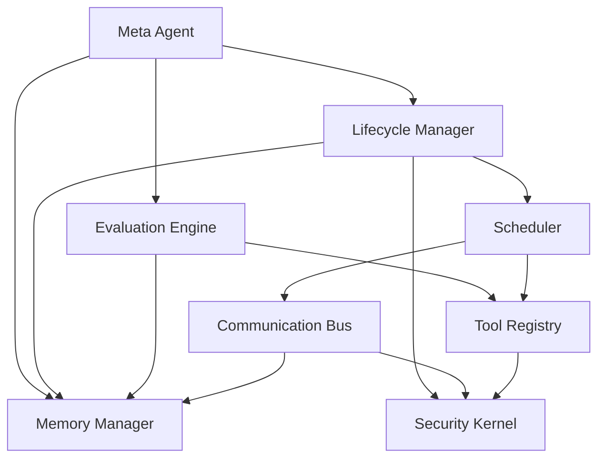
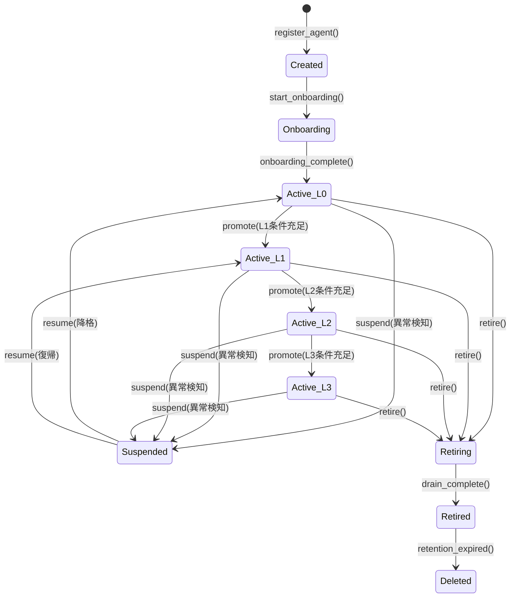
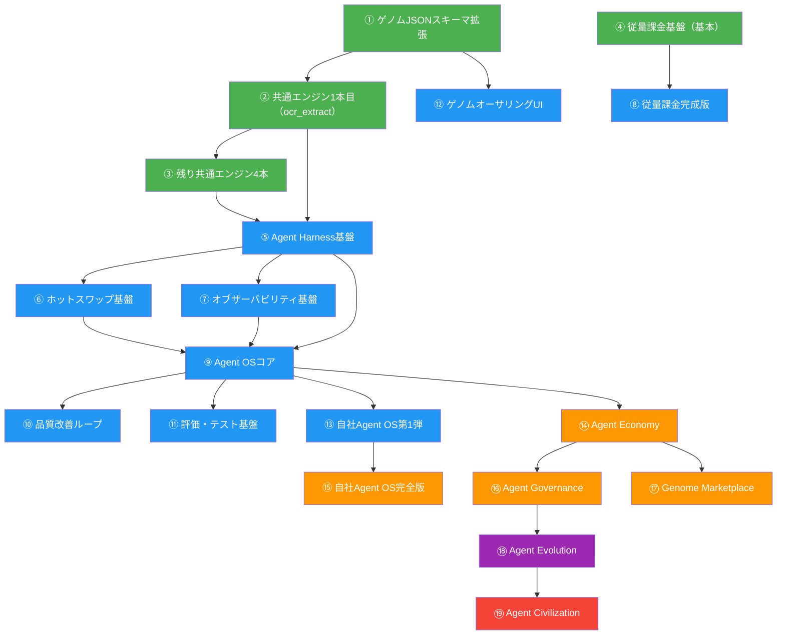

# d_04: Agent OS設計 — 全エージェント統合管理基盤

> **目的**: シャチョツーの全AIエージェントを統合管理するOS（Operating System）を設計する。
> 個々のエージェントの実行制御だけでなく、ライフサイクル管理・メモリ管理・セキュリティ・品質改善・自己進化までを担う。
> **位置づけ**: d_00（BPOアーキテクチャ）・d_01（エンジン設計）の上位レイヤー。全エージェントの「脳幹」。

---

## 0. 4層+2アーキテクチャ概要

シャチョツーの進化ロードマップ全体像。

| Level | 名称 | 概要 | フェーズ |
|---|---|---|---|
| 1 | Agent | 個の業務遂行（見積作成、請求照合等） | Phase 1（今） |
| 2 | Agent OS | 全エージェントの統合管理基盤 | Phase 2 |
| 3 | Agent Economy | エージェント間取引・連携 | Phase 3 |
| 4 | Agent Governance | 自律的統治・規制 | Phase 3+ |
| 5 | Agent Evolution | 自己進化・新エージェント自動生成 | Phase 4+ |
| 6 | Agent Civilization | 外部AI接続・B2B経済圏 | 5年後+ |

本設計書はLevel 2（Agent OS）を対象とする。Level 3以降はd_05を参照。

```
┌──────────────────────────────────────────────────────────────┐
│                    Agent OS                                    │
├──────────────────────────────────────────────────────────────┤
│  §2 Lifecycle Manager  │  §3 Memory Manager                   │
│  §4 Tool Registry      │  §5 Communication Bus                │
│  §6 Security Kernel    │  §7 Evaluation Engine                │
│  §8 Scheduler          │  §9 セーフティ（キルスイッチ）        │
│  §10 コスト制御        │  §11 オブザーバビリティ               │
│  §12 コールドスタート  │  §13 バージョニング                   │
│  §14 知識衝突解決      │  §15 レジリエンス                     │
│  §16 テナント学習隔離  │  §17 OS成長パス                       │
│  §18 品質改善ループ   │  §19 品質ゲート                        │
│  §20 実装優先順位      │                                       │
└──────────────────────────────────────────────────────────────┘
```

---

## §1 Agent OSの全体アーキテクチャ

Agent OSは以下の8コンポーネントから構成される。

```
Agent OS
├── Lifecycle Manager    — エージェントの生成→監視→昇格/降格→停止→引退
├── Memory Manager       — 短期/長期/エピソード記憶・スナップショット・GC
├── Tool Registry        — 内部/外部ツール・権限管理・ヘルスチェック
├── Communication Bus    — エージェント間通信（同一顧客/同一業界/異業界/外部）
├── Security Kernel      — テナント隔離・権限・ガードレール・監査・キルスイッチ
├── Evaluation Engine    — リグレッション・A/B・ベンチマーク・ドリフト検知
├── Scheduler            — 定期/イベント駆動/プロアクティブ/コスト平準化
└── Meta Agent           — OS自体の自律改善（品質改善・進化提案）
```

### コンポーネント間の依存関係



### データフロー全体図

```
                  ┌─────────────────────────────────┐
                  │       Human (Dashboard)          │
                  └──────────┬──────────────────────┘
                             │ 承認/フィードバック/キルスイッチ
                             ▼
┌─────────────────────────────────────────────────────────────┐
│                     Agent OS Core                            │
│  ┌──────────┐  ┌──────────┐  ┌──────────┐  ┌──────────┐    │
│  │Lifecycle │  │ Memory   │  │ Security │  │Evaluation│    │
│  │ Manager  │←→│ Manager  │←→│ Kernel   │←→│ Engine   │    │
│  └────┬─────┘  └────┬─────┘  └────┬─────┘  └────┬─────┘    │
│       │              │              │              │          │
│  ┌────▼─────┐  ┌────▼─────┐  ┌────▼─────┐  ┌────▼─────┐    │
│  │Scheduler │  │  Tool    │  │  Comm    │  │  Meta    │    │
│  │          │←→│ Registry │←→│  Bus     │←→│  Agent   │    │
│  └──────────┘  └──────────┘  └──────────┘  └──────────┘    │
└─────────────────────────┬───────────────────────────────────┘
                          │
          ┌───────────────┼───────────────┐
          ▼               ▼               ▼
    ┌──────────┐   ┌──────────┐   ┌──────────┐
    │ BPO      │   │ Brain    │   │ Connector│
    │ Agents   │   │ Agents   │   │ Agents   │
    │(16業種)  │   │(Q&A/Twin)│   │(kintone等)│
    └──────────┘   └──────────┘   └──────────┘
```

---

## §2 Lifecycle Manager

エージェントの全生涯を管理する。

### エージェント生成: Agent Factory連携

Agent Factory (`engine/agent_factory.py`) を使用して、genome JSON + knowledge_items から BPOAgentRole を自動生成する。
Lifecycle Manager は生成された BPOAgentRole を受け取り、`agent_instances` テーブルに登録して状態遷移を開始する。

### 状態遷移

```
Created → Onboarding → Active(Level 0) → Active(Level 1) → Active(Level 2) → Active(Level 3)
                                              ↓                    ↓
                                          Suspended           Suspended
                                              ↓                    ↓
                                          Active(降格)          Active(降格)

Active(any) → Retiring → Retired(データ保持) → Deleted(保持期間後)
```

### 状態遷移の詳細定義



### 昇格条件（定量的・自動判定）

| 昇格 | 条件 | 測定方法 | 判定間隔 |
|---|---|---|---|
| → Level 1 | 1週間安定稼働 + テスト全pass + エラー率<1% | 自動テスト + メトリクス | 日次 |
| → Level 2 | 診断精度85%超 + 顧客影響0件 + 累計処理100件超 | シャドーモード正答率 | 週次 |
| → Level 3 | 改善成功率90%超 + 累計70件超 + ロールバック率5%以下 | 品質ゲート通過率 | 週次 |

### 降格条件（自動判定）

| 降格 | 条件 | アクション |
|---|---|---|
| Level 3 → 2 | ロールバック率10%超 or 精度80%未満が3日連続 | 自動降格 + 管理者通知 |
| Level 2 → 1 | 顧客影響1件発生 or 精度75%未満 | 自動降格 + 原因分析開始 |
| Level 1 → Suspended | エラー率5%超 or テスト2件以上fail | 即座停止 + スナップショット復元 |

### DBスキーマ

```sql
-- agent_instances: エージェントインスタンスの管理テーブル
CREATE TABLE agent_instances (
    id UUID PRIMARY KEY DEFAULT gen_random_uuid(),
    company_id UUID NOT NULL REFERENCES companies(id),
    agent_type TEXT NOT NULL,           -- 'estimation', 'billing', 'qa' etc.
    industry TEXT NOT NULL,             -- 'construction', 'manufacturing' etc.
    status TEXT NOT NULL DEFAULT 'created',  -- created/onboarding/active/suspended/retiring/retired/deleted
    level INTEGER NOT NULL DEFAULT 0,   -- 0-3
    genome_version TEXT NOT NULL,       -- 'v1.0.0'
    memory_snapshot_id UUID,            -- 最新スナップショットへの参照
    config JSONB NOT NULL DEFAULT '{}', -- エージェント固有設定
    metrics JSONB NOT NULL DEFAULT '{}', -- 直近の精度・エラー率等
    promoted_at TIMESTAMPTZ,            -- 最後の昇格日時
    suspended_at TIMESTAMPTZ,
    created_at TIMESTAMPTZ NOT NULL DEFAULT now(),
    updated_at TIMESTAMPTZ NOT NULL DEFAULT now()
);

-- RLS: テナント分離
ALTER TABLE agent_instances ENABLE ROW LEVEL SECURITY;
CREATE POLICY agent_instances_tenant ON agent_instances
    USING (company_id = current_setting('app.company_id')::UUID);

-- agent_lifecycle_events: 状態遷移の全履歴
CREATE TABLE agent_lifecycle_events (
    id UUID PRIMARY KEY DEFAULT gen_random_uuid(),
    agent_id UUID NOT NULL REFERENCES agent_instances(id),
    company_id UUID NOT NULL,
    event_type TEXT NOT NULL,   -- 'created','promoted','demoted','suspended','resumed','retired'
    from_status TEXT,
    to_status TEXT,
    from_level INTEGER,
    to_level INTEGER,
    reason TEXT,                -- 昇格/降格の理由（自動生成）
    metadata JSONB DEFAULT '{}',
    created_at TIMESTAMPTZ NOT NULL DEFAULT now()
);

ALTER TABLE agent_lifecycle_events ENABLE ROW LEVEL SECURITY;
CREATE POLICY agent_lifecycle_events_tenant ON agent_lifecycle_events
    USING (company_id = current_setting('app.company_id')::UUID);
```

### Pythonモデル

```python
# shachotwo-app/brain/os/lifecycle.py

from enum import Enum
from pydantic import BaseModel
from datetime import datetime
from typing import Optional
import uuid


class AgentStatus(str, Enum):
    CREATED = "created"
    ONBOARDING = "onboarding"
    ACTIVE = "active"
    SUSPENDED = "suspended"
    RETIRING = "retiring"
    RETIRED = "retired"
    DELETED = "deleted"


class AgentLevel(int, Enum):
    L0 = 0  # 初期: ルールベースのみ
    L1 = 1  # 安定: LLM補助あり
    L2 = 2  # 自律: 人間は抜き打ち監査のみ
    L3 = 3  # 完全自律: 改善も自律


class AgentInstance(BaseModel):
    id: uuid.UUID
    company_id: uuid.UUID
    agent_type: str
    industry: str
    status: AgentStatus
    level: AgentLevel
    genome_version: str
    config: dict = {}
    metrics: dict = {}
    promoted_at: Optional[datetime] = None
    created_at: datetime


class PromotionChecker:
    """昇格条件の自動判定"""

    PROMOTION_RULES = {
        AgentLevel.L0: {
            "target": AgentLevel.L1,
            "min_uptime_days": 7,
            "max_error_rate": 0.01,
            "tests_must_pass": True,
        },
        AgentLevel.L1: {
            "target": AgentLevel.L2,
            "min_accuracy": 0.85,
            "min_tasks_completed": 100,
            "max_customer_incidents": 0,
        },
        AgentLevel.L2: {
            "target": AgentLevel.L3,
            "min_improvement_success_rate": 0.90,
            "min_improvements_count": 70,
            "max_rollback_rate": 0.05,
        },
    }

    async def check_promotion(self, agent: AgentInstance) -> Optional[AgentLevel]:
        rules = self.PROMOTION_RULES.get(agent.level)
        if not rules:
            return None  # Level 3は最高レベル

        metrics = agent.metrics
        target = rules["target"]

        if agent.level == AgentLevel.L0:
            if (
                metrics.get("uptime_days", 0) >= rules["min_uptime_days"]
                and metrics.get("error_rate", 1.0) <= rules["max_error_rate"]
                and metrics.get("tests_all_pass", False)
            ):
                return target

        elif agent.level == AgentLevel.L1:
            if (
                metrics.get("accuracy", 0) >= rules["min_accuracy"]
                and metrics.get("tasks_completed", 0) >= rules["min_tasks_completed"]
                and metrics.get("customer_incidents", 1) <= rules["max_customer_incidents"]
            ):
                return target

        elif agent.level == AgentLevel.L2:
            if (
                metrics.get("improvement_success_rate", 0) >= rules["min_improvement_success_rate"]
                and metrics.get("improvements_count", 0) >= rules["min_improvements_count"]
                and metrics.get("rollback_rate", 1.0) <= rules["max_rollback_rate"]
            ):
                return target

        return None
```

---

## §3 Memory Manager

### 3層メモリ構造

| メモリ種別 | 保存先 | 寿命 | 用途 | アクセス速度 |
|---|---|---|---|---|
| 短期メモリ | Redis | タスク終了まで | 実行中の作業記憶 | <1ms |
| 長期メモリ | Supabase | 永続 | 会社固有の学習済みルール | <50ms |
| エピソード記憶 | Supabase | 1年 | 過去の実行履歴・判断ログ | <100ms |

### メモリ構造の詳細

```
Memory Manager
├── Short-Term Memory (Redis)
│   ├── task_context:{task_id}      — 現在のタスク文脈
│   ├── conversation:{session_id}   — セッション中の会話履歴
│   └── scratch:{agent_id}          — 一時計算領域
│
├── Long-Term Memory (Supabase)
│   ├── learned_rules               — 学習済みルール（「A社は常に端数切上」等）
│   ├── entity_knowledge            — 取引先・担当者の知識
│   └── preference_patterns         — 顧客の好みパターン
│
└── Episodic Memory (Supabase)
    ├── execution_logs              — 全実行ログ（入力→判断→出力）
    ├── feedback_records            — 人間の修正履歴
    └── decision_explanations       — 判断理由の記録
```

### DBスキーマ

```sql
-- agent_memories: 長期メモリ
CREATE TABLE agent_memories (
    id UUID PRIMARY KEY DEFAULT gen_random_uuid(),
    company_id UUID NOT NULL,
    agent_id UUID NOT NULL REFERENCES agent_instances(id),
    memory_type TEXT NOT NULL,       -- 'learned_rule', 'entity_knowledge', 'preference'
    key TEXT NOT NULL,               -- 検索用キー（例: 'rounding_rule'）
    value JSONB NOT NULL,            -- メモリ本体
    confidence FLOAT NOT NULL DEFAULT 0.5,  -- 確信度 0.0-1.0
    source TEXT NOT NULL,            -- 'feedback', 'shadow', 'transfer', 'manual'
    access_count INTEGER DEFAULT 0,  -- 参照回数（GC判定用）
    last_accessed_at TIMESTAMPTZ,
    expires_at TIMESTAMPTZ,          -- エピソード記憶のTTL
    created_at TIMESTAMPTZ NOT NULL DEFAULT now(),
    updated_at TIMESTAMPTZ NOT NULL DEFAULT now()
);

CREATE INDEX idx_agent_memories_lookup
    ON agent_memories(company_id, agent_id, memory_type, key);

ALTER TABLE agent_memories ENABLE ROW LEVEL SECURITY;
CREATE POLICY agent_memories_tenant ON agent_memories
    USING (company_id = current_setting('app.company_id')::UUID);

-- agent_snapshots: メモリスナップショット
CREATE TABLE agent_snapshots (
    id UUID PRIMARY KEY DEFAULT gen_random_uuid(),
    company_id UUID NOT NULL,
    agent_id UUID NOT NULL REFERENCES agent_instances(id),
    snapshot_type TEXT NOT NULL,      -- 'daily', 'pre_operation', 'manual'
    genome_version TEXT NOT NULL,
    memories JSONB NOT NULL,          -- 全メモリのダンプ
    config JSONB NOT NULL,            -- エージェント設定のダンプ
    metrics_at_snapshot JSONB,        -- スナップショット時点の精度
    size_bytes BIGINT,
    created_at TIMESTAMPTZ NOT NULL DEFAULT now()
);

CREATE INDEX idx_agent_snapshots_lookup
    ON agent_snapshots(company_id, agent_id, created_at DESC);

ALTER TABLE agent_snapshots ENABLE ROW LEVEL SECURITY;
CREATE POLICY agent_snapshots_tenant ON agent_snapshots
    USING (company_id = current_setting('app.company_id')::UUID);
```

### スナップショット

- 毎日自動保存（ゲノム + メモリの完全コピー）
- 重要操作前にも保存
- ロールバック: 「3月25日時点に戻す」が可能
- ガベージコレクション: 90日以上前のスナップショットは週次に間引き

### ガベージコレクション戦略

```python
# shachotwo-app/brain/os/memory_gc.py

class MemoryGarbageCollector:
    """メモリの自動クリーンアップ"""

    # 間引きポリシー
    RETENTION_POLICIES = {
        "daily_snapshots": {
            "keep_all_within_days": 7,       # 直近7日は全保持
            "keep_weekly_within_days": 30,   # 30日以内は週次に間引き
            "keep_monthly_within_days": 90,  # 90日以内は月次に間引き
            "delete_after_days": 365,        # 1年超は削除
        },
        "episodic_memories": {
            "low_confidence_ttl_days": 30,   # 確信度0.3未満は30日で削除
            "unused_ttl_days": 180,          # 180日未参照は削除
            "max_per_agent": 10000,          # エージェントあたり上限
        },
    }

    async def run_gc(self, agent_id: str) -> dict:
        """週次GCジョブ"""
        results = {
            "snapshots_deleted": 0,
            "memories_deleted": 0,
            "space_freed_mb": 0,
        }

        # 1. スナップショットの間引き
        results["snapshots_deleted"] = await self._thin_snapshots(agent_id)

        # 2. 低確信度エピソードの削除
        results["memories_deleted"] = await self._gc_episodic(agent_id)

        # 3. 未参照メモリの削除
        results["memories_deleted"] += await self._gc_unused(agent_id)

        return results
```

---

## §4 Tool Registry

### パイプラインレジストリ: GenomeRegistry連携

GenomeRegistry (`engine/genome_registry.py`) が `brain/genome/data/*.json` を動的解析し、パイプラインレジストリを構築する。
Tool Registry はこのパイプラインレジストリを参照して、各エージェントが利用可能なパイプラインとツールの組み合わせを管理する。

### ツール定義

```python
# shachotwo-app/brain/os/tool_registry.py

from pydantic import BaseModel
from enum import Enum
from typing import Optional


class ToolCategory(str, Enum):
    INTERNAL = "internal"
    EXTERNAL = "external"
    LLM = "llm"


class ToolHealth(str, Enum):
    HEALTHY = "healthy"
    DEGRADED = "degraded"
    DOWN = "down"


class ToolDefinition(BaseModel):
    name: str
    category: ToolCategory
    description: str
    required_level: int = 0          # 使用に必要なエージェントレベル
    required_permissions: list[str] = []
    fallback_tool: Optional[str] = None  # フォールバック先
    health: ToolHealth = ToolHealth.HEALTHY
    avg_latency_ms: float = 0
    error_rate_24h: float = 0


class ToolRegistry:
    """全ツールの登録・権限管理・ヘルスチェック"""

    TOOLS = {
        # --- 内部ツール ---
        "ocr": ToolDefinition(
            name="ocr",
            category=ToolCategory.INTERNAL,
            description="Google Document AI: 帳票OCR",
            required_level=0,
            required_permissions=["ocr:read"],
        ),
        "llm_fast": ToolDefinition(
            name="llm_fast",
            category=ToolCategory.LLM,
            description="Gemini 2.5 Flash: 高速推論",
            required_level=0,
            required_permissions=["llm:invoke"],
            fallback_tool="llm_standard",
        ),
        "llm_standard": ToolDefinition(
            name="llm_standard",
            category=ToolCategory.LLM,
            description="Claude Sonnet: 標準推論",
            required_level=1,
            required_permissions=["llm:invoke"],
            fallback_tool="llm_fast",
        ),
        "llm_premium": ToolDefinition(
            name="llm_premium",
            category=ToolCategory.LLM,
            description="Claude Opus: 複雑推論",
            required_level=2,
            required_permissions=["llm:invoke_premium"],
            fallback_tool="llm_standard",
        ),
        "db_read": ToolDefinition(
            name="db_read",
            category=ToolCategory.INTERNAL,
            description="Supabase: データ読取",
            required_level=0,
            required_permissions=["db:read"],
        ),
        "db_write": ToolDefinition(
            name="db_write",
            category=ToolCategory.INTERNAL,
            description="Supabase: データ書込",
            required_level=1,
            required_permissions=["db:write"],
        ),
        "notification": ToolDefinition(
            name="notification",
            category=ToolCategory.INTERNAL,
            description="Slack/LINE WORKS: 通知送信",
            required_level=0,
            required_permissions=["notify:send"],
        ),
        "calculation": ToolDefinition(
            name="calculation",
            category=ToolCategory.INTERNAL,
            description="計算エンジン: 見積/請求計算",
            required_level=0,
            required_permissions=["calc:execute"],
        ),

        # --- 外部コネクタ ---
        "kintone": ToolDefinition(
            name="kintone",
            category=ToolCategory.EXTERNAL,
            description="kintone: レコードCRUD",
            required_level=1,
            required_permissions=["connector:kintone"],
            fallback_tool=None,
        ),
        "freee": ToolDefinition(
            name="freee",
            category=ToolCategory.EXTERNAL,
            description="freee: 会計データ連携",
            required_level=1,
            required_permissions=["connector:freee"],
            fallback_tool=None,
        ),
        "slack": ToolDefinition(
            name="slack",
            category=ToolCategory.EXTERNAL,
            description="Slack: メッセージ/チャンネル",
            required_level=0,
            required_permissions=["connector:slack"],
            fallback_tool="notification",
        ),
        "line_works": ToolDefinition(
            name="line_works",
            category=ToolCategory.EXTERNAL,
            description="LINE WORKS: メッセージ",
            required_level=0,
            required_permissions=["connector:line_works"],
            fallback_tool="notification",
        ),
    }

    async def check_permission(
        self, agent: "AgentInstance", tool_name: str
    ) -> bool:
        """エージェントがツールを使用できるか判定"""
        tool = self.TOOLS.get(tool_name)
        if not tool:
            return False

        # レベルチェック
        if agent.level < tool.required_level:
            return False

        # 権限チェック（エージェント設定から）
        agent_permissions = agent.config.get("permissions", [])
        return all(p in agent_permissions for p in tool.required_permissions)

    async def get_healthy_tool(self, tool_name: str) -> Optional[ToolDefinition]:
        """正常なツールを返す（ダウン時はフォールバック）"""
        tool = self.TOOLS.get(tool_name)
        if not tool:
            return None

        if tool.health == ToolHealth.HEALTHY:
            return tool

        # フォールバック
        if tool.fallback_tool:
            return await self.get_healthy_tool(tool.fallback_tool)

        return None  # フォールバックなし & ダウン
```

### ヘルスチェック

```python
class ToolHealthChecker:
    """ツールの死活監視（60秒間隔）"""

    CHECK_INTERVAL_SEC = 60
    CIRCUIT_BREAKER_THRESHOLD = 5  # 5回連続失敗で回路遮断

    async def check_all(self) -> dict[str, ToolHealth]:
        results = {}
        for name, tool in ToolRegistry.TOOLS.items():
            try:
                latency = await self._ping(tool)
                if latency > 5000:  # 5秒超
                    results[name] = ToolHealth.DEGRADED
                else:
                    results[name] = ToolHealth.HEALTHY
                    tool.avg_latency_ms = latency
            except Exception:
                tool.error_rate_24h += 1
                if tool.error_rate_24h >= self.CIRCUIT_BREAKER_THRESHOLD:
                    results[name] = ToolHealth.DOWN
                else:
                    results[name] = ToolHealth.DEGRADED
        return results
```

---

## §5 Communication Bus

### 通信タイプ

| 通信タイプ | 例 | プロトコル | 遅延許容 |
|---|---|---|---|
| 同一顧客内 | 積算→経理にタスクリレー | 内部メッセージキュー | <1秒 |
| 同一業界内 | 匿名化ベンチマーク共有 | 匿名化+集約API | <1分 |
| 異業界間 | 建設→卸売への発注（Phase 3+） | Agent Marketplace API | <5分 |
| 外部通知 | 人間への報告・承認依頼 | Slack/メール/LINE | <30秒 |

### メッセージフォーマット

```python
# shachotwo-app/brain/os/communication.py

from pydantic import BaseModel
from datetime import datetime
from enum import Enum
import uuid


class MessagePriority(str, Enum):
    CRITICAL = "critical"    # キルスイッチ等: 即座配信
    HIGH = "high"            # 顧客影響あり: <1秒
    NORMAL = "normal"        # 通常業務: <10秒
    LOW = "low"              # バッチ処理: 次回スケジュール時


class AgentMessage(BaseModel):
    id: uuid.UUID
    from_agent_id: uuid.UUID
    to_agent_id: uuid.UUID          # or broadcast channel
    company_id: uuid.UUID
    message_type: str                # 'task_relay', 'data_request', 'notification', 'kill'
    priority: MessagePriority
    payload: dict
    requires_ack: bool = False       # 受信確認が必要か
    ttl_seconds: int = 3600          # メッセージの生存時間
    created_at: datetime


class CommunicationBus:
    """エージェント間メッセージング"""

    async def send(self, message: AgentMessage) -> bool:
        """メッセージ送信"""
        # 1. Security Kernelで権限チェック
        if not await self._check_comm_permission(message):
            raise PermissionError(
                f"Agent {message.from_agent_id} cannot send to {message.to_agent_id}"
            )

        # 2. 暗号化 + 監査ログ記録
        await self._audit_log(message)

        # 3. 優先度に応じたルーティング
        if message.priority == MessagePriority.CRITICAL:
            return await self._send_immediate(message)
        else:
            return await self._enqueue(message)

    async def broadcast(
        self, from_agent_id: uuid.UUID, company_id: uuid.UUID,
        channel: str, payload: dict
    ) -> int:
        """同一顧客内の全エージェントにブロードキャスト"""
        # 例: 「この取引先の情報が更新された」を全エージェントに通知
        pass

    async def request_approval(
        self, agent_id: uuid.UUID, company_id: uuid.UUID,
        action_description: str, details: dict
    ) -> uuid.UUID:
        """人間への承認依頼（Slack/LINE WORKS経由）"""
        pass
```

### 同一顧客内タスクリレーの例

```
[積算エージェント] --完了通知--> [Communication Bus] --タスクリレー--> [経理エージェント]
       │                                                                    │
       │  payload: {                                                        │
       │    "estimate_id": "xxx",                                           │
       │    "total_amount": 15000000,                                       │
       │    "action": "generate_invoice"                                    │
       │  }                                                                 │
       │                                                              [請求書自動生成]
```

---

## §6 Security Kernel

### 自律エージェント固有のセキュリティ（a_01 §39に対応）

| 脅威 | 対策 | 検知方法 |
|---|---|---|
| エージェントの暴走 | Level制御 + ガードレール + キルスイッチ | 異常パターン検知（5分以内に停止） |
| 学習データの漏洩 | テナント完全隔離（RLS + 論理分離） | 通信監査ログ + 異常アクセス検知 |
| 学習の汚染 | フィードバックの品質チェック + 異常値除去 | 統計的外れ値検知 |
| 権限昇格の不正 | 昇格条件は定量的・自動判定（人間の恣意性排除） | 昇格イベントの全件監査 |
| エージェント間の情報漏洩 | Communication Busの通信は全て暗号化+監査ログ | company_id不一致の通信遮断 |
| プロンプトインジェクション | 入力サニタイズ + 出力検証 + サンドボックス実行 | パターンマッチ + LLM検証 |

### ガードレール（Level別）

```python
# shachotwo-app/brain/os/security_kernel.py

class GuardrailConfig:
    """レベル別のガードレール設定"""

    GUARDRAILS = {
        0: {
            "max_cost_per_task_yen": 100,
            "allowed_tools": ["ocr", "llm_fast", "db_read", "calculation"],
            "requires_human_approval": ["db_write", "notification"],
            "max_tasks_per_hour": 50,
            "can_modify_genome": False,
            "can_communicate_cross_agent": False,
        },
        1: {
            "max_cost_per_task_yen": 300,
            "allowed_tools": [
                "ocr", "llm_fast", "llm_standard", "db_read",
                "db_write", "calculation", "notification", "slack",
            ],
            "requires_human_approval": ["kintone", "freee"],
            "max_tasks_per_hour": 200,
            "can_modify_genome": False,
            "can_communicate_cross_agent": True,
        },
        2: {
            "max_cost_per_task_yen": 1000,
            "allowed_tools": "__all__",
            "requires_human_approval": ["llm_premium"],
            "max_tasks_per_hour": 500,
            "can_modify_genome": True,  # サンドボックス経由のみ
            "can_communicate_cross_agent": True,
        },
        3: {
            "max_cost_per_task_yen": 3000,
            "allowed_tools": "__all__",
            "requires_human_approval": [],
            "max_tasks_per_hour": 1000,
            "can_modify_genome": True,
            "can_communicate_cross_agent": True,
        },
    }


class SecurityKernel:
    """セキュリティの中核"""

    async def authorize_action(
        self, agent: "AgentInstance", action: str, tool: str, cost_yen: float
    ) -> tuple[bool, str]:
        """アクション実行前の認可チェック"""
        guardrail = GuardrailConfig.GUARDRAILS[agent.level]

        # 1. コスト上限チェック
        if cost_yen > guardrail["max_cost_per_task_yen"]:
            return False, f"コスト上限超過: {cost_yen}円 > {guardrail['max_cost_per_task_yen']}円"

        # 2. ツール権限チェック
        allowed = guardrail["allowed_tools"]
        if allowed != "__all__" and tool not in allowed:
            return False, f"ツール {tool} はLevel {agent.level} では使用不可"

        # 3. 人間承認チェック
        if tool in guardrail["requires_human_approval"]:
            return False, f"ツール {tool} は人間の承認が必要"

        # 4. レートリミットチェック
        if await self._check_rate_limit(agent.id, guardrail["max_tasks_per_hour"]):
            return False, "レートリミット超過"

        # 5. テナント隔離チェック
        if not await self._verify_tenant_isolation(agent):
            return False, "テナント隔離違反"

        return True, "authorized"

    async def kill_switch(self, agent_id: uuid.UUID, reason: str) -> bool:
        """緊急停止"""
        # 1. エージェントを即座にSuspended状態に
        # 2. 実行中タスクを安全にキャンセル
        # 3. 前回正常スナップショットをホットスタンバイに切替
        # 4. 管理者に緊急通知
        # 5. 診断エージェントを起動
        pass
```

### 監査ログ

```sql
-- agent_audit_logs: 全アクションの監査証跡
CREATE TABLE agent_audit_logs (
    id UUID PRIMARY KEY DEFAULT gen_random_uuid(),
    company_id UUID NOT NULL,
    agent_id UUID NOT NULL,
    action TEXT NOT NULL,           -- 'tool_invoke', 'memory_write', 'comm_send', 'kill_switch'
    tool_name TEXT,
    target_resource TEXT,
    input_hash TEXT,                -- 入力のハッシュ（PII非保存）
    result TEXT NOT NULL,           -- 'authorized', 'denied', 'error'
    cost_yen FLOAT DEFAULT 0,
    latency_ms INTEGER,
    metadata JSONB DEFAULT '{}',
    created_at TIMESTAMPTZ NOT NULL DEFAULT now()
);

-- パーティション（月次）: 大量の監査ログを効率管理
CREATE INDEX idx_audit_logs_lookup
    ON agent_audit_logs(company_id, agent_id, created_at DESC);

ALTER TABLE agent_audit_logs ENABLE ROW LEVEL SECURITY;
CREATE POLICY agent_audit_logs_tenant ON agent_audit_logs
    USING (company_id = current_setting('app.company_id')::UUID);
```

---

## §7 Evaluation Engine

### 4つの評価手法

| # | 手法 | 目的 | 頻度 | 自動化 |
|---|---|---|---|---|
| 1 | リグレッションテスト | ゲノム変更時に退行がないか確認 | 変更時 | 完全自動 |
| 2 | A/Bテスト | 設定変更の効果を定量比較 | 随時 | 半自動（設定は手動） |
| 3 | ベンチマーク | 業界標準テストセットでスコアリング | 月次 | 完全自動 |
| 4 | ドリフト検知 | 精度トレンドの下降を早期発見 | 週次 | 完全自動 |

### 実装

```python
# shachotwo-app/brain/os/evaluation.py

from pydantic import BaseModel
from typing import Optional
from datetime import datetime


class EvaluationResult(BaseModel):
    agent_id: str
    eval_type: str          # 'regression', 'ab_test', 'benchmark', 'drift'
    score: float            # 0.0 - 1.0
    baseline_score: float   # 比較対象のスコア
    delta: float            # score - baseline_score
    passed: bool
    details: dict
    evaluated_at: datetime


class EvaluationEngine:
    """エージェントの品質評価"""

    # --- 1. リグレッションテスト ---
    async def run_regression(
        self, agent_id: str, genome_version: str, gold_set_size: int = 100
    ) -> EvaluationResult:
        """
        ゲノム変更時に過去のゴールドセット（正解付きデータ）で精度を測定。
        精度が現行バージョン以上であることを確認。
        """
        # 1. ゴールドセット取得（過去の正解付きデータ）
        gold_set = await self._get_gold_set(agent_id, limit=gold_set_size)

        # 2. 新ゲノムで全件推論
        predictions = await self._run_predictions(agent_id, genome_version, gold_set)

        # 3. 正解率計算
        accuracy = self._calculate_accuracy(predictions, gold_set)
        baseline = await self._get_current_accuracy(agent_id)

        return EvaluationResult(
            agent_id=agent_id,
            eval_type="regression",
            score=accuracy,
            baseline_score=baseline,
            delta=accuracy - baseline,
            passed=accuracy >= baseline,
            details={"gold_set_size": gold_set_size, "errors": self._get_error_details(predictions, gold_set)},
            evaluated_at=datetime.utcnow(),
        )

    # --- 2. A/Bテスト ---
    async def run_ab_test(
        self, agent_id: str,
        variant_a_config: dict,
        variant_b_config: dict,
        sample_size: int = 50,
    ) -> dict:
        """2つの設定を同一データで比較"""
        results_a = await self._run_with_config(agent_id, variant_a_config, sample_size)
        results_b = await self._run_with_config(agent_id, variant_b_config, sample_size)

        return {
            "variant_a": {"accuracy": results_a["accuracy"], "avg_cost": results_a["avg_cost"]},
            "variant_b": {"accuracy": results_b["accuracy"], "avg_cost": results_b["avg_cost"]},
            "winner": "a" if results_a["accuracy"] >= results_b["accuracy"] else "b",
            "statistically_significant": self._check_significance(results_a, results_b),
        }

    # --- 3. ベンチマーク ---
    async def run_benchmark(self, agent_id: str, industry: str) -> EvaluationResult:
        """業界標準テストセットでスコアリング"""
        benchmark_set = await self._get_benchmark_set(industry)
        # ... 評価実行 ...
        pass

    # --- 4. ドリフト検知 ---
    async def detect_drift(self, agent_id: str, window_weeks: int = 4) -> dict:
        """
        直近N週間の精度トレンドを分析。
        下降トレンドを検知したらアラート。
        """
        weekly_scores = await self._get_weekly_scores(agent_id, window_weeks)

        # 線形回帰でトレンド判定
        slope = self._calculate_trend_slope(weekly_scores)

        return {
            "weekly_scores": weekly_scores,
            "trend_slope": slope,
            "drifting": slope < -0.02,  # 週あたり2%以上の下降
            "alert_level": "critical" if slope < -0.05 else "warning" if slope < -0.02 else "normal",
        }
```

### ゴールドセット管理

```sql
-- evaluation_gold_sets: テスト用正解データ
CREATE TABLE evaluation_gold_sets (
    id UUID PRIMARY KEY DEFAULT gen_random_uuid(),
    company_id UUID NOT NULL,
    agent_id UUID NOT NULL,
    industry TEXT NOT NULL,
    input_data JSONB NOT NULL,         -- テスト入力
    expected_output JSONB NOT NULL,    -- 正解データ
    difficulty TEXT DEFAULT 'normal',  -- 'easy', 'normal', 'hard', 'edge_case'
    source TEXT NOT NULL,              -- 'feedback', 'manual', 'synthetic'
    is_active BOOLEAN DEFAULT true,
    created_at TIMESTAMPTZ NOT NULL DEFAULT now()
);

ALTER TABLE evaluation_gold_sets ENABLE ROW LEVEL SECURITY;
CREATE POLICY evaluation_gold_sets_tenant ON evaluation_gold_sets
    USING (company_id = current_setting('app.company_id')::UUID);
```

---

## §8 Scheduler

### トリガー種別

| トリガー種別 | 例 | 実装 |
|---|---|---|
| 定期（cron） | 月末請求、週次レポート、日次チェック | APScheduler / Cloud Scheduler |
| イベント駆動 | 書類アップロード→即時処理 | Supabase Webhooks / Pub/Sub |
| プロアクティブ | エージェントが自分でタスクを発見 | Level 2+のみ許可 |
| コスト最適化 | 処理量の平準化（ピーク時は後回し） | 優先度キュー + 遅延実行 |

### スケジューラ実装

```python
# shachotwo-app/brain/os/scheduler.py

from pydantic import BaseModel
from enum import Enum
from datetime import datetime
from typing import Optional
import uuid


class TriggerType(str, Enum):
    CRON = "cron"
    EVENT = "event"
    PROACTIVE = "proactive"
    COST_OPTIMIZED = "cost_optimized"


class ScheduledTask(BaseModel):
    id: uuid.UUID
    company_id: uuid.UUID
    agent_id: uuid.UUID
    trigger_type: TriggerType
    cron_expression: Optional[str] = None    # "0 0 1 * *" = 毎月1日
    event_trigger: Optional[str] = None      # "file_uploaded", "invoice_received"
    task_type: str                            # パイプライン名
    config: dict = {}
    priority: int = 5                        # 1(最高) - 10(最低)
    max_cost_yen: float = 1000               # タスクあたりコスト上限
    is_active: bool = True
    last_run_at: Optional[datetime] = None
    next_run_at: Optional[datetime] = None


class Scheduler:
    """タスクスケジューリング"""

    async def register_cron(self, task: ScheduledTask) -> str:
        """定期タスクを登録"""
        pass

    async def on_event(self, event_type: str, company_id: uuid.UUID, payload: dict):
        """イベント駆動: マッチするタスクを即座実行"""
        matching_tasks = await self._find_tasks_by_event(event_type, company_id)
        for task in matching_tasks:
            await self._enqueue(task, payload)

    async def cost_optimized_enqueue(self, task: ScheduledTask, payload: dict):
        """
        コスト最適化キューイング:
        - ピーク時（9-12時）は優先度の低いタスクを後回し
        - 深夜帯（2-5時）にバッチ処理を集中
        - LLMコスト上限に達したテナントは翌日に繰り越し
        """
        current_hour = datetime.utcnow().hour + 9  # JST
        if 9 <= current_hour <= 12 and task.priority > 5:
            # ピーク時の低優先度タスクは遅延
            task.next_run_at = self._next_off_peak_slot()
        else:
            await self._enqueue(task, payload)
```

---

## §9 セーフティ（キルスイッチ + ホットスワップ）

### 5分復帰フロー

```
異常検知（自動）
  │
  ├── 0-5分: 異常エージェント停止 → 前回正常スナップショットに瞬時切替
  │          → クライアント影響はここまで（最大5分）
  │
  ├── バックグラウンド（30分-数時間）:
  │   ├── 診断エージェントが自動で原因分析
  │   ├── 修正案を自動生成 + サンドボックステスト
  │   └── 管理者に通知（原因+修正案+精度レポート）
  │
  └── 管理者承認 → 修正版に切替 or 正常版のまま継続
```

### 異常検知パターン

```python
# shachotwo-app/brain/os/safety.py

class AnomalyDetector:
    """異常パターンの自動検知"""

    ANOMALY_RULES = [
        {
            "name": "error_spike",
            "condition": "error_rate_5min > 0.1",      # 5分間エラー率10%超
            "action": "kill_switch",
            "severity": "critical",
        },
        {
            "name": "cost_spike",
            "condition": "cost_1hour > monthly_budget * 0.1",  # 1時間で月予算の10%超
            "action": "suspend_and_notify",
            "severity": "high",
        },
        {
            "name": "accuracy_drop",
            "condition": "accuracy_24h < accuracy_baseline * 0.9",  # 精度10%以上低下
            "action": "notify_and_monitor",
            "severity": "medium",
        },
        {
            "name": "infinite_loop",
            "condition": "same_task_retry_count > 5",   # 同一タスク5回以上リトライ
            "action": "kill_task_and_notify",
            "severity": "high",
        },
        {
            "name": "data_exfiltration",
            "condition": "cross_tenant_data_access_attempt > 0",
            "action": "kill_switch_and_lockdown",
            "severity": "critical",
        },
    ]
```

### ホットスワップ手順

```
1. 異常エージェント(v1.2)を停止
2. スナップショットDB から最新の正常版(v1.1)を取得
3. 正常版のゲノム + メモリをロード（ウォームスタート: <30秒）
4. 新インスタンスをヘルスチェック → pass → ルーティング切替
5. 旧インスタンスの実行中タスクを安全にドレイン
6. 診断エージェント起動 → 原因分析開始
```

### 必要な基盤

- 毎日のスナップショット保存
- ホットスタンバイ（正常版を常にウォーム状態で保持）
- 診断エージェント（原因分析をAIがやる）
- サンドボックスの並列テスト実行

---

## §10 コスト制御（Claude型従量課金）

### 料金モデル

| 項目 | 料金 | 内容 | LLMモデル |
|---|---|---|---|
| ブレイン基本 | ¥30,000/月 | ナレッジ・Q&A・デジタルツイン | — |
| Light | ¥30/タスク | 定型帳票処理 | Gemini Flash |
| Standard | ¥100/タスク | 判断あり | Claude Sonnet相当 |
| Premium | ¥300/タスク | 複雑推論 | Claude Opus相当 |

### ボリュームディスカウント

| 月間タスク数 | 割引率 |
|---|---|
| 〜999 | 0%（定価） |
| 1,000〜4,999 | 10%OFF |
| 5,000〜9,999 | 20%OFF |
| 10,000〜 | 30%OFF |

### 内部コスト管理

```python
# shachotwo-app/brain/os/cost_controller.py

from pydantic import BaseModel


class CostController:
    """テナント別コスト管理"""

    # BPO月額の40%をLLMコスト上限に設定
    LLM_COST_RATIO = 0.40

    # モデル階層別コスト（円/1000トークン）
    MODEL_COSTS = {
        "flash": 0.5,        # Gemini Flash
        "standard": 3.0,     # Claude Sonnet相当
        "premium": 15.0,     # Claude Opus相当
    }

    async def select_model_tier(
        self, company_id: str, task_complexity: str, remaining_budget_yen: float
    ) -> str:
        """
        タスク重要度と残予算でモデル階層を自動選択。
        粗利ガードレール: 予算残少時は自動でモデル階層を下げる。
        """
        budget_ratio = remaining_budget_yen / await self._get_monthly_budget(company_id)

        if budget_ratio < 0.1:
            # 予算残り10%未満: 強制的にFlash
            return "flash"
        elif budget_ratio < 0.3:
            # 予算残り30%未満: Premiumは使わない
            return "flash" if task_complexity == "simple" else "standard"
        else:
            # 通常: タスク複雑度に応じて選択
            return {
                "simple": "flash",
                "moderate": "standard",
                "complex": "premium",
            }.get(task_complexity, "standard")

    async def get_usage_report(self, company_id: str) -> dict:
        """テナント別使用量レポート"""
        return {
            "monthly_budget_yen": await self._get_monthly_budget(company_id),
            "used_yen": await self._get_used_amount(company_id),
            "remaining_yen": 0,  # calculated
            "task_counts": {
                "light": 0,
                "standard": 0,
                "premium": 0,
            },
            "projected_monthly_yen": 0,  # 月末予測
            "alert": None,  # 'warning' if projected > budget * 0.8
        }
```

### コストダッシュボード表示項目

```
┌─────────────────────────────────────────────────┐
│  コスト概要（A社 / 2026年3月）                    │
├─────────────────────────────────────────────────┤
│  月額予算: ¥100,000  │  使用済: ¥67,200 (67%)    │
│  Light:  820件  ¥24,600                          │
│  Standard: 326件  ¥32,600                        │
│  Premium:  33件  ¥9,900                          │
│  割引: -¥0 (1000件未満)                           │
│  月末予測: ¥89,600 ✅ 予算内                      │
└─────────────────────────────────────────────────┘
```

---

## §11 オブザーバビリティ（5層+1設計）

### 6つの観測レイヤー

| # | レイヤー | 内容 | 保存先 | 保持期間 |
|---|---|---|---|---|
| 1 | 思考ログ | エージェントの判断過程を全て記録 | Supabase | 90日 |
| 2 | 判断の説明生成 | 顧客向け「なぜこの結果か」を自然言語で | Supabase | 永続 |
| 3 | リプレイ機能 | 入力+ゲノム版+メモリ状態で完全再現 | スナップショット | 365日 |
| 4 | コンプライアンス監査証跡 | 法定期間保存 | Supabase + GCS | 医療5年/建設10年 |
| 5 | 顧客向け透明性UI | 確信度・参考案件・判断根拠をシンプル表示 | API経由 | — |
| 6 | ドリフト検知 | 週次精度トレンド自動計算、下降でアラート | Supabase | 永続 |

### 思考ログの構造

```python
class ThoughtLog(BaseModel):
    """エージェントの判断1ステップ"""
    task_id: str
    agent_id: str
    step: int
    thought_type: str         # 'observation', 'reasoning', 'decision', 'action'
    content: str              # 「入力画像から品名を抽出→'鉄筋D13'と認識（確信度0.92）」
    confidence: float
    tools_used: list[str]
    cost_yen: float
    latency_ms: int
    timestamp: datetime


class ExplanationGenerator:
    """顧客向けの判断説明を生成"""

    async def generate(self, thought_logs: list[ThoughtLog]) -> str:
        """
        思考ログから顧客向け説明を生成。
        例: 「この見積りは、御社の過去12件の類似案件の平均単価を基に算出しました。
             鉄筋D13の単価¥85,000/tは、業界相場¥80,000-90,000/tの範囲内です。」
        """
        pass
```

### リプレイ機能

```
リプレイに必要な3点セット:
1. 入力データ（原本のハッシュ参照）
2. ゲノムバージョン（v1.2.3）
3. メモリスナップショット（当時の学習状態）

→ この3つがあれば、いつでも「当時と同じ判断」を再現できる
→ 「3月15日の見積りがおかしい」→ リプレイ → 原因特定
```

---

## §12 コールドスタート（オンボーディングエージェント）

### 過去データ遡及学習（Day 1で精度80%）

```
Step 1: 顧客の過去書類を10-50件アップロード
           │
Step 2: OSが全件シミュレーション処理
           │  ┌─────────────────────────────────┐
           │  │ OCR → 抽出 → ゲノム適用 → 出力    │
           │  │ (実際の処理と同一パイプライン)       │
           │  └─────────────────────────────────┘
           │
Step 3: 人間が正解/不正解をまとめてラベル付け
           │  ┌─────────────────────────────────┐
           │  │ ✅ 正解: 42件                      │
           │  │ ❌ 不正解: 8件 → 修正入力           │
           │  └─────────────────────────────────┘
           │
Step 4: → 初日で500件分相当の学習データ
           │
           └→ 精度: 60% → 84%（遡及学習効果）
```

### オンボーディングフロー全体

```python
# shachotwo-app/brain/os/onboarding.py

class OnboardingAgent:
    """新規顧客のコールドスタートを支援"""

    async def start_onboarding(
        self, company_id: str, industry: str, uploaded_files: list[str]
    ) -> dict:
        """
        オンボーディング全自動フロー:
        1. 業界ゲノムテンプレートをロード
        2. 転移学習（同業界の匿名化パターン適用）
        3. 過去データ遡及シミュレーション
        4. 初期精度レポート生成
        """
        # 1. ゲノムテンプレートロード
        genome = await self._load_industry_genome(industry)

        # 2. 転移学習
        transfer_patterns = await self._get_transfer_patterns(industry)
        genome = self._apply_transfer(genome, transfer_patterns)

        # 3. 遡及シミュレーション
        sim_results = await self._run_retrospective(
            company_id, genome, uploaded_files
        )

        # 4. 初期精度レポート
        return {
            "genome_version": genome["version"],
            "files_processed": len(uploaded_files),
            "initial_accuracy": sim_results["accuracy"],
            "needs_labeling": sim_results["uncertain_cases"],
            "estimated_day1_accuracy": 0.80,
            "recommended_next_steps": [
                "不正解8件の修正入力を完了してください",
                "シャドーモードを有効化して自動学習を開始します",
            ],
        }
```

### シャドーモード

```
┌─────────────────────────────────────────────┐
│  通常業務（人間）                               │
│  書類を処理 → 結果を記録                        │
└───────────┬─────────────────────────────────┘
            │ （裏で同時実行）
            ▼
┌─────────────────────────────────────────────┐
│  シャドーエージェント                            │
│  同じ書類を処理 → 予測結果を生成                  │
│  人間の結果と比較 → 差分を学習データに             │
│                                              │
│  人間の追加の手間: ゼロ                          │
│  学習速度: 1日20-50件の自動ラベリング             │
└─────────────────────────────────────────────┘
```

### 転移学習

```
A社（建設・先行顧客）
  │ 3ヶ月運用 → 2000件の学習データ蓄積
  │
  │ 匿名化: 会社名・金額・固有名詞を除去
  │ 抽象化: パターンのみ抽出
  │   例: 「D13鉄筋の単価は見積書の3行目にある確率80%」
  │        「諸経費率は末尾2ページ目の合計の15-20%」
  │
  ▼
B社（建設・新規顧客）
  │ Day 1: 転移パターン適用 → 精度80%スタート
  │ （転移なしの場合: 精度60%スタート）
  │ 2週間後: 自社データで微調整 → 精度88%
```

---

## §13 バージョニング＆ロールバック

### バージョン管理対象

| 対象 | バージョン形式 | 保存先 | ロールバック単位 |
|---|---|---|---|
| ゲノムJSON | SemVer (v1.2.3) | Supabase + Git | 任意のバージョンに |
| メモリ | スナップショットID | Supabase | 日次スナップショット単位 |
| エージェント設定 | 変更履歴 | agent_lifecycle_events | イベント単位 |
| パイプラインコード | Gitコミットハッシュ | GitHub | コミット単位 |

### ゲノムバージョン管理

```sql
-- genome_versions: ゲノムJSONの全バージョン
CREATE TABLE genome_versions (
    id UUID PRIMARY KEY DEFAULT gen_random_uuid(),
    company_id UUID NOT NULL,
    agent_id UUID NOT NULL,
    version TEXT NOT NULL,              -- 'v1.2.3'
    genome_json JSONB NOT NULL,         -- ゲノム本体
    parent_version TEXT,                -- 派生元バージョン
    change_summary TEXT,                -- 「単価テーブルを更新」
    change_diff JSONB,                  -- JSON差分
    is_active BOOLEAN DEFAULT false,    -- 現在有効なバージョン
    created_by TEXT NOT NULL,           -- 'system', 'human', 'meta_agent'
    evaluation_score FLOAT,             -- リグレッションテスト結果
    created_at TIMESTAMPTZ NOT NULL DEFAULT now()
);

ALTER TABLE genome_versions ENABLE ROW LEVEL SECURITY;
CREATE POLICY genome_versions_tenant ON genome_versions
    USING (company_id = current_setting('app.company_id')::UUID);
```

### ロールバック手順

```python
async def rollback_genome(
    agent_id: str, target_version: str, reason: str
) -> dict:
    """
    ゲノムを指定バージョンにロールバック:
    1. 対象バージョンのゲノムJSONを取得
    2. リグレッションテスト実行（ロールバック先でも精度OK？）
    3. 現行バージョンを非アクティブ化
    4. 対象バージョンをアクティブ化
    5. ライフサイクルイベント記録
    6. メモリは保持（ゲノムのみ巻き戻す）
    """
    pass
```

---

## §14 知識の衝突解決

ゲノム（業界常識）とメモリ（会社の癖）が矛盾する時:

### 優先順位マトリクス

| 信頼レベル | 優先順位 | 理由 | 矛盾時の表示 |
|---|---|---|---|
| Level 0-1 | 法規制 > ゲノム > メモリ | 安全寄り | 「業界標準に従いました」 |
| Level 2 | 法規制 > メモリ > ゲノム | 会社の意図を尊重 | 「御社の慣行に従いました」 |
| Level 3 | 法規制 > メモリ > ゲノム（完全自律） | 十分な実績あり | 自動判断 |

### 衝突解決フロー

```python
# shachotwo-app/brain/os/conflict_resolver.py

class ConflictResolver:
    """ゲノムとメモリの衝突を解決"""

    async def resolve(
        self,
        agent_level: int,
        genome_value: dict,        # 業界標準: 鉄筋D13 = ¥80,000/t
        memory_value: dict,        # 会社の癖: 鉄筋D13 = ¥100,000/t
        legal_constraint: dict | None,  # 法規制（あれば最優先）
    ) -> dict:

        # 法規制は常に最優先
        if legal_constraint and self._violates_law(genome_value, memory_value, legal_constraint):
            return {
                "chosen": legal_constraint["value"],
                "source": "legal",
                "explanation": f"法規制により{legal_constraint['description']}が適用されます",
            }

        # Level別の優先度
        if agent_level <= 1:
            chosen = genome_value
            source = "genome"
        else:
            chosen = memory_value
            source = "memory"

        # 矛盾は隠さず顧客に表示
        explanation = self._generate_explanation(
            chosen, source, genome_value, memory_value
        )
        # 例: 「業界相場より25%高い単価ですが、御社の過去実績に基づいています」

        return {
            "chosen": chosen["value"],
            "source": source,
            "explanation": explanation,
            "conflict_details": {
                "genome_value": genome_value["value"],
                "memory_value": memory_value["value"],
                "deviation_pct": self._calc_deviation(genome_value, memory_value),
            },
        }
```

---

## §15 レジリエンス（障害耐性）

### 障害対応マトリクス

| 障害種別 | 対策 | 復旧時間目標 | フォールバック |
|---|---|---|---|
| LLM API停止 | Gemini→Claude→GPT→ルールベース | <30秒 | LLMなしでルールベース処理 |
| DB遅延 | 非同期キュー + 復旧後再処理 | <5分 | Redisキャッシュから読取 |
| 外部SaaSダウン | 該当タスクのみ縮退、他は通常運転 | <1分 | 該当タスクをキューに退避 |
| カスケード障害 | Circuit Breaker（5回連続失敗→回路遮断） | <1分 | 障害コンポーネントを切り離し |
| データ破損 | スナップショットからPoint-in-Time Recovery | <30分 | 直近の正常スナップショット |
| **SLA** | **稼働率99.5%（月間ダウン3.6時間以内）** | — | — |

### Circuit Breaker実装

```python
# shachotwo-app/brain/os/resilience.py

from enum import Enum
from datetime import datetime, timedelta


class CircuitState(str, Enum):
    CLOSED = "closed"       # 正常
    OPEN = "open"           # 遮断中
    HALF_OPEN = "half_open" # 試行中


class CircuitBreaker:
    """サーキットブレーカーパターン"""

    def __init__(
        self,
        name: str,
        failure_threshold: int = 5,
        recovery_timeout_sec: int = 60,
        half_open_max_calls: int = 3,
    ):
        self.name = name
        self.failure_threshold = failure_threshold
        self.recovery_timeout_sec = recovery_timeout_sec
        self.half_open_max_calls = half_open_max_calls
        self.state = CircuitState.CLOSED
        self.failure_count = 0
        self.last_failure_at: datetime | None = None
        self.half_open_calls = 0

    async def call(self, func, *args, **kwargs):
        """回路の状態に応じて呼び出しを制御"""
        if self.state == CircuitState.OPEN:
            if self._should_try_recovery():
                self.state = CircuitState.HALF_OPEN
                self.half_open_calls = 0
            else:
                raise CircuitOpenError(f"{self.name}: 回路遮断中（{self.recovery_timeout_sec}秒後に再試行）")

        try:
            result = await func(*args, **kwargs)
            self._on_success()
            return result
        except Exception as e:
            self._on_failure()
            raise

    def _on_success(self):
        if self.state == CircuitState.HALF_OPEN:
            self.half_open_calls += 1
            if self.half_open_calls >= self.half_open_max_calls:
                self.state = CircuitState.CLOSED  # 回復確認
                self.failure_count = 0
        else:
            self.failure_count = 0

    def _on_failure(self):
        self.failure_count += 1
        self.last_failure_at = datetime.utcnow()
        if self.failure_count >= self.failure_threshold:
            self.state = CircuitState.OPEN

    def _should_try_recovery(self) -> bool:
        if not self.last_failure_at:
            return True
        return datetime.utcnow() > self.last_failure_at + timedelta(seconds=self.recovery_timeout_sec)


# LLMフォールバックチェーン
LLM_FALLBACK_CHAIN = [
    {"provider": "gemini", "model": "gemini-2.5-flash", "circuit": CircuitBreaker("gemini")},
    {"provider": "claude", "model": "claude-sonnet", "circuit": CircuitBreaker("claude")},
    {"provider": "openai", "model": "gpt-4o", "circuit": CircuitBreaker("openai")},
    {"provider": "rule_based", "model": None, "circuit": None},  # 最終手段
]
```

---

## §16 マルチテナント学習隔離

### 隔離アーキテクチャ

```
┌────────────────────────────────────────────────────┐
│                    Agent OS                          │
├────────────────────────────────────────────────────┤
│                                                      │
│  ┌──────────┐  ┌──────────┐  ┌──────────┐          │
│  │  A社      │  │  B社      │  │  C社      │          │
│  │ (建設)    │  │ (建設)    │  │ (製造)    │          │
│  │           │  │           │  │           │          │
│  │ Memory A  │  │ Memory B  │  │ Memory C  │  ← RLS  │
│  │ Agent A   │  │ Agent B   │  │ Agent C   │          │
│  │ Genome A  │  │ Genome B  │  │ Genome C  │          │
│  └──────────┘  └──────────┘  └──────────┘          │
│        │              │              │                │
│        └──────────────┼──────────────┘                │
│                       │                                │
│              匿名化集約レイヤー                         │
│         （consent_records で ON/OFF）                  │
│                       │                                │
│              ┌────────▼────────┐                      │
│              │ 匿名ベンチマーク │                      │
│              │ 転移パターン     │                      │
│              └─────────────────┘                      │
│                                                      │
└────────────────────────────────────────────────────┘
```

### 隔離ルール

| レイヤー | 隔離方法 | 備考 |
|---|---|---|
| メモリ | company_id RLS | 全テーブル必須 |
| エージェントインスタンス | company_id + agent_id | 論理分離 |
| ゲノム | company_id別カスタムゲノム | 業界テンプレートは共有 |
| 通信 | company_id一致チェック | Communication Bus内 |
| 匿名化還元 | consent_records.data_sharing_consent | 顧客がON/OFF選択 |

### 匿名化還元のフロー

```python
async def create_transfer_pattern(
    source_company_id: str, industry: str
) -> dict | None:
    """
    個社データから匿名化パターンを生成。
    consent_records.data_sharing_consent = true の場合のみ。
    """
    # 1. 同意チェック
    consent = await check_consent(source_company_id, "data_sharing")
    if not consent:
        return None

    # 2. パターン抽出（会社固有情報を除去）
    patterns = await extract_patterns(source_company_id, industry)

    # 3. 匿名化（k-匿名性: k=5以上）
    anonymized = anonymize(patterns, k=5)

    # 4. 集約DBに保存
    await save_transfer_pattern(industry, anonymized)

    return anonymized
```

---

## §17 OS自体の成長パス（Level 0→3、最短6ヶ月）

### 6ヶ月タイムライン

| 期間 | OSレベル | やること | 精度目標 | 主要マイルストーン |
|---|---|---|---|---|
| Week 1-2 | Level 0構築 | monitor/snapshot/kill_switch/diagnostics/reporter | — | OS基盤デプロイ |
| Week 3-4 | データ投入 | 修正UI+シャドーモード+過去データ遡及500件 | — | 初回遡及学習完了 |
| Week 5-10 | Level 1運用 | 判断データ2000件蓄積 | 診断精度88% | 2000件突破 |
| Week 10 | Level 2昇格 | 診断精度85%超+顧客影響0件 | — | 昇格判定pass |
| Week 11-24 | Level 2運用 | 品質ゲート自動化、改善75件 | 成功率93% | 75件改善完了 |
| Week 24 | Level 3昇格 | 成功率90%超+累計70件超+ロールバック5%以下 | — | 完全自律到達 |

### 週次チェックポイント

```
毎週金曜 自動レポート:
- 処理件数（今週/累計）
- 精度（今週/4週トレンド）
- エラー率
- コスト消化率
- 昇格条件の充足状況（あと何件/何%で昇格か）
- 改善提案（Meta Agentが生成）
```

### 圧縮手法

| 手法 | 効果 | 適用タイミング |
|---|---|---|
| 過去データ遡及学習 | Day 1で500件分の学習データ | オンボーディング時 |
| シャドーモード | 人間の手間ゼロで学習 | Level 0-1運用中 |
| 転移学習 | 2社目以降は初日精度80% | 新規顧客オンボーディング |
| 小粒改善の高速回転 | 月5件→月20件 | Level 2運用中 |
| サンドボックス10並列 | テスト時間1時間→6分 | 品質ゲート通過時 |
| カナリア自動判定 | 3日→24時間 | Level 2以降 |

---

## §18 品質改善ループ（Claude型）

### 5つのサブシステム

```
┌─────────────────────────────────────────────────────────────┐
│                   品質改善ループ                                │
├─────────────────────────────────────────────────────────────┤
│                                                               │
│  ① フィードバック収集    ② 品質改善エージェント                  │
│  ┌────────────────┐     ┌────────────────────────┐           │
│  │人間の修正を      │────→│ 週次精度分析            │           │
│  │全件構造化記録    │     │ → 改善案生成            │           │
│  └────────────────┘     │ → サンドボックステスト   │           │
│                          │ → 管理者承認            │           │
│                          │ → デプロイ              │           │
│                          └────────────────────────┘           │
│                                                               │
│  ③ 攻撃テストエージェント  ④ 自己評価ループ                      │
│  ┌────────────────┐     ┌────────────────────────┐           │
│  │異常入力を自動生成│     │ 生成（Flash）           │           │
│  │→ 正しく拒否      │     │ → 評価（Sonnet）        │           │
│  │  できるか検証    │     │ → 品質スコア自動付与    │           │
│  └────────────────┘     └────────────────────────┘           │
│                                                               │
│  ⑤ カナリアリリース                                            │
│  ┌──────────────────────────────────────────┐                │
│  │  1社 → 10社 → 全社 の段階展開               │                │
│  │  各段階でメトリクス確認 → 自動判定            │                │
│  └──────────────────────────────────────────┘                │
│                                                               │
└─────────────────────────────────────────────────────────────┘
```

### ① フィードバック収集エージェント

```python
# shachotwo-app/brain/os/feedback_collector.py

class FeedbackCollector:
    """人間の修正を構造化記録"""

    async def record_correction(
        self,
        task_id: str,
        agent_id: str,
        company_id: str,
        original_output: dict,      # エージェントの出力
        corrected_output: dict,     # 人間の修正後
        correction_type: str,       # 'value_change', 'addition', 'deletion', 'restructure'
    ) -> dict:
        """
        修正を構造化して記録:
        - 何が間違っていたか（diff）
        - どう直されたか（correction）
        - パターン分類（同じミスが繰り返されていないか）
        """
        diff = self._compute_diff(original_output, corrected_output)
        pattern = await self._classify_pattern(diff)

        record = {
            "task_id": task_id,
            "agent_id": agent_id,
            "company_id": company_id,
            "diff": diff,
            "pattern": pattern,
            "correction_type": correction_type,
            "recorded_at": datetime.utcnow(),
        }

        # DBに保存
        await self._save(record)

        # 同一パターンが3回以上 → 品質改善エージェントに通知
        pattern_count = await self._count_pattern(agent_id, pattern)
        if pattern_count >= 3:
            await self._notify_improvement_agent(agent_id, pattern, pattern_count)

        return record
```

### ② 品質改善エージェント

```python
class QualityImprover:
    """週次で精度分析→改善案生成→テスト→デプロイ"""

    async def weekly_improvement_cycle(self, agent_id: str) -> dict:
        """
        週次改善サイクル:
        1. 直近1週間のフィードバックを分析
        2. 頻出パターンを特定
        3. ゲノム/メモリの改善案を生成
        4. サンドボックスでテスト
        5. 精度向上ならカナリアリリース
        """
        # 1. フィードバック分析
        feedbacks = await self._get_weekly_feedbacks(agent_id)
        patterns = self._extract_patterns(feedbacks)

        improvements = []
        for pattern in patterns:
            # 3. 改善案生成（LLMに依頼）
            proposal = await self._generate_improvement(agent_id, pattern)

            # 4. サンドボックステスト
            test_result = await self._sandbox_test(agent_id, proposal)

            if test_result["passed"]:
                improvements.append({
                    "pattern": pattern,
                    "proposal": proposal,
                    "test_result": test_result,
                    "accuracy_delta": test_result["new_accuracy"] - test_result["old_accuracy"],
                })

        return {
            "feedbacks_analyzed": len(feedbacks),
            "patterns_found": len(patterns),
            "improvements_proposed": len(improvements),
            "improvements": improvements,
        }
```

### 3層チェック体制（Who watches the watchers?）

| Layer | 手法 | 精度 | 役割 |
|---|---|---|---|
| Layer 1 | 自動メトリクス（ルールベース） | 100%（事実ベース） | 数値異常の検知 |
| Layer 2 | AIエージェント評価 | 90%目標（人間の承認/却下で学習） | 判断品質の評価 |
| Layer 3 | 人間サンプル監査（月50件） | 最終判断 | Layer 1-2の校正 |

```
Layer 3（人間）
  │ 月50件をサンプル監査
  │ → Layer 2の評価精度を校正
  ▼
Layer 2（AI評価エージェント）
  │ 全件の判断品質を自動評価
  │ → Layer 1で検知できない品質問題を発見
  ▼
Layer 1（自動メトリクス）
  │ エラー率・コスト・レイテンシ等を自動監視
  │ → 数値異常は100%検知
  ▼
Agent（実行エージェント）
```

---

## §19 品質ゲート（5段自動ゲート）

### ゲートフロー

```
改善案生成
  ↓
Gate 1: シミュレーション精度 ≥ 現在精度 → pass/fail
  │  ゴールドセット100件で新旧比較
  │  fail → 改善案を棄却、理由を記録
  ↓
Gate 2: サンドボックスtest 全件pass → pass/fail
  │  ユニットテスト + 統合テスト + エッジケース
  │  fail → 失敗テストケースをフィードバック
  ↓
Gate 3: カナリア24時間 メトリクス正常 → pass/fail
  │  1社に展開、24時間メトリクス監視
  │  エラー率・精度・コストが基準内であること
  │  fail → 即座ロールバック
  ↓
Gate 4: 全体展開
  │  全テナントに段階展開（1社→10社→全社）
  │  各段階で1時間メトリクス確認
  ↓
Gate 5: 72時間後 精度再測定 → 確定/ロールバック
  │  展開後72時間の実データで精度を再測定
  │  精度低下 → 自動ロールバック
  │  精度維持/向上 → 確定
  ↓
改善確定 ✅
```

### ゲート判定の実装

```python
# shachotwo-app/brain/os/quality_gate.py

class QualityGate:
    """5段自動品質ゲート"""

    async def run_all_gates(
        self, agent_id: str, improvement_proposal: dict
    ) -> dict:
        """全ゲートを順次実行"""
        results = {}

        # Gate 1: シミュレーション精度
        g1 = await self._gate_simulation(agent_id, improvement_proposal)
        results["gate_1"] = g1
        if not g1["passed"]:
            return {"passed": False, "failed_at": "gate_1", "results": results}

        # Gate 2: サンドボックステスト
        g2 = await self._gate_sandbox(agent_id, improvement_proposal)
        results["gate_2"] = g2
        if not g2["passed"]:
            return {"passed": False, "failed_at": "gate_2", "results": results}

        # Gate 3: カナリア24時間
        g3 = await self._gate_canary(agent_id, improvement_proposal, hours=24)
        results["gate_3"] = g3
        if not g3["passed"]:
            return {"passed": False, "failed_at": "gate_3", "results": results}

        # Gate 4: 全体展開
        g4 = await self._gate_rollout(agent_id, improvement_proposal)
        results["gate_4"] = g4

        # Gate 5: 72時間後に非同期で精度再測定（スケジュール登録）
        await self._schedule_gate5(agent_id, improvement_proposal, delay_hours=72)
        results["gate_5"] = {"status": "scheduled", "check_at": "72h後"}

        return {"passed": True, "results": results}

    async def _gate_simulation(self, agent_id: str, proposal: dict) -> dict:
        """Gate 1: ゴールドセットでの精度比較"""
        current_score = await self._get_current_accuracy(agent_id)
        new_score = await self._simulate_with_proposal(agent_id, proposal)
        return {
            "passed": new_score >= current_score,
            "current_score": current_score,
            "new_score": new_score,
            "delta": new_score - current_score,
        }

    async def _gate_canary(
        self, agent_id: str, proposal: dict, hours: int
    ) -> dict:
        """Gate 3: 1社に展開してメトリクス監視"""
        canary_company = await self._select_canary_company(agent_id)

        # カナリア展開
        await self._deploy_canary(agent_id, canary_company, proposal)

        # メトリクス監視（非同期、定期チェック）
        metrics = await self._monitor_canary(agent_id, canary_company, hours)

        passed = (
            metrics["error_rate"] < 0.02
            and metrics["accuracy"] >= metrics["baseline_accuracy"]
            and metrics["avg_cost"] <= metrics["baseline_cost"] * 1.2
        )

        if not passed:
            await self._rollback_canary(agent_id, canary_company)

        return {"passed": passed, "metrics": metrics}
```

全て自動。人間介入ゼロ。5ゲート全通過のみ本番反映。

---

## §20 実装優先順位

### 依存関係グラフ



### 実装一覧

| # | 項目 | フェーズ | 依存 | 工数目安 | 担当 |
|---|---|---|---|---|---|
| ① | ゲノムJSONスキーマ拡張 | Phase 1残り | なし | 3日 | バックエンド |
| ② | 共通エンジン1本目（ocr_extract） | Phase 1残り | ① | 5日 | バックエンド |
| ③ | 残り共通エンジン4本 | Phase 1残り | ② | 10日 | バックエンド |
| ④ | 従量課金基盤（基本） | Phase 1残り | なし | 5日 | バックエンド |
| ⑤ | Agent Harness基盤 | Phase 2前半 | ②③ | 10日 | バックエンド |
| ⑥ | ホットスワップ基盤 | Phase 2前半 | ⑤ | 7日 | インフラ |
| ⑦ | オブザーバビリティ基盤 | Phase 2前半 | ⑤ | 7日 | バックエンド |
| ⑧ | 従量課金完成版 | Phase 2前半 | ④ | 5日 | バックエンド+フロント |
| ⑨ | Agent OSコア | Phase 2後半 | ⑤⑥⑦ | 15日 | バックエンド |
| ⑩ | 品質改善ループ | Phase 2後半 | ⑨ | 10日 | バックエンド |
| ⑪ | 評価・テスト基盤 | Phase 2後半 | ⑨ | 7日 | バックエンド |
| ⑫ | ゲノムオーサリングUI | Phase 2後半 | ① | 10日 | フロント |
| ⑬ | 自社Agent OS第1弾 | Phase 2後半 | ⑨ | 15日 | 全チーム |
| ⑭ | Agent Economy | Phase 3 | ⑨ | 20日 | 全チーム |
| ⑮ | 自社Agent OS完全版 | Phase 3 | ⑬ | 20日 | 全チーム |
| ⑯ | Agent Governance | Phase 3 | ⑭ | 15日 | バックエンド |
| ⑰ | Genome Marketplace | Phase 3 | ⑭ | 15日 | 全チーム |
| ⑱ | Agent Evolution | Phase 4+ | ⑯ | TBD | — |
| ⑲ | Agent Civilization | 5年後+ | ⑱ | TBD | — |

---

## 付録A: ディレクトリ構成（Agent OS実装時）

```
shachotwo-app/
├── brain/
│   ├── os/                          ← Agent OS本体
│   │   ├── __init__.py
│   │   ├── lifecycle.py             ← §2 Lifecycle Manager
│   │   ├── memory_manager.py        ← §3 Memory Manager
│   │   ├── memory_gc.py             ← §3 ガベージコレクション
│   │   ├── tool_registry.py         ← §4 Tool Registry
│   │   ├── communication.py         ← §5 Communication Bus
│   │   ├── security_kernel.py       ← §6 Security Kernel
│   │   ├── evaluation.py            ← §7 Evaluation Engine
│   │   ├── scheduler.py             ← §8 Scheduler
│   │   ├── safety.py                ← §9 セーフティ
│   │   ├── cost_controller.py       ← §10 コスト制御
│   │   ├── observability.py         ← §11 オブザーバビリティ
│   │   ├── onboarding.py            ← §12 コールドスタート
│   │   ├── versioning.py            ← §13 バージョニング
│   │   ├── conflict_resolver.py     ← §14 知識衝突解決
│   │   ├── resilience.py            ← §15 レジリエンス
│   │   ├── feedback_collector.py    ← §18 フィードバック収集
│   │   ├── quality_improver.py      ← §18 品質改善エージェント
│   │   ├── quality_gate.py          ← §19 品質ゲート
│   │   └── meta_agent.py            ← Meta Agent（OS自己改善）
│   ├── genome/
│   ├── knowledge/
│   ├── twin/
│   └── ...
├── db/
│   └── migrations/
│       ├── 030_agent_instances.sql
│       ├── 031_agent_memories.sql
│       ├── 032_agent_snapshots.sql
│       ├── 033_agent_audit_logs.sql
│       ├── 034_genome_versions.sql
│       └── 035_evaluation_gold_sets.sql
└── ...
```

---

## 付録B: 用語集

| 用語 | 定義 |
|---|---|
| Agent OS | 全エージェントの統合管理基盤。本設計書の対象 |
| ゲノム | 業界・業務の知識をJSON化したもの。エージェントの「DNA」 |
| メモリ | 個社固有の学習結果。エージェントの「経験」 |
| スナップショット | ゲノム+メモリ+設定の完全コピー。ロールバック用 |
| ゴールドセット | 正解付きテストデータ。精度評価に使用 |
| シャドーモード | 人間の業務を裏で追跡し、予測と比較して学習する方式 |
| 転移学習 | A社の匿名化パターンをB社に適用すること |
| カナリアリリース | 1社に先行展開して安全性を確認する方式 |
| Circuit Breaker | 連続失敗時に自動で回路を遮断する障害耐性パターン |
| ガードレール | レベル別のアクション制限。暴走防止 |
| キルスイッチ | エージェントの緊急停止機能 |
| ホットスワップ | 異常版を正常版に即座切替する機能 |
| Meta Agent | Agent OS自体を改善するエージェント |
