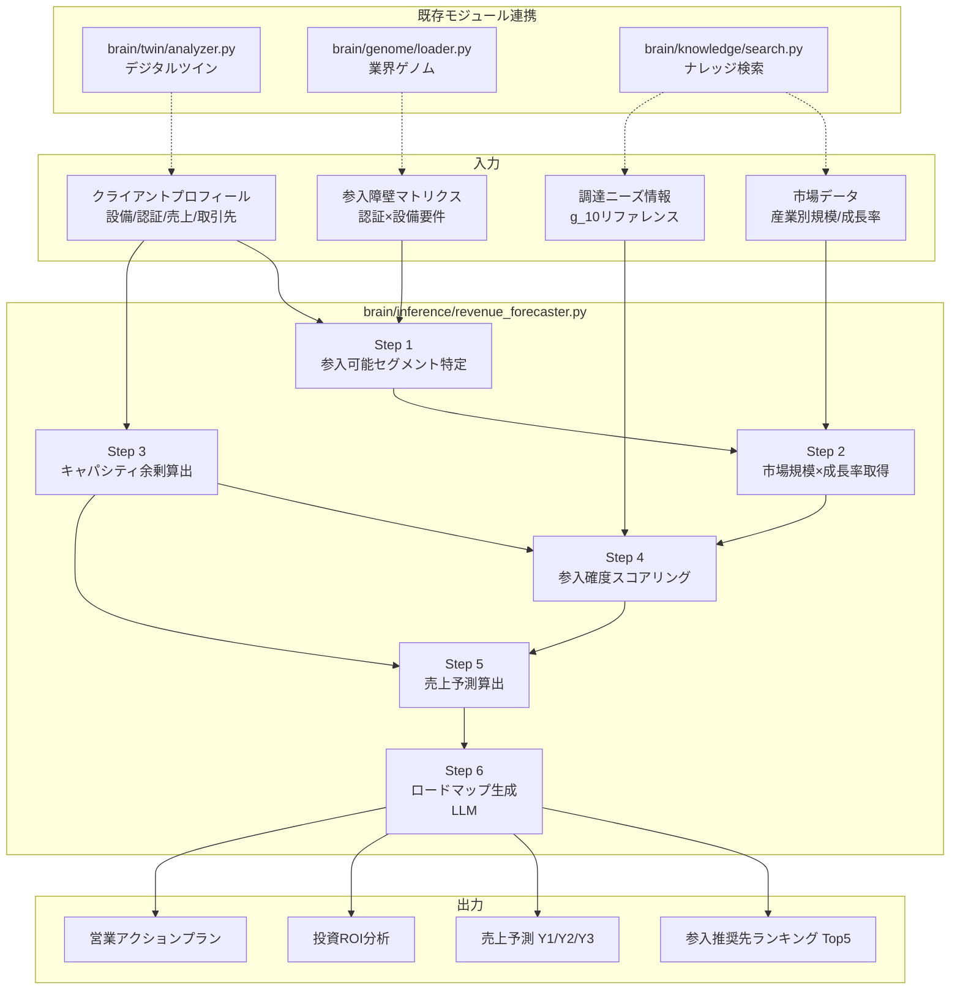

# d_11 売上予測モデル設計

> **ステータス**: 設計中（Phase 2）
> **担当モジュール**: `brain/inference/revenue_forecaster.py`
> **依存**: デジタルツイン (`brain/twin/`)、ゲノム (`brain/genome/`)、ナレッジ (`brain/knowledge/`)

---

## 1. 概要

クライアント（製造業）の保有リソース情報を入力すると、**参入可能な市場**と**3年間の売上予測**を自動生成するAIモジュール。

### 解く問題

「ウチの設備と技術で、次にどの業界・どの製品を攻めれば売上が伸びるか？」

### 入力 → 処理 → 出力

```
[入力]                    [処理]                         [出力]
クライアントプロフィール → 参入可能性スコアリング      → 参入推奨先ランキング (Top 5)
  保有設備リスト           市場規模×成長率マッチング      各ターゲットの売上予測 (Y1/Y2/Y3)
  認証リスト               キャパシティ余剰算出           必要投資とROI
  売上構成                 3年ロードマップ生成            営業アクションプラン
  主要取引先
  所在地・従業員数
```

---

## 2. 入力データ

### 2.1 クライアントプロフィール

| フィールド | 型 | 例 | 取得元 |
|---|---|---|---|
| `equipment_list` | `list[Equipment]` | `[{name: "5軸MC", maker: "DMG MORI", model: "DMU50", count: 3, utilization: 0.72}]` | ヒアリング / ゲノム |
| `certifications` | `list[str]` | `["ISO9001", "IATF16949", "JIS Q 9100"]` | ヒアリング / ゲノム |
| `revenue_breakdown` | `dict[str, int]` | `{"自動車部品": 180_000_000, "半導体装置": 60_000_000}` | ヒアリング |
| `top_customers` | `list[str]` | `["デンソー", "アイシン"]` | ヒアリング |
| `location` | `str` | `"愛知県刈谷市"` | companies テーブル |
| `employee_count` | `int` | `45` | companies テーブル |
| `annual_revenue` | `int` | `300_000_000` | ヒアリング |
| `available_capacity_pct` | `float` | `0.15` | 設備稼働率から算出 |

### 2.2 市場データ

`g_ナレッジ/` 配下の業界知識および外部データを構造化して利用。

| データ | ソース | 更新頻度 |
|---|---|---|
| 産業別市場規模 | 経済産業省 工業統計 / 矢野経済研究所 | 年次 |
| セグメント別成長率 | 各業界団体レポート | 年次 |
| 地域別集積度 | 工業統計メッシュデータ | 年次 |
| 主要OEMの調達動向 | `g_10_調達ニーズ情報源リファレンス.md` | 月次 |

### 2.3 参入障壁マトリクス

加工法 × 産業ごとの参入に必要な要件を定義。

| 産業 | 必須認証 | 必須設備 | 参入リードタイム | 備考 |
|---|---|---|---|---|
| 自動車 Tier1 | IATF16949 | 5軸MC, CMM | 12-18ヶ月 | 量産実績必須 |
| 航空宇宙 | JIS Q 9100 (AS9100) | 5軸MC, 恒温室 | 18-24ヶ月 | Nadcap推奨 |
| 半導体装置 | ISO9001 | 5軸MC, ワイヤ放電 | 6-12ヶ月 | クリーンルーム加工は別途 |
| 医療機器 | ISO13485 | 5軸MC, レーザー | 12-18ヶ月 | 生体適合材料の実績 |
| 金型 | なし | MC, 放電, 研削 | 3-6ヶ月 | 設計力が差別化要因 |
| 一般産機 | ISO9001 | 汎用MC/旋盤 | 1-3ヶ月 | 価格競争が激しい |

---

## 3. 処理ロジック

### Step 1: 参入可能セグメント特定

保有設備 × 保有認証から、技術的に参入可能な「産業 × Tier」の組み合わせをフィルタリング。

```python
def identify_accessible_segments(
    equipment: list[Equipment],
    certifications: list[str],
    barrier_matrix: BarrierMatrix,
) -> list[AccessibleSegment]:
    """
    参入障壁マトリクスと照合し、設備・認証が足りているセグメントを抽出。
    不足がある場合も「追加投資で参入可能」として別リストに含める。
    """
```

**判定ロジック**:
- 必須設備を全て保有 → `ready`
- 必須設備の80%以上保有 → `near_ready`（不足設備と概算投資額を付記）
- 必須認証を保有 → `certified`
- 必須認証を未保有 → `certification_needed`（取得期間と費用を付記）

### Step 2: 市場規模×成長率の取得

各ターゲットセグメントの市場規模と成長率をDBから取得。

```python
def fetch_market_data(
    segments: list[AccessibleSegment],
) -> list[MarketData]:
    """
    産業×セグメント別の市場規模、CAGR、地域別シェアを取得。
    """
```

### Step 3: キャパシティ余剰の算出

クライアントが追加受注可能な金額を設備キャパシティから逆算。

```python
def calculate_capacity_headroom(
    equipment: list[Equipment],
    current_revenue: int,
) -> CapacityHeadroom:
    """
    余剰キャパシティ = Σ(設備台数 × (1 - 稼働率) × チャージレート × 稼働時間/月)
    年間追加受注可能額 = 余剰キャパシティ × 12
    """
```

**チャージレート参考値**:
| 設備カテゴリ | チャージレート（円/時間） |
|---|---|
| 汎用MC | 4,000 - 6,000 |
| 5軸MC | 8,000 - 15,000 |
| 複合旋盤 | 6,000 - 10,000 |
| ワイヤ放電 | 5,000 - 8,000 |
| レーザー加工機 | 7,000 - 12,000 |

### Step 4: 参入確度スコアリング

各セグメントに対して、0-100の参入確度スコアを算出。

```python
def score_entry_probability(
    segment: AccessibleSegment,
    market: MarketData,
    client: ClientProfile,
) -> EntryScore:
    """
    スコア = w1×認証スコア + w2×設備適合スコア + w3×地理スコア + w4×実績スコア
    """
```

**重み付け**:
| 要素 | 重み | スコア算出方法 |
|---|---|---|
| 認証保有 | 0.30 | 必須認証の充足率 (0-100) |
| 設備適合 | 0.25 | 必須設備の充足率 × 精度グレード |
| 地理的近接性 | 0.15 | 主要OEMの工場からの距離（100km以内=100, 300km=50, それ以上=20） |
| 過去実績 | 0.20 | 同業界の受注実績有=100, 類似業界=60, なし=20 |
| 市場成長率 | 0.10 | CAGR 5%以上=100, 3-5%=70, 0-3%=40, マイナス=10 |

### Step 5: 売上予測

各ターゲットの売上予測を算出。市場規模の獲得可能シェアとキャパシティ上限の小さい方を採用。

```python
def forecast_revenue(
    segment: AccessibleSegment,
    market: MarketData,
    capacity: CapacityHeadroom,
    entry_score: EntryScore,
) -> RevenueForecast:
    """
    獲得可能売上 = min(
        市場規模 × 想定シェア(entry_scoreベース),
        キャパシティ上限
    )

    Year 1: 試作・小ロット = 獲得可能売上 × 0.10
    Year 2: 量産移行       = 獲得可能売上 × 0.40
    Year 3: フル量産       = 獲得可能売上 × 0.80
    """
```

**想定シェア算出**:
- entry_score 80以上 → 市場規模の 0.1-0.3%
- entry_score 60-79 → 市場規模の 0.05-0.1%
- entry_score 40-59 → 市場規模の 0.01-0.05%

### Step 6: 3年ロードマップ生成

LLMを使って、具体的なアクションプランを生成。

```python
async def generate_roadmap(
    ranked_targets: list[RankedTarget],
    client: ClientProfile,
) -> Roadmap:
    """
    Top 5ターゲットに対して:
    - Year 1: 試作獲得のためのアクション（展示会出展、認証取得開始、設備投資判断）
    - Year 2: 量産化のためのアクション（品質体制構築、ライン増設）
    - Year 3: 横展開のためのアクション（関連部品への拡大、新規OEM開拓）
    """
```

---

## 4. 出力

### 4.1 参入推奨先ランキング（Top 5）

```json
{
  "recommendations": [
    {
      "rank": 1,
      "segment": "半導体装置部品",
      "entry_score": 87,
      "market_size_billion": 1200,
      "cagr_pct": 8.2,
      "readiness": "ready",
      "missing_requirements": [],
      "revenue_forecast": {
        "year1": 12_000_000,
        "year2": 48_000_000,
        "year3": 96_000_000
      },
      "required_investment": 0,
      "roi_months": 0,
      "key_actions": ["SEMI展示会出展", "半導体装置メーカー3社にアプローチ"]
    }
  ]
}
```

### 4.2 投資ROI分析

認証取得や設備導入が必要な場合の投資対効果を算出。

| 投資項目 | 概算費用 | 期間 | 期待追加売上/年 | ROI |
|---|---|---|---|---|
| IATF16949取得 | 300-500万円 | 12-18ヶ月 | 3,000-5,000万円 | 8-12ヶ月 |
| 5軸MC 1台導入 | 3,000-5,000万円 | 3-6ヶ月 | 2,000-4,000万円 | 18-30ヶ月 |
| ISO13485取得 | 200-400万円 | 12ヶ月 | 1,500-3,000万円 | 6-12ヶ月 |

### 4.3 営業アクションプラン

- ターゲットOEM/Tier1のリスト（調達ポータル登録先を含む）
- 推奨展示会・商談会のスケジュール
- 提案書テンプレート（保有設備×認証を強調した技術PR資料）

---

## 5. データフロー図



---

## 6. 実装計画

### 配置

```
shachotwo-app/brain/inference/
├── __init__.py
├── accuracy_monitor.py          # 既存
├── revenue_forecaster.py        # 新規: メインモジュール
├── market_data.py               # 新規: 市場データ管理
└── barrier_matrix.py            # 新規: 参入障壁マトリクス
```

### 既存モジュールとの連携

| 連携先 | 用途 |
|---|---|
| `brain/twin/analyzer.py` | クライアントのデジタルツイン（設備・人員・コスト）から入力データを自動取得 |
| `brain/genome/loader.py` | 業界別ゲノムJSONから参入障壁マトリクスの初期値をロード |
| `brain/knowledge/search.py` | 市場データ・調達ニーズ情報のベクトル検索 |
| `llm/client.py` | Step 6のロードマップ生成でLLM呼び出し |
| `workers/bpo/sales/pipelines/proposal_generation_pipeline.py` | 売上予測結果を営業提案書に自動組込み |

### APIエンドポイント

```python
# routers/forecast.py
@router.post("/api/v1/forecast/revenue")
async def forecast_revenue(
    request: RevenueForecastRequest,
    company_id: UUID = Depends(get_company_id),
) -> RevenueForecastResponse:
    """売上予測を生成"""

@router.get("/api/v1/forecast/segments")
async def list_accessible_segments(
    company_id: UUID = Depends(get_company_id),
) -> list[AccessibleSegment]:
    """参入可能セグメント一覧"""
```

### 実装優先度

1. **Phase 2 Week 1-2**: 参入障壁マトリクスのJSON定義 + Step 1-2の実装
2. **Phase 2 Week 3**: Step 3-5の実装 + テスト
3. **Phase 2 Week 4**: Step 6（LLMロードマップ生成）+ APIエンドポイント
4. **Phase 2 Week 5**: フロントエンド統合 + パイロット企業でのテスト

### テスト方針

- `tests/brain/inference/test_revenue_forecaster.py`: ユニットテスト（モックデータで各Stepを検証）
- `tests/brain/inference/test_barrier_matrix.py`: 参入障壁マトリクスの整合性テスト
- パイロット企業のリアルデータでE2Eテスト（手動検証）
