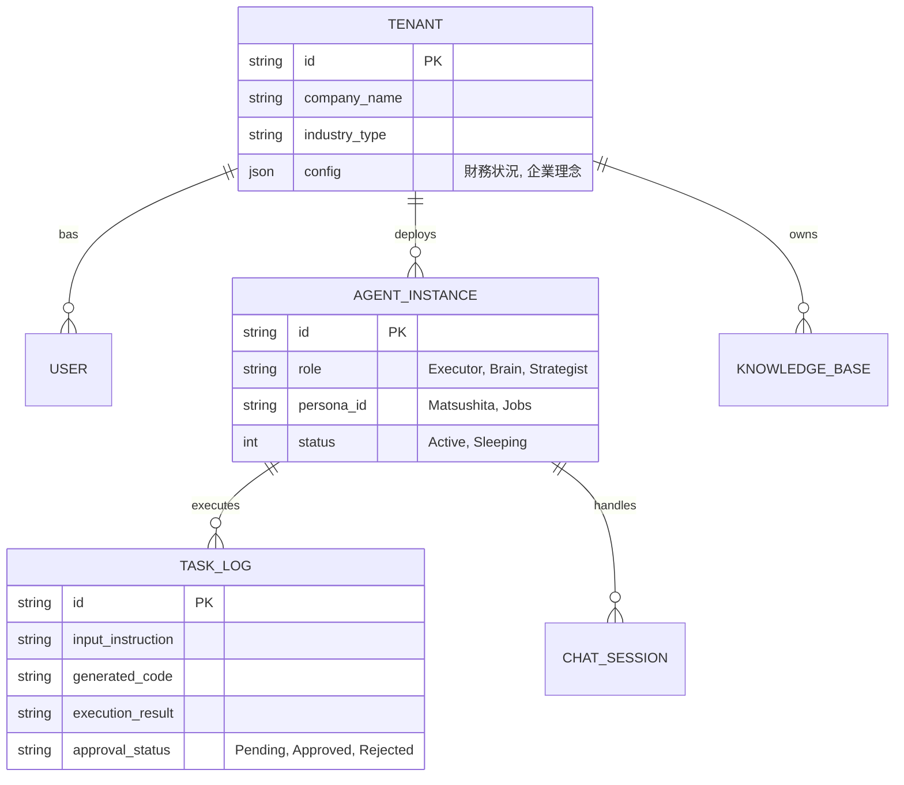

### 自律型AIエージェント開発・運用基盤「Agent Factory & Runtime（仮）」要件定義書
**Version:** 1.0
**Date:** 202X-XX-XX
**Status:** Draft for Phase 0 Development

---

## 1. はじめに

### 1.1 プロジェクトの目的

本システムは、中堅・中小企業（SMB）に対して「AI社員（Executor, Brain, Strategist）」を提供するための開発および運用プラットフォームである。
人間のPMやオペレーター（AI Handler）が最小限の介入で、顧客ごとの業務フローに合わせたシステムを構築し、日々の業務をAIに自律実行させることを目的とする。

### 1.2 スコープ

1. **Agent Factory (Build)**: 自然言語による要件定義から、業務アプリケーション（コード・DB・UI）を自動生成する機能。
2. **Agent Runtime (Run)**: 生成されたアプリケーションおよびAIエージェントが、24時間365日稼働する実行環境。
3. **Operator Cockpit (Manage)**: AI Handler（人間）がAIの挙動を監視、承認、修正するための管理画面。

---

## 2. システム全体アーキテクチャ

### 2.1 概念図

`User (Client)` ⇔ `Interface (Chat/Voice)` ⇔ **[Orchestrator]** ⇔ `Agent Modules` ⇔ `External APIs / DB`
(Human Handler monitors via `Cockpit`)

### 2.2 主要コンポーネント

1. **Gateway / Router**: ユーザーの入力（チャット、ファイル、音声）を受け取り、適切なエージェントに振り分ける。
2. **Context Manager**: 会話履歴、企業の基本情報（社風、財務状況）、長期記憶（Vector DB）を管理する。
3. **Task Planner**: 抽象的な指示（例：「来月の資金繰り表を作って」）を、具体的な実行タスク（DBクエリ作成→計算→Excel出力）に分解する。
4. **Code Generator (Dev Agent)**: Python/SQL/Reactのコードを生成し、サンドボックス環境でテスト・デプロイする。
5. **Reviewer (Critique)**: 生成された成果物を「自己批評」し、エラーや論理破綻を修正する。

---

## 3. 機能要件 (Functional Requirements)

### 3.1 共通基盤機能 (Core Platform)

| ID | 機能名 | 詳細要件 |
| --- | --- | --- |
| **C-01** | **マルチモーダル入力処理** | テキスト、音声データ（mp3/wav）、画像（PDF/OCR）、CSV/Excelを解析し、構造化データ（JSON）に変換するパイプライン。 |
| **C-02** | **長期記憶 (Vector Store)** | 企業ごとの固有知識（社内規定、過去の意思決定、議事録）をEmbeddingして保存。RAG（Retrieval-Augmented Generation）により回答精度を高める。 |
| **C-03** | **サンドボックス実行環境** | AIが生成したPythonコードを安全に実行するためのDockerコンテナ基盤。インターネットアクセス制限やタイムアウト設定を含む。 |
| **C-04** | **Human-in-the-loop承認** | クリティカルなアクション（送金、外部メール送信、DB削除）の前に、必ず人間の承認（Approveボタン）を要求するワークフローエンジン。 |

### 3.2 開発エージェント機能 (The Developer)

*目的: 顧客専用の業務アプリを爆速で構築する*

| ID | 機能名 | 詳細要件 |
| --- | --- | --- |
| **D-01** | **要件定義の構造化** | 「こういう業務フローなんだけど」という曖昧な会話から、UML図、ER図、API仕様書をドラフト作成する。 |
| **D-02** | **スキーマ自動生成** | 要件に基づき、PostgreSQL/NoSQLのDDLを生成し、マイグレーションを実行する。 |
| **D-03** | **UIコンポーネント生成** | React/Vue等のフレームワークを用い、CRUD画面、ダッシュボード、入力フォームのコードを生成・デプロイする。 |
| **D-04** | **Self-Healing (自己修復)** | コンパイルエラーやRuntimeエラーが発生した場合、エラーログをAI自身が読み取り、コードを修正して再実行するループ機能（最大リトライ数設定）。 |

### 3.3 業務特化エージェント機能 (The Workers)

### A. 事務エージェント (Executor)

- **連携機能 (iPaaS)**: Gmail, Slack, Chatwork, freee, Salesforce, kintone等のAPIコネクタを標準装備。
- **定型業務自動化**: 請求書PDFの受領→OCR読み取り→会計ソフト入力→支払一覧表作成→承認依頼チャット送信、の一連フローの実行。
- **スケジュール管理**: Google Calendar/Outlookと連携し、会議調整やリマインドを行う。

### B. No.2 エージェント (Brain)

- **財務分析エンジン**: 会計データ（CSV/API）を取り込み、PL/BS/CFの推移、損益分岐点、キャッシュバーンレートを計算・可視化する。
- **偉人ペルソナ (Persona Injection)**: プロンプトエンジニアリングにより、松下幸之助、スティーブ・ジョブズ等の思考モデルを適用。「松下ならこう言う」というアドバイスを生成。
- **アラート検知**: 「粗利率が先月より3%低下しています」「現預金が3ヶ月分を切りました」等の異常検知プッシュ通知。

### C. M&A/戦略エージェント (Strategist)

- **Web Crawler**: 指定されたキーワードや競合企業名に基づき、Google Search、ニュースサイト、決算発表資料をクローリングする。
- **市場分析レポート生成**: 収集した情報を要約し、SWOT分析、PEST分析のフレームワークに落とし込んでレポート出力する。
- **企業マッチング**: 買収候補リスト（ロングリスト）の自動生成。

### 3.4 管理・運用画面 (Operator Cockpit)

*ユーザーは使用せず、自社のAI Handler（オペレーター）が使用する画面*

| ID | 機能名 | 詳細要件 |
| --- | --- | --- |
| **O-01** | **マルチテナント管理** | 顧客企業ごとの環境切り替え、契約プラン管理、リソース使用量（Token数）モニタリング。 |
| **O-02** | **タスク監視・介入** | AIが実行中のタスクステータス（Planning, Coding, Executing, Error）を可視化。エラー時に人間が介入して手動修正できる機能。 |
| **O-03** | **会話履歴・Diffチェック** | ユーザーとAIのチャットログ閲覧。AIが生成したコードやドキュメントの差分（Diff）確認。 |
| **O-04** | **承認フロー管理** | AIが「承認待ち」ステータスにしたタスクの一覧表示と一括承認/却下。 |

---

## 4. 非機能要件 (Non-Functional Requirements)

### 4.1 パフォーマンス・スケーラビリティ

- **応答速度**: チャット応答（単純回答）は3秒以内。複雑なタスク（コード生成・実行）は「考え中」ステータスを表示し、非同期で処理（最大10分程度）。
- **同時接続数**: Phase 1で100社、Phase 2で1,000社以上の同時稼働に耐えうるサーバーレスアーキテクチャ（AWS Lambda / Fargate等）の採用。

### 4.2 セキュリティ・コンプライアンス

- **データ分離**: 顧客ごとのデータは論理的（Tenant ID）または物理的（Schema/Database）に完全に分離する。他社の学習データに混入させない。
- **個人情報保護**: PII（個人特定情報）のマスキング処理機能を実装。
- **監査ログ**: 誰が（User/AI/Handler）、いつ、何をしたかの操作ログを100%保存する。

### 4.3 可用性・保守性

- **SLA**: 稼働率99.9%を目標とする（日中業務時間に停止しないこと）。
- **APIバージョン管理**: LLMモデル（GPT-4oなど）のバージョンアップに対応しやすいモジュラー構成にする。

---

## 5. データモデル設計 (概略)

### 5.1 主要エンティティ

---

## 6. 技術スタック選定 (Tech Stack)

### 6.1 AI & Backend

- **LLM Orchestrator**: LangChain または LangGraph（複雑な自律エージェントの制御に最適）
- **Primary LLM**: GPT-4o (推論・複雑な指示), Claude 3.5 Sonnet (コーディング・長文読解)
- **Secondary LLM**: Llama 3 (単純タスク・コスト削減用)
- **Backend Framework**: Python (FastAPI) - 非同期処理とAIライブラリとの親和性
- **Worker Queue**: Celery / Redis - 重い処理の非同期化

### 6.2 Database & Storage

- **RDBMS**: PostgreSQL - 業務データ、トランザクション管理
- **Vector DB**: Pinecone または Weaviate - 長期記憶、ナレッジ検索用
- **Object Storage**: AWS S3 - ファイル、生成された成果物、ログ保存

### 6.3 Infrastructure

- **Cloud Provider**: AWS (推奨) または GCP
- **Container**: Docker / Kubernetes (EKS) - サンドボックス環境の分離
- **CI/CD**: GitHub Actions - 自社開発および生成されたコードのデプロイ

### 6.4 Frontend (Cockpit & Client App)

- **Framework**: Next.js (React) + TypeScript
- **UI Library**: Tailwind CSS, Shadcn/ui - 高速なUI構築
- **State Management**: TanStack Query / Zustand

---

## 7. 開発ロードマップ (Phase 0 - MVP)

### Month 1: コアエンジンの開発

- [ ]  LLM呼び出し基盤、プロンプト管理機能の実装
- [ ]  開発エージェント（自然言語→SQL生成）のプロトタイプ作成
- [ ]  Vector DBへのドキュメント取り込み機能

### Month 2: オペレーター画面とサンドボックス

- [ ]  AI Handler用管理画面（Cockpit）の実装
- [ ]  生成コードを安全に実行するDockerサンドボックス環境の構築
- [ ]  エラー時の自己修復ループの実装

### Month 3: 事務エージェント・統合テスト

- [ ]  Slack/Chatwork連携の実装
- [ ]  特定業務（例：請求書処理）のE2Eテスト
- [ ]  友人企業（αテスター）への限定公開とフィードバックループ

---

## 8. リスクと対策 (Technical Risks)

- **Risk**: LLMが無限ループに陥り、APIコストが爆増する。
    - **Mitigation**: タスクごとの最大ステップ数制限、API予算上限アラート（Circuit Breaker）の実装。
- **Risk**: 生成されたコードが既存データを破壊する（DELETE文など）。
    - **Mitigation**: AI用のDBユーザー権限を制限する。破壊的な操作を含むコードは、正規表現等で検知し、強制的に人間承認フローへ回す。
- **Risk**: AIの回答精度が安定しない。
    - **Mitigation**: 「Evals（評価セット）」を作成し、プロンプト変更時に回帰テストを行う仕組みを導入する。